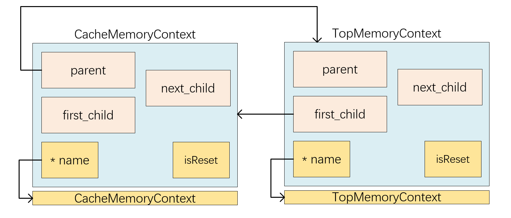
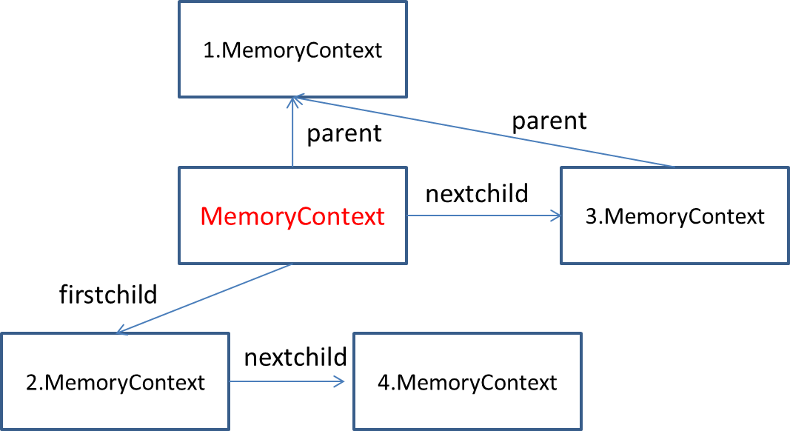
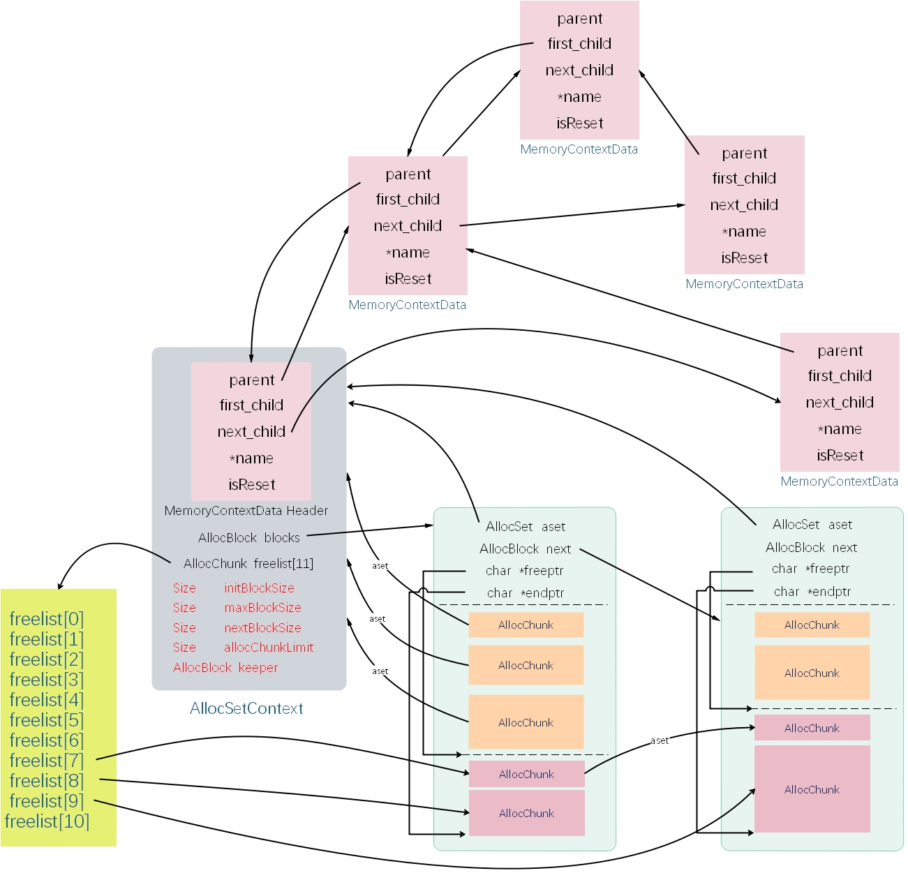

# [PostgreSQL内存池结构解析](https://github.com/Chan-I/MEMContext)

## 1.内存上下文

​	postgresql在7版本引入了内存上下文机制，目的是解决日益严重的内存泄漏问题。在引入了内存上下文以后，所有的内存分配改为在内存上下文中进行。对于用户来说，对内存的申请有原来的malloc、tree变味了palloc、pfree。对内存上下文的常用操作包括：

> * 创建一个内存上下文：		    MemoryContextCreate
> * 在内存上下文中分配内存片：  palloc
> * 删除内存上下文：                      MemoryContextDelete
> * 重置内存上下文：                      MemoryContextReset

PostgreSQL的动态管理内存的方式有以下优点：

1. 防止内存泄漏。采用传统的malloc/free来控制和管理内存经常会导致验证的内存泄漏。首先要保证每一个malloc的内存都有对应的free来释放，在工程量较大的项目中，函数调用是很深的，很难保证；其次要保证函数退出或者异常处理时每种情况下都能正确的释放内存，这对代码编写人员是个很大的挑战。PostgreSQL的内存管理通过预先分配一大段内存，然后自己来管理这段内存，最后只要在合适的时间点释放这些内存就可以，不需要考虑内部的小块内存。
2. 分配效率。由于堆内存是线程间共享的，所以传统的malloc必须要考虑分配时候的线程安全问题，从而要用锁来控制；PostgreSQL由于是多进程架构，每个进程只有一个线程。不需要考虑并发；项目可以看到，PostgreSQL内存管理没有涉及到锁，因此性能较快。
3. 减少内存碎片。根据第一点的描述，每次想OS申请一大段内存，然后自主管理，可以有效地减少碎片。

**主要的全局内存上下文：**

- **TopMemoryContext** — 位于内存上下文树型管理结构的顶层，所有其它的内存上下文都是TopMemoryContext的直接或间接子节点。在TopMemoryContext上的内存分配其实和malloc是完全一样的，因为TopMemoryContext是永远存在的，从不会被重用和删除。只有那些会话级或控制模块相关的，需要永久保留的，才能使用TopMemoryContext。
- **TopMemoryContext**–这是内存环境树实际的最高层级,其他每一个内存环境都是其直接或间接的子内存环境.在这里,分配内存与使用”malloc”一样,因为这个内存环境永远也不会重设或删除.这样做是为了那些永远存在或是在删除时需要非常仔细的情况.一个例子是,fd.c中打开文件的列表,以及内存环境自身的内存环境管理节点本身.,除非真正需要,应避免在这里分配内存.另外,特别要避免在运行时CurrentMemoryContext指向这里.
- **PostmasterContext**–这是postmaster正常的工作内存环境.后台进程建立之后,就可以删除PostmasterContext,从而释放postmaster不再需要的内存.(所有需要从postmaster传递到后台进程的数据都是通过TopMemoryContext内存环境来传递的.postmaster只有TopMemoryContext,PostmasterContext,以及ErrorContext–其余的最高层次的内存环境将在每个后台进程启动时创建.
- **CacheMemoryContext**–relcache,catcache以及相关模块的持久存储,无法重设或删除,所以无法真正地将其和TopMemoryContext区分开来.但是需要将两者区分开来以方便调试.(注意:CacheMemoryContext会有短生命周期的子内存环境.例如,有一个作为relcache项的最好的辅助存储的子内存环境.我们可以很容易地释放规则分析树,而无需创建一个可靠版本的freeObject函数来释放规则分析树占用的内存.
- **MessageContext**–此内存环境持有前台进程传递过来的当前命令消息,以及当前消息衍生出来的并且与当前消息生命周期相同的存储空间.(例如,在simple-Query模式下,分析树和计划树可以在此内存环境中).这个内存环境可以在PostgresMain的每一次循环中被重设,其子内存环境被删除.这与每一个事务和运行平台(portal)的内存环境分开,因为一个查询语句可能需要比单一一个事务或运行平台(portal)保留的时间长或短一些.
- **TopTransactionContext**–此内存环境一直持续到最高层事务结束的时候.在每一次最高层事务结束的时候,这个内存环境都会被重设,其所有的子内存环境都会被删除.在大多数情况下,你无须在这里分配内存,而应该在CurTransactionContext中分配.在此内存环境中的应该是管理多个子事务状态的控制信息.注意:此内存环境不会在出错时立即清除,而是到事务块通过调用COMMIT/ROLLBACK时清除.
- **CurTransactionContext**–此内存环境持有当前事务的数据直到当前事务结束,特别是在最高层事务提交时需要此内存环境.当我们处于一个最高层事务中时,此内存环境就跟TopTransactionContext一致,但是在一个子事务中,CurTransactionContext指向一个子内存环境.
- **PortalContext**–这并不是一个独立的内存环境,而是一个全局变量,指向当前活动着的运行平台的per-portal内存环境.在需要分配与当前运行平台(portal)运行时长一致的存储空间时使用.
- **ErrorContext**–这个持久性的内存环境会在错误恢复过程中切换过去,然后在恢复结束时重设.我们安排了8K在任何时刻都有效的内存.这样,我们可以保证了,甚至在后台进程已经用尽了其所有内存,都会有一些内存可以用来进行错误恢复.这使得内存用尽可以被当做一个通常的错误(ERROR)情况,而不是一个崩溃(FATAL)情况.

## 1.1内存上下文管理结构

PG里内存上下文的控制结构可以视为两层结构，一个是底层的AllocSet层和上层的MemoryContext层。MemoryContext只是一个抽象类型用于对外提供统一的内存上下文操作的标准接口，只关心SQL执行阶段不同内存上下之前的继承关系，不关心内存本身的分配释放。AllocSet类似于简单的操作系统内存管理，要组织已使用内存和已空闲内存的管理。

底层的AllocSet具体实现可以有多种方式，但目前只提供了AllocSetContext一种实现。通过看下面的两个结构体介绍可以看到，AllocSetContext最开始位置是一个MemoryContextData类型的属性。这有点像面向对象编程语言中类的继承，其中MemoryContextData是父类，AllocSetContext是子类，在父类的基础上增加了一些新的属性和成员函数。实际上PG里有很多地方采用这样的思想实现对接口的封装。因此所有的实现方式的内存上下文结构都必须以MemoryContext开头，以实现继承的目的。（参见MemoryContextMethods结构的注释部分）

相关代码：

- src/backend/utils/mmgr/aset.c, mcxt.c, portalmem.c, README: 内存管理模块
- src/include/nodes/memnodes.h: 实现内存上下文管理结构封装接口的头文件
- src/include/utils/memutils.h: 内存上下文对外使用标准接口头文件


### 1.1.1 MemoryContextData结构体

系统中内存的分配工作都是在各种语义的内存上下文MemoryContext中进行，因此可以很轻松的通过内存上下文释放其中的所有相关内存空间，而不用费心去释放每一个空间。这样的内存分配和释放更快捷，更可靠。这种机制借鉴了操作系统中的一些概念。操作系统中进程可以在执行环境中执行而不用互相影响。

postgresql中通过MemoryContextCreate创建内存上下文。下面举一个简单地微缩版本代码：

```c
#include <stdio.h>
#include <stdlib.h>

typedef struct MemoryContextData *MemoryContext;
typedef struct MemoryContextData
{
    MemoryContext parent;		/* NULL if toplevel context */
    MemoryContext first_child;	/* head of linked list of children */
    MemoryContext next_child;	/* next child of same parent */
    char *name;					/* context name */
    char isReset;				/* T = nospace alloced since last reset */
} MemoryContextData;

/*
 *	 name:	MemoryContextCreate
 * 	 function:	初始化内存上下文结构
 *	 params：	parent	父节点
 *				name	内存上下文名称
 */
MemoryContext 
MemoryContextCreate( const char * name, MemoryContext parent )
{
    MemoryContext node;
    int size = sizeof(MemoryContextData);
    int needSize = size + strlen(name) + 1;
    
    node = (MemoryContext) malloc(needSize);
    if(!node)
    {
        printf("error\n");
        exit(0);
    }
    
    memset(node,0,size);
    node->parent = NULL;
    node->first_child = NULL;
    node->next_child = NULL;
    node->isReset = 1;
    node->name = (char *)node + size;
    strcpy(node->name,name);
    
    if(parent)
    {
        node->parent = parent;
        node->next_child = parent->first_child;
        parent->first_child = node;
    }
    return node;
}

int main()
{
    MemoryContext TopMemoryContext, CacheMemoryContext;
    TopMemoryContext = (MemoryContext) MemoryContextCreate("TopMemoryContext",NULL);
    CacheMemoryContext = (MemoryContext) MemoryContextCreate("MemoryContextCreate",TopMemoryContext);
    
    printf("name:: %s\n",CacheMemoryContext->name);
    printf("name:: %s\n",CacheMemoryContext->parent->name);
    return 0;
}
```

上述小规模代码的结构体如下图所示：



按照上述小规模代码，内存上下文结构通过MemoryContextData实现最基本的内存管理机制。

MemoryContextData的结构如下：

```c
typedef struct MemoryContextData
{
    NodeTag     type;           /* identifies exact kind of context */
    MemoryContextMethods *methods;      /* virtual function table */
    MemoryContext parent;       /* NULL if no parent (toplevel context) */
    MemoryContext firstchild;   /* head of linked list of children */
    MemoryContext nextchild;    /* next child of same parent */
    char       *name;           /* context name (just for debugging) */
    bool        isReset;        /* T = no space alloced since last reset */
} MemoryContextData;
```

且MemoryContextData之间形成一种树形结构，如下图所示：



每个内存上下文节点中都有三个指针，分别指向其父上下文，胞弟上下文，长子上下文。

* **\*method**：用来记录该上下文中进行内存操作的接口和回调函数。
* **iseset**：是否重置内存上下文。所谓重置内存上下文是指释放内存上下文中所分配的内存给操作系统。在一个内存上下文被创建时，其isReset字段置为True，表示从上一次重置到目前没有内存被分配。只要在该内存上下文中进行了分配，就需要将isReset字段置为False。有了该变量的标识，在进行重置时，我们可以检查该字段的值，如果内存上下文没有进行过内存分配，则不需要进行实际的重置工作，从而提高效率。
* **name**：用来标记该上下文的名称。
* **type**：用来标记上下文的类型。

总体来说，MemoryContextData结构体现的是不同上下文之间的关系。

### 1.1.2 AllocSetContext结构体

MemoryContextData并没有体现内存之间的具体管理方式，现在不妨将MemoryContextData扩大一层，以便于进一步分析：

```c
typedef struct AllocSetContext
{
    MemoryContextData header;   /* Standard memory-context fields */
    /* Info about storage allocated in this context: */
    AllocBlock  blocks;         /* head of list of blocks in this set */
    AllocChunk  freelist[ALLOCSET_NUM_FREELISTS];       /* free chunk lists */
    /* Allocation parameters for this context: */
    Size        initBlockSize;  /* initial block size */
    Size        maxBlockSize;   /* maximum block size */
    Size        nextBlockSize;  /* next block size to allocate */
    Size        allocChunkLimit;    /* effective chunk size limit */
    AllocBlock  keeper;         /* if not NULL, keep this block over resets */
} AllocSetContext;
```

上图中已经由MemoryContextData明确了内存上下文之间的关系，AllocSetContext在MemoryContextData的基础上，添加了部分结构。其中header成员就标记了所属的内存上下文组成的树形结构。

* **header**：头部信息是一个MemoryContextData结构，header是一个进入上下文的外部接口，事实上管理内存上下文就是通过这个header完成的。
* **blocks**：内存块链表。该字段是一个指向内存块结构体的指针，表示一个内存块。不同的内存块成员之间通过next指针连接成一个单向链表，blocks指向的就是这个链表的头部。那个内存块中进行分配时产生的内存片段被称为内存片，每个内存片包括一个头部信息和数据区域。其中头部包含了最最必要的该分片所属的内存上下文以及内存区的其他信息。内存片的数据区则被紧密安排在头部信息以后。并通过palloc和pfree自由取用。

- **initBlockSize、maxBlockSize、nextBlockSize**：initBlockSize和maxBlockSize字段在内存上下文创建时指定，且在创建是nextBlockSize会置为和initBlockSize相同的值。nextBlockSize表示下一次分配的内存块的大小，在进行内存分配时，如果需要分配一个新的内存块，则这个新的内存块的大小将采用nextBlockSize的值。在有些情况下，需要将下一次要分配的内存块的大小置为上一次的2倍，这时nextBlockSize就会变大。但最大不超过maxBlockSize指定的大小。当内存上下文重置时，nextBlockSize又会恢复到初始值，也就是initBlockSize。

- **allocChunkLimit**：内存块会分成多个被称为内存片的内存单元，在分配内存片时，如果一个内存片的尺寸超过了宏ALLOC_CHUNK_LIMIT时，将会为该内存片单独分配一个独立的内存块，这样做是为了避免日后进行内存回收时造成过多的碎片。由于宏ALLOC_CHUNK_LIMIT是不能运行时更改的，因此PostgreSQL提供了allocChunkLimit用于自定义一个阈值。如果定义了该字段的值，则在进行超限检查时会使用该字段来替换宏定义进行判断。

- **keeper**：在内存上下文进行重置时不会对keeper中记录的内存块进行释放，而是对齐内容进行清空。这样可以保证内存上下文重置结束后就可以包含一定的可用内存空间，而不需要使用malloc另行申请。另外也可以避免在某个内存上下文被反复重置时，反复进行内存片malloc带来的风险。

- **freelist**:长度为11的数组，用于维护在内存块中的空闲内存片，这些内存片主要用于再分配。该数组每一个元素指向一个由特定大小的空闲内存片组成的链表，这个大小与该元素在数组中的位置有关：free数组中最小的空闲存片为2^3^=8；最大为2^13^=8K字节。即数组中第k个元素指向链表每个空闲数据库的大小为2^k+2^字节。因此freelist维护了11个大小不同的空闲内存片链表，管理着11个不同大小的空闲内存片。

  - aset：有两个作用，如果成员正在使用当中，aset字段可以指向所属的AllocSet。如果内存片为空闲，也就是说处于一个空闲链表中，那么他的aset字段就指向空闲链表中它之后的内存片。这样一来从freelist数组元素指向链表的头开始，顺着aset字段指向下一个内存片就可以找到该空闲连标红所有的空闲的内存片。

  可以发现freelist内存片的大小都是2的倍数（TO DO），申请特定大小内存将取正好够用的那个内存片。如果申请的内存超过了allocChunkLimit字段的值。则直接分配一个内存块，这个内存卡只存放一个内存片。这种情况下在这个内存片释放的时候，会将整个内存块释放，而不是将内存片加到freelist中。

## 1.2 内存块和内存片

* 内存块（BLOCK）：	内存上下文在内存中申请（malloc）到的内存单位。
* 内存片（CHUNK）：   用户在内存上下文中申请（palloc）到的内存单位。

每个管理的内存区域包括多个内存快，每个内存块又被分为多个内存片单元。通俗的理解：内存块就是比较大块的内存，内存片就是大块内存中的更小的内存单元。一般来说内存的小规模使用频率较高，所以申请内存块使用的是malloc，使用后就会立即释放给操作系统；申请小内存使用的是自己的一套机制，使用完以后并不会直接返还给操作系统，而是放入自己维护的一个内存管理链表，方便后续的使用。

### 1.2.1 AllocBlock，AllocChunk结构体

#### AllocBlock

内存片和内存块都是管理内存的基本单位，数据结构如下：

```c
/*
 * AllocBlock
 *		An AllocBlock is the unit of memory that is obtained by aset.c
 *		from malloc().	It contains one or more AllocChunks, which are
 *		the units requested by palloc() and freed by pfree().  AllocChunks
 *		cannot be returned to malloc() individually, instead they are put
 *		on freelists by pfree() and re-used by the next palloc() that has
 *		a matching request size.
 *
 *		AllocBlockData is the header data for a block --- the usable space
 *		within the block begins at the next alignment boundary.
 */
typedef struct AllocBlockData
{
	AllocSet	aset;			/* aset that owns this block */
	AllocBlock	next;			/* next block in aset's blocks list */
	char	   *freeptr;		/* start of free space in this block */
	char	   *endptr;			/* end of space in this block */
}	AllocBlockData;

typedef AllocBlockData * AllocBlock;
```
- **aset:** 指向拥有这个block的AllocSetContext结构
- **prev, next:** 当前内存块的上一个和下一个内存块的地址，用于组织成链表结构方便重置和释放。
- **freeptr: **指向当前内存块中空闲空间的首地址
- **endptr:** 指向当前内存块的尾地址

一个内存块的物理结构形式如下，前面是控制结构，后面是实际使用的空间。

```
++++++++++++++++++
+ AllocBlockData +
++++++++++++++++++
+   used space   +
+   free space   +
+   free space   +
++++++++++++++++++
```

通过AllocBlockData结构的注释我们可以知道，AllocBlock内存块是aset.c向操作系统申请内存的最小单元结构。AllocBlock内存块中包含了很多AllocChunks内存片，内存片是palloc,pfree操纵的内存单元结构。内存片释放后会归还到AllocSetContext的空闲列表中，而不是归还给操作系统。

内存块是内存上下文向操作系统申请的连续的一块内存空间，申请后将AllocBlockData结构置于空间的首部，其中freeptr和endptr用与指向当前内存块中空闲空间的首地址和当前内存块的尾地址，见图2-1中的“连续内存段（内存块）”。aset指向控制结构AllocSetContext，next指针形成内存块的链式结构。

#### AllocChunk

```c
/*
 * AllocChunk
 *		The prefix of each piece of memory in an AllocBlock
 *
 * NB: this MUST match StandardChunkHeader as defined by utils/memutils.h.
 */
typedef struct AllocChunkData
{
	/* aset is the owning aset if allocated, or the freelist link if free */
	void	   *aset;
	/* size is always the size of the usable space in the chunk */
	Size		size;
#ifdef MEMORY_CONTEXT_CHECKING
	/* when debugging memory usage, also store actual requested size */
	/* this is zero in a free chunk */
	Size		requested_size;
#endif
}	AllocChunkData;

typedef AllocChunkData * AllocChunk;
```

- **aset:** aset是一个多重复用指针，内存片被使用时指向内存上下文地址; 内存片被释放时指向内存块的freelist(相当于单向链表的next指针)
- **size: **内存片分配的可用空间大小
- **requested_size:** 用户申请时申请的内存大小

一个内存片的物理结构形式如下，前面是控制结构，后面是实际使用的空间。

```
++++++++++++++++++
+ AllocChunkData +
++++++++++++++++++
+   alloc space  +
++++++++++++++++++
```

内存片是内存块被分割使用形成的一个个内存片段，内存片空间的开头是AllocChunkData结构，后面是该内存片的用户实际使用空间，palloc返回的是用户实际使用空间的首地址。内存片有两种状态被使用和被释放，同时存在于内存块当中。内存片被释放时仅仅是将内存片记录到AllocSetContext的freelist当中，并不进行内存的移动和归还给操作系统。

内存片存在于内存块以内，是内存块分割后形成的一段空间，内存片空间的头部为AllocChunkData结构体，后面跟着该内存片的空间，实际上palloc返回的就这指向这段空间首地址的指针。内存片有两种状态：AllocSetContext中freelist数组中存放的是内存片指针是被回收的内存片；另外一种内存片是用户正在使用的内存片。（注意两种状态的内存片都存在于内存块中，被回收只是改变内存片aset指针，形成链表保存在freelist中；在使用中的内存片aset指针指向所属的AllocSetContext）

#### freelist

该数组用于维护内存块中被回收的空闲内存片chunk，这些空闲内存片将被用于再分配。FreeList数组元素类型为AllocChunk，数组长度默认为11。FreeList数组中的每一个元素指向一个由特定大小的空闲内存片组成的链表。这个大小与该元素在数组中的顺序有关系。比如，FreeList数组中第k个元素指向链表的每个空闲数据块的大小为2^(k+2)。空闲内存片最小为8字节。

所以freelist数组实际上维护了11个空闲的链表，管理着11个大小的空闲内存片。需要注意的是AllocChunkData结构中的aset字段是一个复用成员，一方面它可以用来指向其所属的AllocSet，另一方面可以用来指向下一个空闲chunk。

需要注意的是，所有的Freelist所指向的chunk大小都是2的整数倍。：

- 当size < (1 << ALLOC_MINBITS)时，k为0，其中ALLOC_MINBITS系统预定义为3，即freelist中保留最小的字节数为2^3 = 8。
- 当(1 << ALLOC_MINBITS) < size < ALLOC_CHUNK_LIMIT时，若2^(N-1) < size < 2^(N)，则K= N - 3，其中ALLOC_CHUNK_LIMIT为FreeList数组中所能维持的空闲内存片的最大值。

一个内存块的大小如果超过了ALLOC_CHUNK_LIMIT，则会被当做一个独立的块看待。

```c
typedef struct AllocSetContext
{
        MemoryContextData header;       /* Standard memory-context fields */
        /* ... */
        AllocChunk      freelist[ALLOCSET_NUM_FREELISTS];               /* free chunk lists */
        /* ... */
} AllocSetContext;
```

操作系统内核只提供了很基础的物理内存的映射接口，应用程序使用的malloc,free只是glibc对内存管理的一种实现。通过文章开头可以看到用户态的内存管理有很多种实现方式。不管哪种方式， 对空闲内存的管理往往代表着该种方式的效率。PG里的内存上下文管理，相当于在glibc等实现的基础之上，又在应用层进行自己的内存管理。同样freelist管理也很重要。每个内存上下文的AllocSetContext结构中都维护着一个freelist

```c
/*--------------------
 * Chunk freelist k holds chunks of size 1 << (k + ALLOC_MINBITS),
 * for k = 0 .. ALLOCSET_NUM_FREELISTS-1.
 *
 * Note that all chunks in the freelists have power-of-2 sizes.  This
 * improves recyclability: we may waste some space, but the wasted space
 * should stay pretty constant as requests are made and released.
 *
 * A request too large for the last freelist is handled by allocating a
 * dedicated block from malloc().  The block still has a block header and
 * chunk header, but when the chunk is freed we'll return the whole block
 * to malloc(), not put it on our freelists.
 *
 * CAUTION: ALLOC_MINBITS must be large enough so that
 * 1<<ALLOC_MINBITS is at least MAXALIGN,
 * or we may fail to align the smallest chunks adequately.
 * 8-byte alignment is enough on all currently known machines.
 *
 * With the current parameters, request sizes up to 8K are treated as chunks,
 * larger requests go into dedicated blocks.  Change ALLOCSET_NUM_FREELISTS
 * to adjust the boundary point; and adjust ALLOCSET_SEPARATE_THRESHOLD in
 * memutils.h to agree.  (Note: in contexts with small maxBlockSize, we may
 * set the allocChunkLimit to less than 8K, so as to avoid space wastage.)
 *--------------------
 */

#define ALLOC_MINBITS           3       /* smallest chunk size is 8 bytes */
#define ALLOCSET_NUM_FREELISTS  11
#define ALLOC_CHUNK_LIMIT       (1 << (ALLOCSET_NUM_FREELISTS-1+ALLOC_MINBITS))
/* Size of largest chunk that we use a fixed size for */
#define ALLOC_CHUNK_FRACTION    4
/* We allow chunks to be at most 1/4 of maxBlockSize (less overhead) */
```

freelist结构：

```
    ++++++++++++++++++++++++++++++++++++++++++++++++++++++++++++++++++
    + 8 | 16 | 32 | 64 | 128 | 256 | 512 | 1024 | 2048 | 4096 | 8192 +
    ++++++++++++++++++++++++++++++++++++++++++++++++++++++++++++++++++
    ck11      ck22       ck41       ck23          ck32
    ck21      ck31                  ck42
                                    ck12
    ++++++++++++++++++++++++++++++++++++++++++++++++++++++++++++++++++
    注：这些ck分别表示指向不同block的chunk，同一个链上的chunk大小一样
```

- **AllocSetContext**结构中freelist是一个定长指针数组（默认长度为ALLOCSET_NUM_FREELISTS），数组里每一项都存了一种按空闲内存片大小分的不同的空闲内存片链表的头指针。
- **freelist**的第k个位置存储大小为2^(k+ALLOC_MINBITS)的空闲内存片组成的链表，k从0到ALLOCSET_NUM_FREELISTS-1。例如：数组下标0位置保存8字节的内存片，下标1位置保存16字节的内存片，以此类推，freelist中可以保存的最大的内存片为8k字节。
- 内存片大小都是2的次幂，这意味着一些空间的浪费。
- 如果一次内存申请超过内存片大小限制，那么将创建一个只有一个内存片的特殊内存块，释放时直接归还操作系统，而不是加入freelist中。

## 1.3原理图



## 1.4算法实现

#### MemoryContextInit——内存上下文的初始化

任何PG进程在使用内存上下文之前都要进行内存上下文的初始化，通过MemoryContextInit进行初始化。（也就是说创建一个内存上下文的关键根节点，作为整个数据库运行环境的基础）

```c
void
MemoryContextInit(void)
{
	AssertState(TopMemoryContext == NULL);
    //如果TopMemoryContext不为空，说明已经初始化过了，不需要再继续初始化了

	 //初始化TopMemoryContext,即初始化内存上下文树，并初始化根节点。
	TopMemoryContext = AllocSetContextCreate((MemoryContext) NULL,
						 	"TopMemoryContext",
							 ALLOCSET_DEFAULT_SIZES);

	 //由于当前内存上下文并没有其他可以指向的对象，因此将其指向刚创建的TopMemoryContext。
	CurrentMemoryContext = TopMemoryContext;

	/* 初始化ErrorContext,作为TopMemoryContext的第一个子节点。我在上一篇博客有提到过，
     * 这里会始终保留最少8KB的空闲空间，作为内存用完时的备用空间。这也是唯一一个需要保留空闲空间的内存上下文。
     */
	ErrorContext = AllocSetContextCreate(TopMemoryContext,
							"ErrorContext",
							8 * 1024,
				 			8 * 1024,
							8 * 1024);
	MemoryContextAllowInCriticalSection(ErrorContext, true);
}

```

通过内存上下文的初始化，为进程初始化了内存上下文的树形结构。主要建立了TopMemoryContext、ErrorContextCreate这两个核心节点。

#### AllocSetContextCreate——内存上下文的创建

AllocSetContextCreate函数功能主要是靠AllocSetContextCreateInternal实现的。下面是AllocSetContextCreateInternal函数的主要工作流程：

```c
/* 1. 调用标准内存上下文创建接口创建内存上下文，并设置init,next,max大小 */
set = (AllocSet) MemoryContextCreate(T_AllocSetContext,
                                	sizeof(AllocSetContext),
                                	&AllocSetMethods,
                                	parent,
                                	name);

/* 2. 设置内存上下的增长大小和限制 */
set->initBlockSize; //第一个内存块大小，最小1KB
set->nextBlockSize; //下一个内存块大小，每次翻倍增长，达到maxBlockSize后不再增长。
set->maxBlockSize;  //最大的内存块大小
set->allocChunkLimit; //内存片大小限制，不能大于freelist限制

/* 为该内存块计算内存片的最大限制，由于freelist的长度，首先内存片大小不能大于ALLOC_CHUNK_LIMIT
 * 通常情况maxBlockSize都是2的整数次幂，内存片最大是maxBlockSize的1/8
 * 先将allocChunkLimit设置为默认最大限制ALLOC_CHUNK_LIMIT，
 * 然后只要allocChunkLimit + ALLOC_CHUNKHDRSZ大于“最大内存块可用空间的1/4”，则对allocChunkLimit除2。
 */
set->allocChunkLimit = ALLOC_CHUNK_LIMIT;
while ((Size) (set->allocChunkLimit + ALLOC_CHUNKHDRSZ) >
        (Size) ((maxBlockSize - ALLOC_BLOCKHDRSZ) / ALLOC_CHUNK_FRACTION))
    set->allocChunkLimit >>= 1;

/* 3. 是否提前给内存上下文分配内存块 */
/* 如果设置了minContextSize，并且minContextSize大于最小的大小(ALLOC_BLOCKHDRSZ + ALLOC_CHUNKHDRSZ)
 * 则提前创建好一个内存块。
 * 内存上下文创建时minContextSize一般都为0，只有ErrorContext才设置为8k，以便即使是内存不足时，
 * 在错误处理流程中仍有内存空间使用。
 */
```

```c
MemoryContext
AllocSetContextCreateInternal(MemoryContext parent,//该节点的父节点
							  const char *name,//该节点的名称
							  Size minContextSize,//最小的内存上下文大小
							  Size initBlockSize,//初始化内存块大小
							  Size maxBlockSize)//最大的内存块大小
{
	int			freeListIndex;//即该上下文在context_freelists中的序号，如果未放入则为-1。
	Size		firstBlockSize;//第一个内存块的大小
	AllocSet	set;//要初始化的内存上下文头部数据结构（上篇博客分析过）
	AllocBlock	block;//内存块头部信息

	 //检查参数是否匹配可用的freelist
	if (minContextSize == ALLOCSET_DEFAULT_MINSIZE &&
		initBlockSize == ALLOCSET_DEFAULT_INITSIZE)//如果最小大小和初始化大小均符合默认
		freeListIndex = 0;
	else if (minContextSize == ALLOCSET_SMALL_MINSIZE &&
			 initBlockSize == ALLOCSET_SMALL_INITSIZE)//如果最小大小和初始化大小均为最小
		freeListIndex = 1;
	else
		freeListIndex = -1;//未找到可用的freelist

	//如果存在合适的freelist，回收一个空闲的上下文空间利用即可
	if (freeListIndex >= 0)
	{
		AllocSetFreeList *freelist = &context_freelists[freeListIndex];//获取对应的freelist

		if (freelist->first_free != NULL)//freelist不为空，即存在符合条件的空闲空间
		{
			set = freelist->first_free;//拿到空闲空间指针，赋给set
			freelist->first_free = (AllocSet) set->header.nextchild;
            //将在freelist中取得的空闲空间指针
			
            freelist->num_free--;//将freelist中的空闲空间数减去1

			//更新最大块大小
			set->maxBlockSize = maxBlockSize;

			//调用MemoryContextCreate函数创建一个MemoryContext结构(上下文头部信息)赋给set
			MemoryContextCreate((MemoryContext) set,
								T_AllocSetContext,
								&AllocSetMethods,
								parent,
								name);

			return (MemoryContext) set;
		}
	}
	//不存在合适的freelist
	//设置要初始化的内存块(内存上下文也要存放在内存块中)的大小
	firstBlockSize = MAXALIGN(sizeof(AllocSetContext)) +
		ALLOC_BLOCKHDRSZ + ALLOC_CHUNKHDRSZ;
		
	if (minContextSize != 0)//如果最小上下文大小不为0
		firstBlockSize = Max(firstBlockSize, minContextSize);
    	//则取firstBlockSize和minContextSize两者中更大的值
	else
		firstBlockSize = Max(firstBlockSize, initBlockSize);
    	//则取firstBlockSize和initBlockSize两者中更大的值

	set = (AllocSet) malloc(firstBlockSize);
    /* set即内存上下文分配足够的内存空间，并强制转换为AllocSet结构体，填充AllocSet其他结构体元素的信息，
     * 比如初始化内存块的大小以及最大内存块的大小，并根据最大内存块的大小设置要分配内存片的尺寸阈值。
     */
	if (set == NULL)//如果分配失败
	{
		if (TopMemoryContext)//如果TopMemoryContext已经存在
			MemoryContextStats(TopMemoryContext);//检查TopMemoryContext的状态
		ereport(ERROR,
				(errcode(ERRCODE_OUT_OF_MEMORY),
				 errmsg("out of memory"),
				 errdetail("Failed while creating memory context \"%s\".",
						   name)));//否则可能是内存空间不够用导致错误
	}

	//填充初始化块的头部信息
	block = (AllocBlock) (((char *) set) + MAXALIGN(sizeof(AllocSetContext)));
    	//将该内存块转换为AllocBlock结构
	block->aset = set;
    	//初始化该内存块所位于的AllocSet
	block->freeptr = ((char *) block) + ALLOC_BLOCKHDRSZ;
    	//初始化该内存块中空闲区域的首地址，即块头后
	block->endptr = ((char *) set) + firstBlockSize;//指向该内存块的尾地址
	block->prev = NULL;//初始化链表中上一个内存块的指针为NULL
	block->next = NULL;//初始化链表中下一个内存块的指针为NULL

	//将为分配的空间标记为不可访问
	VALGRIND_MAKE_MEM_NOACCESS(block->freeptr, block->endptr - block->freeptr);

	//将该块放入该内存上下文中存放所有内存块的链表
	set->blocks = block;
	//将该块放入keeper，即下一次内存上下文重置时内存空间会被保留
	set->keeper = block;

	//填充上下文中AllocSet数据结构的一些头部信息
	MemSetAligned(set->freelist, 0, sizeof(set->freelist));
	set->initBlockSize = initBlockSize;
	set->maxBlockSize = maxBlockSize;
	set->nextBlockSize = initBlockSize;
	set->freeListIndex = freeListIndex;

	set->allocChunkLimit = ALLOC_CHUNK_LIMIT;
    	//按照上篇博客分析，内存片的大小不能超出ALLOC_CHUNK_LIMIT的限制。
	/*只要内存片的阈值和内存片的头部数据大小大于（最大块大小减去块头，再除以分配的内存片数量）
   	 即每个内存片可分配的平均大小*/
	while ((Size) (set->allocChunkLimit + ALLOC_CHUNKHDRSZ) >
		   (Size) ((maxBlockSize - ALLOC_BLOCKHDRSZ) / ALLOC_CHUNK_FRACTION))
		set->allocChunkLimit >>= 1;
    	//右移一位，即/2，来缩小内存片的阈值（因为内存片的大小为2的次幂，只能通过这种方式来扩大或者缩小）
	
	//调用MemoryContextCreate函数进行上下文的创建
	MemoryContextCreate((MemoryContext) set,
						T_AllocSetContext,
						&AllocSetMethods,
						parent,
						name);

	return (MemoryContext) set;//返回创建的上下文
}
```

整个流程如下：

- 1.判断是否有可用的空闲内存上下文空间，如果有则直接在对应的空间中调用MemoryContextCreate创建。
- 2.如果没有可用的空闲内存上下文，则计算所需要的空闲空间，然后申请空闲空间，填补头部信息（包括：第一个内存块的头部信息、内存片的头部信息）最终调用MemoryContextCreate函数创建上下文并且返回。

#### 内存上下文中关于内存的实际使用和操作

内存上下文已经申请好了，其中的内存块和内存片也准备好提供给进程使用了。为了实现对真正存储信息的Block和Chunk的操作，PG特地实现了自己的palloc、repalloc和pfree三个函数，分别对应内存上下文中对内存的分配、再分配和释放。

需要注意的是这里所说的释放并不代表交还给操作系统，而是将这部分内存重新由内存上下文中，可以被其他进程使用，使用时内部可能还储存着之前一个进程使用过的信息。

#### palloc函数——从内存上下文中申请内存

palloc的源代码如下，可以看出来整体分配内容的核心还是在MemoryContext的method方法的函数指针中实现。此处为AllocSetAlloc函数。

```c
void *
palloc(Size size)
{
	/* duplicates MemoryContextAlloc to avoid increased overhead */
	void	   *ret;
	MemoryContext context = CurrentMemoryContext;

	AssertArg(MemoryContextIsValid(context));
	AssertNotInCriticalSection(context);

	if (!AllocSizeIsValid(size))
		elog(ERROR, "invalid memory alloc request size %zu", size);

	context->isReset = false;

	ret = context->methods->alloc(context, size); //AllocSetAlloc 函数
	if (unlikely(ret == NULL))
	{
		MemoryContextStats(TopMemoryContext);
		ereport(ERROR,
				(errcode(ERRCODE_OUT_OF_MEMORY),
				 errmsg("out of memory"),
				 errdetail("Failed on request of size %zu in memory context \"%s\".",
						   size, context->name)));
	}

	VALGRIND_MEMPOOL_ALLOC(context, ret, size);

	return ret;
}
```

```c
void *
MemoryContextAlloc(MemoryContext context, Size size)
{
	void	   *ret;

	AssertArg(MemoryContextIsValid(context));
	AssertNotInCriticalSection(context);

	if (!AllocSizeIsValid(size))
		elog(ERROR, "invalid memory alloc request size %zu", size);

	context->isReset = false;

	ret = context->methods->alloc(context, size);
	if (unlikely(ret == NULL))
	{
		MemoryContextStats(TopMemoryContext);

		/*
		 * Here, and elsewhere in this module, we show the target context's
		 * "name" but not its "ident" (if any) in user-visible error messages.
		 * The "ident" string might contain security-sensitive data, such as
		 * values in SQL commands.
		 */
		ereport(ERROR,
				(errcode(ERRCODE_OUT_OF_MEMORY),
				 errmsg("out of memory"),
				 errdetail("Failed on request of size %zu in memory context \"%s\".",
						   size, context->name)));
	}

	VALGRIND_MEMPOOL_ALLOC(context, ret, size);

	return ret;
}
```

可以看到MemoryContextAlloc函数也是调用这个函数指针。

##### AllocSetAlloc

该函数为内存上下文节点以及需要申请的内存大小。分配流程如下：

1) 判断需要申请的内存大小是否超过了当前内存上下文中允许分配的最大值，如果超过了。则分配一个单独的内存块，并在其中分配指定的内存片。接着讲内存块加入链表，最后设置isReset为false。
2) 计算申请的内存大小在FreeList数组中的对应位置，如果存在合适的内存空闲片，则将空闲链表的指针指向该内存片aset指向的地址。
3) 对于内存上下文中的block链表的第一个块进行检查，如果block中有未分配的内存空间，则直接在该内存中分配内存片，并返回内存片的指针。在内存上下文中进行分配时，总是在内存块链表中的第一个内存块中进行，当该内存块中空间用完后会分配新的内存块作为新的内存块链表的首部，因此内存块链表中的第一块也叫活动内存块。
4) 如果现有的块都不能满足需求，需要分配新的内存块。但是当前的内存块中还有未分配的空间，则将这些空间再次尽可能大的划分为内存片，并化进freelist中。然后再创建一个新的内存块，并将之作为新的活动内存块。

```c
/* 1. 看用户请求的内存大小是否超过了内存片大小限制（内存块的1/8）
 * 	  考虑到内存的使用情况比较特殊，即使PG规定了内存片和内存块的最大限制，
 *    也有可能出现数据量大于最大限制的情况。一旦此情况发生，需要申请一个单独的内存块。
 *    这个内存块的大小不受规则限制，使用过后立即返还给操作系统。
 */
if (size > set->allocChunkLimit) {
    /* 如超过，为该请求分配一个特殊的大内存块（仅含单个内存片，并且释放时立即归还给操作系统）
     * 将新建block放到block链表中顶部活跃block的后面，也就是第二个位置
     * 如果放到链表第一个位置，那么顶部活跃block的空闲空间由于尚未加入freelist将被永远浪费
     */
    block = (AllocBlock) malloc(size + ALLOC_BLOCKHDRSZ + ALLOC_CHUNKHDRSZ);
    /* 申请的空间大小:内存快的头部大小 + 内存片数量大小 + 内存片头部大小。
     */
    return chunk;
}

/* 2. 按申请大小查找相应的freelist中的链表，看有无空闲chunk可用 */
fidx = AllocSetFreeIndex(size);
chunk = set->freelist[fidx];
if (chunk != NULL)
{
    set->freelist[fidx] = (AllocChunk) chunk->aset;
    chunk->aset = (void *) set;
    return chunk;
}

/* 3. 看内存块链表顶部的活跃block中是否有空间可分配 */
if ((block = set->blocks) != NULL) {
    Size availspace = block->endptr - block->freeptr;
    if (availspace < (chunk_size + ALLOC_CHUNKHDRSZ)) {
        /* 顶部活跃内存块的剩余空间不满足申请大小时，需要将其剩余空间全部变成空闲chunk加入到freelist中 */
        while (availspace >= ((1 << ALLOC_MINBITS) + ALLOC_CHUNKHDRSZ)) {
            /* 如果剩余空间大于freelist中最小大小+ALLOC_CHUNKHDRSZ */
            Size availchunk = availspace - ALLOC_CHUNKHDRSZ;
            int a_fidx = AllocSetFreeIndex(availchunk);

            /* 
             * In most cases, we'll get back the index of the next larger
             * freelist than the one we need to put this chunk on.  The
             * exception is when availchunk is exactly a power of 2.
             */
            if (availchunk != ((Size) 1 << (a_fidx + ALLOC_MINBITS)))
            {
                a_fidx--;
                availchunk = ((Size) 1 << (a_fidx + ALLOC_MINBITS));
            }

            chunk = (AllocChunk) (block->freeptr);
            block->freeptr += (availchunk + ALLOC_CHUNKHDRSZ);
            availspace -= (availchunk + ALLOC_CHUNKHDRSZ);
            chunk->size = availchunk;
            chunk->aset = (void *) set->freelist[a_fidx];
            set->freelist[a_fidx] = chunk;
        }
        block = NULL; /* 需要分配新的内存块 */
    }
}

/* 4. 没有内存块或活跃内存块空间不足时，分配新的内存块 */
if (block == NULL)
{
    /*分配一个新的内存块*/
    Size		required_size;//需要的大小

		 //就像上篇博客提到的，blksize的赋值为当前上下文nextBlockSize，这个值的初始值为initBlockSize
		blksize = set->nextBlockSize;
		set->nextBlockSize <<= 1;//由于上个内存块不够用，因此这次的内存块分配大小翻倍
		if (set->nextBlockSize > set->maxBlockSize)//如果大小翻倍后超过限制
			set->nextBlockSize = set->maxBlockSize;//设置为最大块大小

		required_size = chunk_size + ALLOC_BLOCKHDRSZ + ALLOC_CHUNKHDRSZ;
    	//计算加上块头部后需求大小
		while (blksize < required_size)//如果块大小小于需要的大小
			blksize <<= 1;//将块大小翻倍（为了保持2的次幂）

		block = (AllocBlock) malloc(blksize);//尝试分配blksize大小的内存
		//之所以是尝试，是因为需求的内存可能会比较大。

		              
		while (block == NULL && blksize > 1024 * 1024)//如果分配内存失败并且块的大小大于1MB
		{
			blksize >>= 1;//将块的大小右移一位，即变为原大小二分之一
			if (blksize < required_size)//如果块大小小于需求的大小
				break;//跳出循环（不可能满足条件）
			block = (AllocBlock) malloc(blksize);//尝试分配内存
		}

		if (block == NULL)//如果分配内存仍然失败，说明条件无法满足
			return NULL;//返回分配失败
		
		//分配成功
		block->aset = set;//设置内存块所属上下文
		block->freeptr = ((char *) block) + ALLOC_BLOCKHDRSZ;
    		//设置空闲空间起始位置为内存块头后面
    
		block->endptr = ((char *) block) + blksize;//设置空闲空间尾部为指针加块大小

		block->prev = NULL;//由于这是新的块，将放在blocks链表的头部
		block->next = set->blocks;//旧的块将放置在当前块的next
		if (block->next)//如果旧的块存在
			block->next->prev = block;//将旧块的前驱设置为当前块
		set->blocks = block;//将上下文的链表更换为新链表
}


/* 5. 从当前可用内存块中分配内存片 */
	chunk = (AllocChunk) (block->freeptr);//直接在空闲位置分配一个内存片（所需的内存片）

	block->freeptr += (chunk_size + ALLOC_CHUNKHDRSZ);
	//空闲空间起始位置后移（内存片数据大小+内存片头部大小）个字节

	Assert(block->freeptr <= block->endptr);//如果空闲空间起始位置超过尾部，则报错。

	chunk->aset = (void *) set;//设置内存片所属的上下文
	chunk->size = chunk_size;//设置内存片的大小

	return AllocChunkGetPointer(chunk);//返回分配的内存片
```

#### repalloc函数——内存上下文中的内存重分配

在指定的内存上下文中对context指向的上下文内存空间进行重新分配。新分配的内存大小由另一个参数size来决定。context中的内存会被复制到新分配的内存空间中，并且释放context原来的内存空间，最终返回一个在新内存空间上下文的指针。

主要流程：

- 首先判断请求的大小是否超过了内存片的阈值，未超过则分配内存片。超过则分配内存块。
- 超过了，则会申请一个新的内存块，进行各种初始化操作后，返回新分配的内存上下文的指针。
- 未超过，则会继续判断，如果可以从freelist中取得合适的内存片，则设置上下文，并维护freelist后返回该内存片。如果不能从freelist中取得合适的内存片，则要创建一个新的内存块（在这之前，会将队列头部的内存块的空闲空间尽可能的转化成内存片，因为只有队列头部的内存块的空闲空间会被利用，而新建的内存块会被放在头部，导致这个内存块的空闲空间再也不会被使用），然后在新的内存块中取得符合大小的内存片。

##### AllocSetRealloc

Realloc用户申请的内存片，将指定的内存上下文对参数pointer指向的内存空间进行重新分配，新分配的内存大小由参数size决定。pointer指向的内存中的内容被复制到新的空间中去。并释放pointer原来指向的空间：

1) 由于内存片在分配最开始就被对其为2的幂，因此有可能参数pointer指向的旧的内存空间的大小本来就大于参数size指定的新的大小。如果是这样，则修改pointer所指向的AllocChunkData的requested_size为新的大小。
2) 如果pointer所指向的内容占据一个内存块时，则找到这个内存块并增加这个内存块的空间，即将这个内存块的freeptr和endptr指针都向后移动到size所制定的位置。如果pointer指向的内存片不是一个独占内存块则执行下一步。
3) 调用AllocSetAlloc分配一个新的内存片，并将pointer所指向内存片的数据复制到其中。然后调用AllocSetFree函数释放旧的内存片，如果是占用一个内存块的内存片则直接释放(这样的内存片所占的内存空间较大，直接释放不会造成过多碎片)；否则将其加入到FreeList中以便下次分配。

```c
/* 1. 因为申请size在分配内存时已经按2的整数次幂对齐了，因此有可能oldsize已经大于了newsize */
if (oldsize >= size)
{
    return pointer;
}

/* 2. 大于set->allocChunkLimit的叫做单内存片的超大内存块，直接relloc */
if (oldsize > set->allocChunkLimit)
{
    block = (AllocBlock) realloc(block, blksize);
    return pointer;
}

/* 3. 分配新大小的内存片，拷贝内容后，释放旧的内存片 */
```

#### 内存上下文中的释放

关于内存上下文的释放，我在前面提到过三种情况：

- 释放内存上下文中的所有内存块
- 重置内存上下文
- 释放一个内存上下文中指定的内存片

##### AllocSetFree

释放用户申请的内存片，由pfree调用。

- 如果该内存片是个超大内存片（超过正常内存片限制，所在内存块仅含该内存片），则直接归还给操作系统
- 否则，将该内存片加入到freelist中

```c
static void
AllocSetFree(MemoryContext context, void *pointer)//传参为内存上下文和要删除的内存片的指针
{
	AllocSet	set = (AllocSet) context;//将context转换为AllocSet类型
	AllocChunk	chunk = AllocPointerGetChunk(pointer);//根据pointer取得内存片

	AllocFreeInfo(set, chunk);

    	//如果内存片的大小大于内存片的阈值，说明该内存片是一个内存块
	if (chunk->size > set->allocChunkLimit)
	{
		AllocBlock	block = (AllocBlock) (((char *) chunk) - ALLOC_BLOCKHDRSZ);
        	//获取内存块头部信息

		 //如果内存块所属的上下文不为传入的上下文
		if (block->aset != set ||
			block->freeptr != block->endptr ||
			block->freeptr != ((char *) block) +
			(chunk->size + ALLOC_BLOCKHDRSZ + ALLOC_CHUNKHDRSZ))
			elog(ERROR, "could not find block containing chunk %p", chunk);//则报错
		
		//由于还有链表，释放前需要先对链表进行删除
		if (block->prev)//如果该块有前驱
			block->prev->next = block->next;
        		//从链表中移除该块，即将前驱的next设置为该块的next（删除中间节点）
		else//如果该块没有前驱
			set->blocks = block->next;
        		//则该块为链表头，将链表头设置为该块的next（删除头节点）
		if (block->next)//如果该块的next不为NULL
			block->next->prev = block->prev;//则将该该块的next的前驱设置为该块的前驱

		free(block);//释放该块内存
	}
	else//否则，为正常的内存片
	{
		int fidx = AllocSetFreeIndex(chunk->size);
        	//将该内存片放入对应大小的freelist链表中

		chunk->aset = (void *) set->freelist[fidx];//将该内存片的next设置为原链表的头部

		set->freelist[fidx] = chunk;//链表头设置为该节点
	}
}
```

##### AllocSetDelete

将内存上下文所有的内存块归还给操作系统。

- 清空set->freelist
- 释放set->blocks中所有block，包括set->keeper

```c
static void
AllocSetDelete(MemoryContext context)//要释放的内存上下文
{
	AllocSet	set = (AllocSet) context;//转换为AllocSet类型
	AllocBlock	block = set->blocks;//获取该上下文内存块链表

	AssertArg(AllocSetIsValid(set));//判断是否为正确的AllocSet

	if (set->freeListIndex >= 0)//这说明该块可以放入freelist中，而不必释放
	{
		AllocSetFreeList *freelist = &context_freelists[set->freeListIndex];
        	//取得符合条件的freelist

		 
		if (!context->isReset)//如果不需要重置
			MemoryContextResetOnly(context);


		if (freelist->num_free >= MAX_FREE_CONTEXTS)//如果freelist已经满了
		{
			while (freelist->first_free != NULL)//只要freelist的头节点不为NULL
			{
				AllocSetContext *oldset = freelist->first_free;//获取头节点

				freelist->first_free = (AllocSetContext *) oldset->header.nextchild;
                		//将头节点设置为头节点的next
                
				freelist->num_free--;//freelist的数量减一

				free(oldset);//释放头节点
			}
		}

		//将freelist清空后，再将该上下文放入freelist中
		set->header.nextchild = (MemoryContext) freelist->first_free;
		freelist->first_free = set;
		freelist->num_free++;

		return;
	}

	while (block != NULL)//如果内存块链表不为空，就一直循环
	{
		AllocBlock	next = block->next;//获取链表头的next，用于下一次循环

		if (block != set->keeper)//如果该块未在keeper中
			free(block);//释放该块

		block = next;//将next赋值给block
	}

	free(set);//释放上下文头部信息
}
```

##### AllocSetReset

重置内存上下文，仅保留内存块链表顶部的活跃内存块。

- 清空set->freelist
- 释放set->keeper以外的其它set->blocks，再把set->blocks设置为set->keeper
- set->nextBlockSize设置为set->initBlockSize

##### AllocSetIsEmpty

内存上下文是否是空的，其实是除了keeper（第一次分配的内存块）以为是否包含其它内存块。

##### AllocSetStats

统计内存上下文的内存块数，内存片数，总空间大小，剩余空间大小。