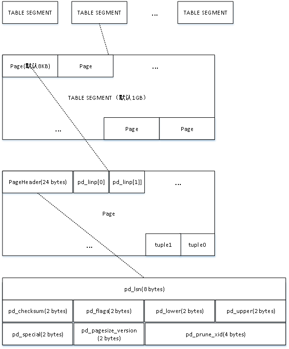

# 0.在一切之前——小端模式

## 0.1 大端模式和小端模式

先来看看什么叫**大端模式**和**小端模式**。例如数字```0x123456```在内存中的存储方式：

- 大端模式

```txt
低地址  ---->  高地址
0x12 | 0x34 | 0x56 
```

- 小端模式

```txt
低地址  ---->  高地址
0x56 | 0x34 | 0x12
```

## 0.2 为什么会有大小端模式

1. 一开始是由于不同架构的CPU处理多个字节数据的顺序不一样，比如```x86的是小段模式```，KEIL C51是大端模式。但是后来互联网流行，TCP/IP协议规定为大端模式，为了跨平台通信，还专门出了网络字节序和主机字节序之间的转换接口（ntohs、htons、ntohl、htonl）

2. 大小端模式各有优势：小端模式强制转换类型时不需要调整字节内容，直接截取低字节即可；大端模式由于符号位为第一个字节，很方便判断正负。

# 1.体系综述

PostgreSQL中每个表都有一个文件（表文件）来进行存储，表文件以表的OID命名。对于超出操作系统大小文件限制的文件，会自动切分为多个文件进行存储。并在原表文件末尾添加一个切分文件的顺序号来标识它们。还有两个附属文件，可见性映射表文件（VM）和空闲空间映射映射表文件（FSM）。前者用于加快VACUUM机制的清理，后者用于表文件空闲空间的管理。同时为了避免打开过多的文件，超过操作系统的文件数限制，PostgreSQL使用了虚拟文件描述符机制（VFD），使得可以操作无限多个文件。

# 2.Tuple and Page

PostgreSQL的存储管理器采用了与操作系统类似的分页存储管理模式，也就是说在内存中是以页面块的形式存在。每个表文件由多个BLCKSZ字节大小的文件组成，每个文件块又包含多个元组。标文件已文件块的形式读取入内存，每个文件块在内存中形成一个页面块。PostgreSQL采用行存模式，也就是说以元组的形式为单位进行数据的存储。

在PG中，同一个表中的元组按照创建顺序插入到表文件中，在进行清理操作清楚被删除的元组后，元组也可以以无序的方式插入到具有空闲空间的文件块中。元组之间不进行关联，这样的表文件称为堆文件。

PG包含四种堆文件，普通堆、临时堆、序列、TOAST表。临时堆和普通堆结构相同，但临时堆仅在会话过程中临时创建，会话结束会自动删除。序列时一种元组值自动增长的特殊堆。TOAST表用来存储大字段的值。

1. PageHeaderData是长度为14字节的页头数据，包括一些文件的信息。
   - 空闲的起始和结束位置；
   - Special space的开始位置；
   - 项指针的开始位置；
   - 标志信息，如果存在空闲项指针，是否所有的元组都可见。
2. Linp是ItemIdData类型的数组，ItemIdData类型由lp_off，lp_flags和lp_len三个属性组成。每一个ItemIdData结构用来指向文件块中的一个元组，其中lp_off是元祖在文件块中的偏移量，而lp_len则说明了该元组的长度，lp_flags表示元组的状态。每个Linp数组的长度为4字节。
3. Freespace是指未分配的空间，新插入页面的元组及其对应的Linp元素都将从这部分空间中来分配，其中Linp元素从Freespace的开头开始分配，而新元祖数据则从尾部开始分配。
4. Special space是特殊空间，用于存放与索引方法相关的特定数据，不同的索引方法在Special space中存放不同的数据。由于索引文件块结构和普通表文件的相同，因此Specialspace在普通快文件中没有使用，其内容将被指为空。

## 2.1 Page

为了摸清PostgreSQL是如何对数据进行存储的，可以在数据库中创建一个数据表```create table test(a int，b char(8));```。然后象征性的导入几条数据（注意不要导入太多，不然数据会变得很长，不太好看）。接着通过```pg_relation_filepath```函数将数据库表的存储位置打印出来。

```shell
postgres=# select pg_relation_filepath('test');
 pg_relation_filepath 
----------------------
 base/13593/16384
(1 row)

```

进入```base/13593```目录，可以发现当前目录中16384文件，该文件即为数据库表test的数据实际存储位置。

> 实例中仅仅象征性的导入了部分数据，当我们把数据规模扩大时，可以发现16384前缀有很多文件(16384.1,15384.2,...)

尝试将16384文件进行内容展示如下：

```txt
$ hexdump -C ~/pgsql/data/base/13593/16384
00000000  01 00 00 00 88 20 2a 12  00 00 00 00 28 00 60 1f  |..... *.....(.`.|
00000010  00 20 04 20 00 00 00 00  d8 9f 4e 00 b0 9f 4e 00  |. . ......N...N.|
00000020  88 9f 4e 00 60 9f 4e 00  00 00 00 00 00 00 00 00  |..N.`.N.........|
00000030  00 00 00 00 00 00 00 00  00 00 00 00 00 00 00 00  |................|
*
00001f60  e5 1b 18 00 00 00 00 00  00 00 00 00 00 00 00 00  |................|
00001f70  04 00 03 00 02 08 18 00  04 00 00 00 13 34 20 20  |.............4  |
00001f80  20 20 20 20 20 05 64 00  e4 1b 18 00 00 00 00 00  |     .d.........|
00001f90  00 00 00 00 00 00 00 00  03 00 02 00 02 08 18 00  |................|
00001fa0  0a 00 00 00 13 61 62 63  20 20 20 20 20 00 00 00  |.....3       .c.|
00001fb0  e3 1b 18 00 00 00 00 00  00 00 00 00 00 00 00 00  |................|
00001fc0  02 00 03 00 02 08 18 00  02 00 00 00 13 32 20 20  |.............2  |
00001fd0  20 20 20 20 20 05 62 00  e2 1b 18 00 00 00 00 00  |     .b.........|
00001fe0  00 00 00 00 00 00 00 00  01 00 03 00 02 08 18 00  |................|
00001ff0  01 00 00 00 13 31 20 20  20 20 20 20 20 05 61 00  |.....1       .a.|
```

PostgreSQL里的page文件存储模式如下：每一个Page文件大小为1GB，此举是为了兼容一些平台，文件过大可能会导致数据错误。也就是下图中的Table Segment。每个page默认8KB，Page结构有Page头和数据部以及特殊数据部分



在每个page文件的头部第一个数据结构就是PageHeaderData，记录了一些信息。接着是linp1~linpN，用来表示指向行数据的指针（```line pointer```）一般用来描述实际数据的存储信息。接着实际数据存储部分。最后是特殊数据部分，用来存储一些特殊数据。

如图可见，数据指针和数据存储是从两头分别向中间写的。

```c
/*
   +----------------+-------+-------+-------+---------+
   | PageHeaderData | linp1 | linp2 | linp3 |   ...   |
   +-----------+----+-------+-------+-------+---------+
   | ... linpN |                                      |
   +-----------+                                      |
   |           ^                                      |
   |        pd_lower                                  |
   |                                                  |
   |                                                  |
   |           pd_upper                               |
   |              v                                   |
   |              +--------+--------------------------+
   |              | tupleN |          ...             |
   +-----+--------+--------+--------+-----------------+
   | ... | tuple3 | tuple2 | tuple1 | "special space" |
   +-----+--------+--------+--------+-----------------+
  									^ pd_special
  */
```
PageHeaderData结构体如下：

```c
typedef struct PageHeaderData
{
	/* XXX LSN is member of *any* block, not only page-organized ones */
	PageXLogRecPtr pd_lsn;		/* LSN: next byte after last byte of xlog
								 * record for last change to this page */
	uint16		pd_checksum;	/* checksum */
	uint16		pd_flags;		/* flag bits, see below */
	LocationIndex pd_lower;		/* offset to start of free space */
	LocationIndex pd_upper;		/* offset to end of free space */
	LocationIndex pd_special;	/* offset to start of special space */
	uint16		pd_pagesize_version;
	TransactionId pd_prune_xid; /* oldest prunable XID, or zero if none */
	ItemIdData	pd_linp[FLEXIBLE_ARRAY_MEMBER]; /* line pointer array */
} PageHeaderData;
```

在PageHeaderData中，pd_lsn占用8个字节。（也就是说其内容xlogid为0x122a0288 xrecoff内容为0x00000010）

（0000000-0000007）122a0288和00000010表示的是pg_lsn的成员xlogid和xrecoff。(需要注意小端存储)

> ```c
> typedef struct
> {
> 	uint32		xlogid;		/* high bits */
> 	uint32		xrecoff;		/* low bits */
> } PageXLogRecPtr;
> ```

（0000008-0000009）0000 表示的是pg_checksum；

（000000a-000000b）0000 表示的是pd_flags；

（000000c-000000d）0028 表示的是从0x0028开始是空闲空间。

（000000e-000000f）1f60表示的是，从1f60开始不再是空闲空间。

（0000010-0000011）2000表示的是pd_special，即存储特殊空间的开始位置。

（0000012-0000013）2004表示的是pd_pagesize_version，即pg页大小和版本。

（0000014-0000017）00000000表示的是pd_pure_xid。

至此PageHeaderData部分数据已经完毕。即24个字节。接下来是linp部分数据。

（0000018-000001b）d8 9f 4e 00（004e9fd8） 这四个字节存储的是pd_linp[0]。

> ```c
> /*
>  * A line pointer on a buffer page.  See buffer page definitions and comments
>  * for an explanation of how line pointers are used.
>  *
>  * In some cases a line pointer is "in use" but does not have any associated
>  * storage on the page.  By convention, lp_len == 0 in every line pointer
>  * that does not have storage, independently of its lp_flags state.
>  */
> typedef struct ItemIdData
> {
> 	unsigned	lp_off:15,		/* offset to tuple (from start of page) */
> 			lp_flags:2,		/* state of line pointer, see below */
> 			lp_len:15;		/* byte length of tuple */
> } ItemIdData;
> typedef ItemIdData *ItemId;
> ```
>
> 00000000 01001110 10011111 11011000
>
> 00000000 0100111  ————————————————  lp_len    39
>
> [00000000 0100111] 0 1 —————————————— lp_flags  LP_NORMAL
>
> [00000000 01001110 1]0011111 11011000 ——————  lp_len    8152

（0001f60-0001f63）：e5 1b 18 00（00181be5） HeapTupleFields的t_xmin，元组插入时候的事务号。

（0001f64-0001f67）：00 00 00 00 表示的是HeapTupleFilelds的t_xmax，代表元组失效时候的事务号。

（0001f68-0001f6b）：00 00 00 00表示的是t_filed3，插入或者删除的命令号，或vacuum full时候的xid。

（0001f6b-0001f71）：00 00 00 00 04 00 ipblkid为0，ip_posid为4。

（0001f72-0001f73）：02 00 表示的是t_infomask2，低11位为表的列数，表示有三列。

（0001f74-0001f75）：02 08表示的是t_infomask 

```c
t_infomask
#define HEAP_XMAX_INVALID		0x0800	
/* t_xmax invalid/aborted */
#define HEAP_HASVARWIDTH		0x0002	
/* has variable-width attribute(s) */
```

（0001f76-0001f76）：t_hoff代表用户数据偏移 0x18 = 24，即8152+24=8176,0x1ff0

（0001f78-0001f7b）：0a 00 00 00 表示的是int类型的10。

（0001f7c-0001f85）：9个字节表示的是char8类型的  ```abc ```后面还有五个空格。 abc的ascii值为0x61-0x63。空格为0x20


## 2.2 Tuple

元组信息中除了存放元组的实际数据，还存放了元祖头部信息，该信息通过HeapTupleHeaderData结构描述，其中记录了操作此元组的事务的ID和命令ID等信息，每个元组都会有一个这样的头部信息。

```c
struct HeapTupleHeaderData
{
	union
	{
		HeapTupleFields t_heap;
		DatumTupleFields t_datum;
	}			t_choice;

	ItemPointerData t_ctid;		/* current TID of this or newer tuple (or a
								 * speculative insertion token) */

	/* Fields below here must match MinimalTupleData! */

#define FIELDNO_HEAPTUPLEHEADERDATA_INFOMASK2 2
	uint16		t_infomask2;	/* number of attributes + various flags */

#define FIELDNO_HEAPTUPLEHEADERDATA_INFOMASK 3
	uint16		t_infomask;		/* various flag bits, see below */

#define FIELDNO_HEAPTUPLEHEADERDATA_HOFF 4
	uint8		t_hoff;			/* sizeof header incl. bitmap, padding */

	/* ^ - 23 bytes - ^ */

#define FIELDNO_HEAPTUPLEHEADERDATA_BITS 5
	bits8		t_bits[FLEXIBLE_ARRAY_MEMBER];	/* bitmap of NULLs */

	/* MORE DATA FOLLOWS AT END OF STRUCT */
};
```

- t_choice
  - t_heap：用于记录对元组执行插入/删除操作的事务ID和命令ID，这些信息主要用于并发控制时检查元组对事物的可见性。
  - t_datum：如果有新元组在内存中形成，此时只需要DatumTupleFields结构来记录元组的长度等信息。
- t_cid：用来记录当前元组和新元素的物理位置。
- t_infomask2：使用11位表示元组的属性个数，其他用于包括用于HOT技术及其元组可见性的标志位。
- t_infomask：用于标识元组当前的状态，比如元组是否具有OID、是否有空属性，t_infomask的每一位对应不同的状态。
- t_hoff：表示该元组头的大小。
- ——bits[]：表示该元组哪些字段为空。

