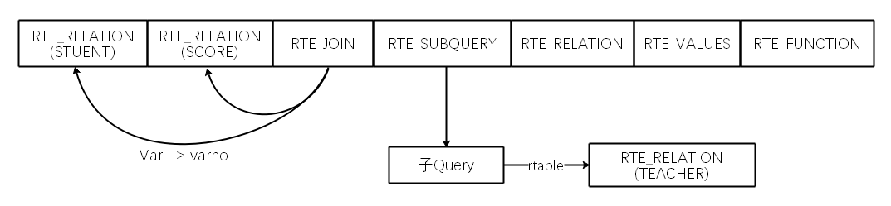
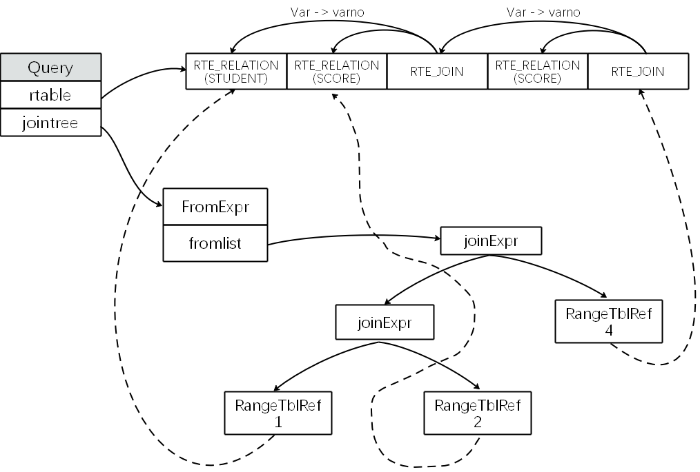
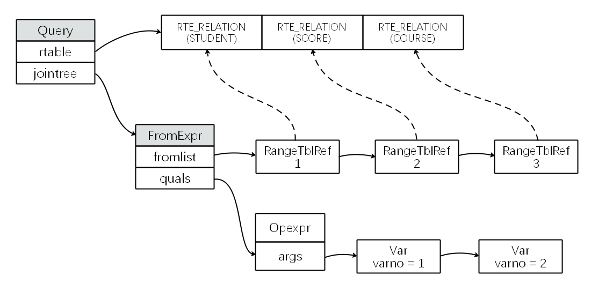
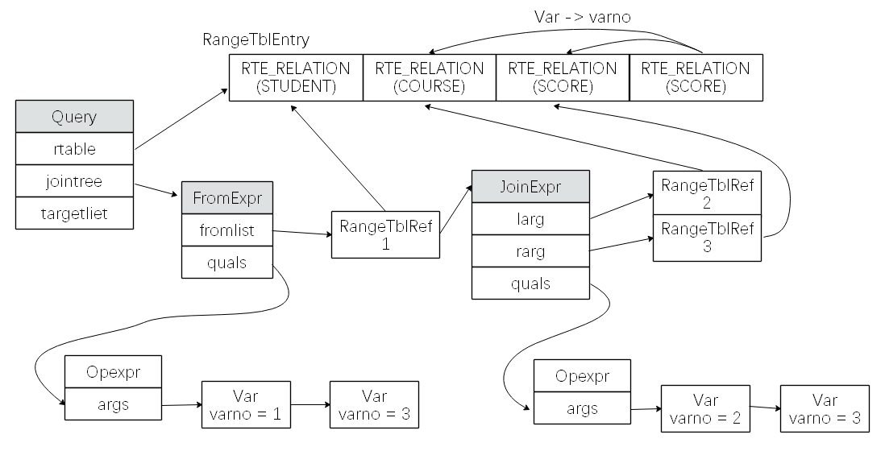

# 查询树

​		一般来说数据库在完成了词法分析、语法分析、语义分析后会生成一颗查询树。这棵树往往代表着关系代数的一种关系。这个查询树就可以输入给查询优化器，所以需要优先分析一下这个查询树的结构和成员代表的意义。

## 必要的数据结构

 ### Var

​		Var是结构体中表示查询涉及到的表的列属性，语法分析中涉及到列信息的记录使用的是，`ColumnRef`结构体，语义分析结束后，会将语法树中的`ColumnRef`替换成Var用来表示一个列属性。此Var结构体主要作用是标记rtable结构体中的顺序等信息。

vars一般被用在 标注某个关系（join等)设计到的列属性的关系。 

```c
typedef struct Var
 {
     Expr        xpr;
     Index       varno;          /* 列属性所在的表在Query->rtable中的rindex */    
    							 /* 用来确定列属性所在表的“编号”，这个编号来自Query */
    							 /* 中的rtable，查询语句中每一个表都会记录在rtable中 */
        					     /* 其在rtable中的“编号”是唯一的确定值。 */

     AttrNumber  varattno;       /* attribute number of this var, or zero for
                                  * all attrs ("whole-row Var") */
    							 /* varattno确定了这个列是表中的第几列 */
        
     Oid         vartype;        /* pg_type OID for the type of this var */
     int32       vartypmod;      /* pg_attribute typmod value */
        					     
        					     /* vartype和vartypmod确定了和列属性的类型有关 */    
        					     /* varnoold/varaottno通常和varno/varattno相同 */
        					     /* 但是等价变化的过程中。 */
        
     Oid         varcollid;      /* OID of collation, or InvalidOid if none */
     Index       varlevelsup;    /* for subquery variables referencing outer
                                  * relations; 0 in a normal var, >0 means N
                                  * levels up */
    							 /* varlevelsup确定了列属性对应的表所在的层次 */
               
     Index       varnosyn;       /* syntactic relation index (0 if unknown) */
     AttrNumber  varattnosyn;    /* syntactic attribute number */
     int         location;       /* token location, or -1 if unknown */    
 } Var;
```


### RangeTblEntry

​		范围表条目(`RTE`)主要描述查询中出现的表，包括子查询、函数查询等。`RangeTblEntry`根据`RTEKind`来判断自己的类型，以便于后续逻辑层面的处理。说白了就是整个SQL语句涉及到了哪些”表“，这个”表“可以是实际的表，也可是子查询、函数计算、数值计算抽象成的”表“。

>需要注意的是，不同RTE类型的RangeTblEntry，其成员用途也不一样。比方说relid和relkind这两个成员：当RTE类型为RTE_RELATION时，这两个参数是有用的；而对于RTE_SUBQUERY类型，这两个成员是没用的，有效的是subquery成员。
>

```c
typedef struct RTEKind
{
	RTE_RELATION，
    RTE_SUBQUERY，
    RTE_JOIN,
    RTE_FUNCTION,
    RTE_TABLEFUNC,
    RTE_VALUES,
    RTE_CTE,
    RTE_NAMESPACESTORE
} RTEKind;
```


```c
typedef struct RangeTblEntry
{
     NodeTag     type;
 
     RTEKind     rtekind;        /* 见上述RTEKind */
 
     /*
      * XXX the fields applicable to only some rte kinds should be merged into
      * a union.  I didn't do this yet because the diffs would impact a lot of
      * code that is being actively worked on.  FIXME someday.
      */
 
     Oid         relid;          /* OID of the relation */
     char        relkind;        /* relation kind (see pg_class.relkind) */
     int         rellockmode;    /* lock level that query requires on the rel */
     struct TableSampleClause *tablesample;  /* sampling info, or NULL */
 
     /*
      * Fields valid for a subquery RTE (else NULL):
      */
     Query      *subquery;       /* the sub-query */
     bool        security_barrier;   /* is from security_barrier view? */
 
     /*
      * Fields valid for a join RTE (else NULL/zero):
      *
      * joinaliasvars is a list of (usually) Vars corresponding to the columns
      * of the join result.  An alias Var referencing column K of the join
      * result can be replaced by the K'th element of joinaliasvars --- but to
      * simplify the task of reverse-listing aliases correctly, we do not do
      * that until planning time.  In detail: an element of joinaliasvars can
      * be a Var of one of the join's input relations, or such a Var with an
      * implicit coercion to the join's output column type, or a COALESCE
      * expression containing the two input column Vars (possibly coerced).
      * Elements beyond the first joinmergedcols entries are always just Vars,
      * and are never referenced from elsewhere in the query (that is, join
      * alias Vars are generated only for merged columns).  We keep these
      * entries only because they're needed in expandRTE() and similar code.
      *
      * Within a Query loaded from a stored rule, it is possible for non-merged
      * joinaliasvars items to be null pointers, which are placeholders for
      * (necessarily unreferenced) columns dropped since the rule was made.
      * Also, once planning begins, joinaliasvars items can be almost anything,
      * as a result of subquery-flattening substitutions.
      *
      * joinleftcols is an integer list of physical column numbers of the left
      * join input rel that are included in the join; likewise joinrighttcols
      * for the right join input rel.  (Which rels those are can be determined
      * from the associated JoinExpr.)  If the join is USING/NATURAL, then the
      * first joinmergedcols entries in each list identify the merged columns.
      * The merged columns come first in the join output, then remaining
      * columns of the left input, then remaining columns of the right.
      *
      * Note that input columns could have been dropped after creation of a
      * stored rule, if they are not referenced in the query (in particular,
      * merged columns could not be dropped); this is not accounted for in
      * joinleftcols/joinrighttcols.
      */
     JoinType    jointype;       /* type of join */
     int         joinmergedcols; /* number of merged (JOIN USING) columns */
     List       *joinaliasvars;  /* list of alias-var expansions */
     List       *joinleftcols;   /* left-side input column numbers */
     List       *joinrightcols;  /* right-side input column numbers */

    ... ...
        
} RangeTblEntry;
```

前文叙述过`RangeTblEntry`是用来标记SQL语句涉及的“表”的结构体。假设我们有如下的SQL语句：

```sql
SELECT 
	* 
FROM 
	STUDENT LEFT JOIN SCORE ON TRTUE,
	(SELECT * FROM TEACHER) AS t,
	COURSE,
	(VALUES(1,1)) AS NUM(x, y),
	GENERATE_SERIES(1,10) AS GS(z);
```

| 类型         | 对应SQL语句                     |
| ------------ | ------------------------------- |
| RTE_RELATION | COURSE                          |
| RTE_JOIN     | STUDENT LEFT JOIN SCORE ON TRUE |
| RTE_SUBQUERY | (SELECT * FROM TEACHER)         |
| RTE_FUNCTION | GENERATE_SERIES(1，10) AS GZ(z) |
| RTE_VALUES   | (VALUES(1,2) AS NUM(x,y))       |

需要注意的是`RangeTblEntry`往往是是作为`Query->rtable`这个List类型中的一个元素。整个`Query->rtable`标记了整句SQL涉及到的所有范围表信息，其中关系用`RangeTblEntry`一一表明，并使用`rtable`这个List结构串在一起。


如上图所示，整个SQL语句描述的关系就非常直观的表示出来了，其中用到了单纯的RELATION，用到了两表的JOIN，用到了VALUES，用到了FUNCTION，还用到了子查询的结构体嵌套。

### RangeTblRef

​	前文叙述过的`RangeTblEntry`是用来描述涉及到的表的结构体，保存在`Query->rtable`的List中。关系表达清楚了还不够，还需要保存关系代数中的连接操作。这就需要一份标记上述范围表的join信息。但是在存储一份`RangeTblEntry`会造成信息冗余和维护困难。这里用一个`RangeTblRef`的结构巧妙的标记连接操作。即`RangeTblRef`作为树形结构的叶子节点，表明join的树状关系，又通过指针标记其所对应的实际范围表。

```c
typedef struct RangeTblRef
{
     NodeTag     type;
     int         rtindex;
} RangeTblRef;
```


### JoinExpr

查询语句中如果需要显示的指定两个表之间的关系，例如A LEFT JOIN B ON Pad。就需要一个`JoinExpr`结构体来表示它们。

```c
typedef struct JoinExpr
{
     NodeTag     type;
     JoinType    jointype;       /* type of join */
     bool        isNatural;      /* Natural join? Will need to shape table */
     Node       *larg;           /* left subtree */
     Node       *rarg;           /* right subtree */
     List       *usingClause;    /* USING clause, if any (list of String) */
     Node       *quals;          /* qualifiers on join, if any */
     Alias      *alias;          /* user-written alias clause, if any */
     int         rtindex;        /* RT index assigned for join, or 0 */
} JoinExpr;
```

```sql
SELECT * FROM STUDENT LEFT JOIN SCORE ON TRUE LEFT JOIN COURSE ON SCORE.cno = COURSE.cno;
```

上述语句指明了三个表之间的连接关系，就需要两个`JoinExpr`表述这种连接关系，如右下角所示。

由`RangeTblRef`组成的树形结构表示了join的形式，而且通过其属性标记了在`rtable`中的具体位置。



### FromExpr

`FromExpr`和`JoinExpr`是用来表示表之间的连接关系的结构体。通常来说，`FromExpr`中的各个表之间的连接关系是`Inner Join`，这样就可以在`FromExpr -> fromlist`中保存任意多个表。

```c
typedef struct FromExpr
{
     NodeTag     type;
     List       *fromlist;       /* List of join subtrees */
     Node       *quals;          /* qualifiers on join, if any */
} FromExpr;
```

```sql
SELECT * FROM STUDENT, SCORE LEFT JOIN COURSE ON SCORE.cno = COURSE.cno;
```
通过`FromExpr`结构体的作用，链表`fromlist`中有三个`RangeTblRef`，分别对应三个`RTE_RELATION`。


### Query

`Query`结构体是查询优化模块的输入结构体参数，这个结构体源自于语法分析模块。一个SQL语句经过了词法、语法、语义分析后会得出`Query`查询树。

这个查询树一般会经过优化，并在优化后形成一个新的查询树。

```c
typedef struct Query
{
     NodeTag     type;
 
     CmdType     commandType;    /* select|insert|update|delete|utility */
 
     QuerySource querySource;    /* where did I come from? */
 
     uint64      queryId;        /* query identifier (can be set by plugins) */
 
     bool        canSetTag;      /* do I set the command result tag? */
 
     Node       *utilityStmt;    /* non-null if commandType == CMD_UTILITY */
 
     int         resultRelation; /* rtable index of target relation for
                                  * INSERT/UPDATE/DELETE; 0 for SELECT */
 
     bool        hasAggs;        /* has aggregates in tlist or havingQual */
     bool        hasWindowFuncs; /* has window functions in tlist */
     bool        hasTargetSRFs;  /* has set-returning functions in tlist */
     bool        hasSubLinks;    /* has subquery SubLink */
     bool        hasDistinctOn;  /* distinctClause is from DISTINCT ON */
     bool        hasRecursive;   /* WITH RECURSIVE was specified */
     bool        hasModifyingCTE;    /* has INSERT/UPDATE/DELETE in WITH */
     bool        hasForUpdate;   /* FOR [KEY] UPDATE/SHARE was specified */
     bool        hasRowSecurity; /* rewriter has applied some RLS policy */
 
     List       *cteList;        /* WITH list (of CommonTableExpr's) */
 
     List       *rtable;         /* list of range table entries */
     FromExpr   *jointree;       /* table join tree (FROM and WHERE clauses) */
 
     List       *targetList;     /* target list (of TargetEntry) */
 
     OverridingKind override;    /* OVERRIDING clause */
 
     OnConflictExpr *onConflict; /* ON CONFLICT DO [NOTHING | UPDATE] */

     List       *returningList;  /* return-values list (of TargetEntry) */
 
     List       *groupClause;    /* a list of SortGroupClause's */
 
     List       *groupingSets;   /* a list of GroupingSet's if present */
 
     Node       *havingQual;     /* qualifications applied to groups */
 
     List       *windowClause;   /* a list of WindowClause's */
 
     List       *distinctClause; /* a list of SortGroupClause's */
 
     List       *sortClause;     /* a list of SortGroupClause's */
 
     Node       *limitOffset;    /* # of result tuples to skip (int8 expr) */
     Node       *limitCount;     /* # of result tuples to return (int8 expr) */
    
     LimitOption limitOption;    /* limit type */
 
     List       *rowMarks;       /* a list of RowMarkClause's */
 
     Node       *setOperations;  /* set-operation tree if this is top level of
                                  * a UNION/INTERSECT/EXCEPT query */
 
     List       *constraintDeps; /* a list of pg_constraint OIDs that the query
                                  * depends on to be semantically valid */
 
     List       *withCheckOptions;   /* a list of WithCheckOption's (added
                                      * during rewrite) */
 
     /*
      * The following two fields identify the portion of the source text string
      * containing this query.  They are typically only populated in top-level
      * Queries, not in sub-queries.  When not set, they might both be zero, or
      * both be -1 meaning "unknown".
      */
     int         stmt_location;  /* start location, or -1 if unknown */
     int         stmt_len;       /* length in bytes; 0 means "rest of string" */
} Query;
```

- rtable : 在查询中`FROM`子句后面会有指出需要进行查询的一个范围，可能是对某范围进行查询，也可能是对几个范围表做连接操作，`rtable`中记录了这些表。作为一个`List`类型的指针，所有需要查询的范围表就记录在这个`List`，每个都用`RangeTblEntry`结构体表示，因此`rtable`是一个`RangeTblEntry`组成的链表。
- jointree : `rtable`中列出了查询语句的表，但是没有明确指出各个表之间的连接关系，这个连接关系则通过`jointree`来表明，`jointree`是一个`FromExpr`类型的结构体，它有3种类型的节点：`FromExpr`、`JoinExpr`和`RangeTblRef`。
- targetlist : `targetlist`中包含了需要投影的例，也就是`SFW`查询中的投影列。

```sql
select st.sname, c.cname, sc.degree from student st, course c inner join scoure sc on c.cno = sc.cno where st.sno = sc.sno ; 
```





```
LOG:  parse tree:
DETAIL:     
{QUERY 
   :commandType 1 
   ... ...
   :cteList <> 
   :rtable (   ------>   rtable指出要查询的范围 
      {RTE                             -------------------->   第一个RELATION   student
      :alias 
         {ALIAS 
         :aliasname st 
         :colnames <>
         }
      :eref 
         {ALIAS 
         :aliasname st 
         :colnames ("sno" "sname")
         }
      :rtekind 0 
      :relid 39844 
      :relkind r 
      :rellockmode 1 
      :tablesample <> 
      :lateral false 
      :inh true 
      :inFromCl true 
      :requiredPerms 2 
      :checkAsUser 0 
      :selectedCols (b 8 9)
      :insertedCols (b)
      :updatedCols (b)
      :extraUpdatedCols (b)
      :securityQuals <>
      }
      {RTE                             -------------->  第二个relation   course
      :alias 
         {ALIAS 
         :aliasname c 
         :colnames <>
         }
      :eref 
         {ALIAS 
         :aliasname c 
         :colnames ("cno" "cname" "")
         }
      :rtekind 0 
      :relid 39849 
      :relkind r 
      :rellockmode 1 
      :tablesample <> 
      :lateral false 
      :inh true 
      :inFromCl true 
      :requiredPerms 2 
      :checkAsUser 0 
      :selectedCols (b 8 9)
      :insertedCols (b)
      :updatedCols (b)
      :extraUpdatedCols (b)
      :securityQuals <>
      }
      {RTE                          ------------>    第三个 relation  scoure
      :alias 
         {ALIAS 
         :aliasname sc 
         :colnames <>
         }
      :eref 
         {ALIAS 
         :aliasname sc 
         :colnames ("sno" "cno" "degree")
         }
      :rtekind 0 
      :relid 39854 
      :relkind r 
      :rellockmode 1 
      :tablesample <> 
      :lateral false 
      :inh true 
      :inFromCl true 
      :requiredPerms 2 
      :checkAsUser 0 
      :selectedCols (b 8 9 10)
      :insertedCols (b)
      :updatedCols (b)
      :extraUpdatedCols (b)
      :securityQuals <>
      }
      {RTE                         --------------> join关系  course join score 
      :alias <> 
      :eref 
         {ALIAS 
         :aliasname unnamed_join 
         :colnames ("cno" "cname" "sno" "cno" "degree")  
         }
      :rtekind 2 
      :jointype 0 
      :joinmergedcols 0 
      :joinaliasvars (
         {VAR                                     -------->  第二个表的第一列：cno
         :varno 2 
         :varattno 1 
         :vartype 23 
         :vartypmod -1 
         :varcollid 0 
         :varlevelsup 0 
         :varnosyn 2 
         :varattnosyn 1 
         :location -1
         }
         {VAR                                    -------->  第二个表第二列：cname
         :varno 2 
         :varattno 2 
         :vartype 1043 
         :vartypmod 36 
         :varcollid 100 
         :varlevelsup 0 
         :varnosyn 2 
         :varattnosyn 2 
         :location -1
         }
         {VAR                                   -------->  第三个表第一列：sno
         :varno 3 
         :varattno 1 
         :vartype 23 
         :vartypmod -1 
         :varcollid 0 
         :varlevelsup 0 
         :varnosyn 3 
         :varattnosyn 1 
         :location -1
         }
         {VAR                                  -------->  第三个表第二列：cno
         :varno 3 
         :varattno 2 
         :vartype 23 
         :vartypmod -1 
         :varcollid 0 
         :varlevelsup 0 
         :varnosyn 3 
         :varattnosyn 2 
         :location -1
         }
         {VAR                                 -------->  第三个表第三列：degree
         :varno 3 
         :varattno 3 
         :vartype 23 
         :vartypmod -1 
         :varcollid 0 
         :varlevelsup 0 
         :varnosyn 3 
         :varattnosyn 3 
         :location -1
         }
      )
      :joinleftcols (i 1 2)
      ... ...
      }
   )
   :jointree         ------------>   表明各个表之间的连接关系
      {FROMEXPR 
      :fromlist (
         {RANGETBLREF          -------->  fromlist的第一个元素   RangeTblRef
         :rtindex 1
         }
         {JOINEXPR             -------->  fromlist的第二个元素   joinExpr关系   
         :jointype 0 
         :isNatural false 
         :larg                   
            {RANGETBLREF                  -------> 第一个   join表    id为 2
            :rtindex 2
            }
         :rarg 
            {RANGETBLREF                  -------> 第二个   join表    id为3
            :rtindex 3
            }
         :usingClause <> 
         :quals                           -------> join条件(隶属于fromlist中的jointree)
            {OPEXPR 						|--------> course.cno = score.cno
            ... ...
            :args (
               {VAR 						    -----> course.cno
               :varno 2 
               :varattno 1 
               :vartype 23 
               :vartypmod -1 
               :varcollid 0 
               :varlevelsup 0 
               :varnosyn 2 
               :varattnosyn 1 
               :location 86
               }
               {VAR 							-----> score.cno
               :varno 3 
               :varattno 2 
               :vartype 23 
               :vartypmod -1 
               :varcollid 0 
               :varlevelsup 0 
               :varnosyn 3 
               :varattnosyn 2 
               :location 94
               }
            )
            :location 92
            }
         :alias <> 
         :rtindex 4
         }
      )
      :quals                     ----------> where条件(隶属于FromExpr)
         {OPEXPR 					|----------> student.sno = score.sno
         ... ...
         :args (							
            {VAR 							------> student.sno 
            :varno 1 
            :varattno 1 
            :vartype 23 
            :vartypmod -1 
            :varcollid 0 
            :varlevelsup 0 
            :varnosyn 1 
            :varattnosyn 1 
            :location 107
            }
            {VAR 							------> score.sno
            :varno 3 
            :varattno 1 
            :vartype 23 
            :vartypmod -1 
            :varcollid 0 
            :varlevelsup 0 
            :varnosyn 3 
            :varattnosyn 1 
            :location 116
            }
         )
         :location 114
         }
      }
   :targetList (
      ... ...
   )
   :override 0 
   ... ...
   :stmt_len 123
}
```

