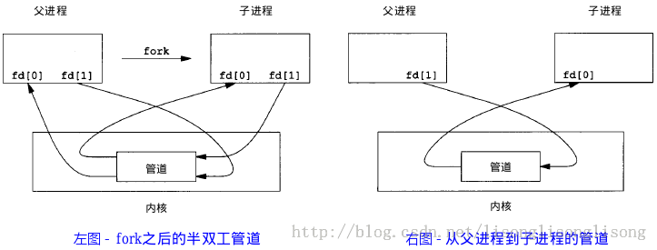

# 前言

**进程间通信（IPC，InterProcess Communication）**指的是不同进程之间传播和交流信息的一种途径，主要可以用来多进程直接的协调调度。可以通过巧妙的进程间通信，实现多进程之间无不干扰的和谐工作。

# PIPE无名管道

管道方式是比较简单的、比较古老的Unix进程间通信的方法。

## 特点

- **数据的流向为单向，只能从某个进程流向另一个进程**，采用半双工模式工作。具有固定的写端、读端；
- 只能作用于**亲属关系的进程之间**，即父子进程之间或者兄弟进程之间；
- 是一种比较特殊的文件，一个进程使用write模式，另一个进程使用read模式。**这个所谓的文件不存储于文件系统，只存在于内存中。**

## 原理

```c
#include <unistd.h>
int pipe(int fd[2]);	//  成功为0， 失败为-1；
						//	fd[0]为读，fd[1]为写；
```

建立管道的时候，会闯将两个文件描述符：

- `fd[0]`	:	读
- `fd[1]`	:	写


## 例子

如上述IPC图所示，当一个管道建立时候，会有两个文件描述符，而且在内存中会有管道与其对应。与此同时，单个进程中的管道几乎没有任何用处，所以pipe的进程接着就可以调用fork函数。子进程顺带着继承了父进程的IPC通道。如下图所示：



```c
#include <stdio.h>
#include <unistd.h>

int main()
{
    int fd[2];  // 两个文件描述符
    pid_t pid;
    char buff[20];

    if(pipe(fd) < 0)  // 创建管道
        printf("Create Pipe Error!\n");

    if((pid = fork()) < 0)  // 创建子进程
        printf("Fork Error!\n");
    else if(pid > 0)  // 父进程
    {
        close(fd[0]); // 父进程关闭读端，准备向内写入数据
        write(fd[1], "hello world\n", 12);
    }
    else
    {
        close(fd[1]); // 子进程关闭写端，准备从中读取数据
        read(fd[0], buff, 20);
        printf("%s", buff);
    }

    return 0;
}
```

# FIFO命名管道

FIFO，称为命名管道，也是一种"文件"。

## 特点

- FIFO可以在**无关进程**之间交换数据，不同于无名管道；
- 是一种文件，以一种特殊设备文件的形式**被存储在文件系统中**。

## 原理

```c
#include <sys/stat.h>
// 返回值：成功返回0，出错返回-1
int mkfifo(const char *pathname, mode_t mode);
```

这个mode参数与`open`函数中的mode相同。一旦创建了FIFO，就可以用一般的文件I/O操作它。

当open一个FIFO时候，会涉及到是否设置非阻塞标志(`O_NONBLOCK`)的区别：

- 若没有指定`O_NONBLOCK`(默认)，只读open要阻塞到某个其他进程为写而打开此FIFO。类似的，只写open要阻塞到某个进程为读而打开它。
- 若指定了`O_NONBLOCK`，则只读open立即返回。而只写open将出错返回-1，如果没有进程已经为读而打开这个FIFO，其errno置为ENXIO。

总的来说，FIFO的通信方式就类似于在进程中使用文件的方式彼此传输数据，只不过FIFO类型的文件同时兼具管道的特征。数据被读取以后，数据也会被响应删除，并且遵循**先进先出（First In First OUT）**。

## 例子

**write_fifo.c**

```c
#include<stdio.h>
#include<stdlib.h>   // exit
#include<fcntl.h>    // O_WRONLY
#include<sys/stat.h>
#include<time.h>     // time

int main()
{
    int fd;
    int n, i;
    char buf[1024];
    time_t tp;

    printf("I am %d process.\n", getpid()); // 说明进程ID

    if((fd = open("fifo1", O_WRONLY)) < 0) // 以写打开一个FIFO
    {
        perror("Open FIFO Failed");
        exit(1);
    }

    for(i=0; i<10; ++i)
    {
        time(&tp);  // 取系统当前时间
        n=sprintf(buf,"Process %d's time is %s",getpid(),ctime(&tp));
        printf("Send message: %s", buf); // 打印
        if(write(fd, buf, n+1) < 0)  // 写入到FIFO中
        {
            perror("Write FIFO Failed");
            close(fd);
            exit(1);
        }
        sleep(1);  // 休眠1秒
    }

    close(fd);  // 关闭FIFO文件
    return 0;
}
```

read_fifo.c

```c
#include<stdio.h>
#include<stdlib.h>
#include<errno.h>
#include<fcntl.h>
#include<sys/stat.h>

int main()
{
    int fd;
    int len;
    char buf[1024];

    if(mkfifo("fifo1", 0666) < 0 && errno!=EEXIST) // 创建FIFO管道
        perror("Create FIFO Failed");

    if((fd = open("fifo1", O_RDONLY)) < 0)  // 以读打开FIFO
    {
        perror("Open FIFO Failed");
        exit(1);
    }

    while((len = read(fd, buf, 1024)) > 0) // 读取FIFO管道
        printf("Read message: %s", buf);

    close(fd);  // 关闭FIFO文件
    return 0;
}
```


# 消息队列

消息队列是消息的链表，**存放在内核中**。一个消息队列由一个标识符（即队列ID）来标识。通常被用来在不同进程发送特定格式的消息数据。

## 特点

- 消息队列是面向记录的，其中的消息具有特定的**格式**以及特定的**优先级**。
- 消息队列**独立于发送和接收的进程**，进程终止时，消息队列及其内容不会删除。也就是说某个进程写入消息队列的消息，可以在未来一段时间后，被另一个进程读取。
- 消息队列可以实现**消息的随机查询**，消息不一定要以FIFO方式读取，也可以按照消息类型。

## 原理

```c
#include <sys/msg.h>
// 创建或打开消息队列：成功返回队列ID，失败返回-1
int msgget(key_t key, int flag);
// 添加消息：成功返回0，失败返回-1
int msgsnd(int msqid, const void *ptr, size_t size, int flag);
// 读取消息：成功返回消息数据的长度，失败返回-1
int msgrcv(int msqid, void *ptr, size_t size, long type,int flag);
// 控制消息队列：成功返回0，失败返回-1
int msgctl(int msqid, int cmd, struct msqid_ds *buf);
```

在以下两种情况下，`msgget`将创建一个新的消息队列：

- 如果没有与键值key相对应的消息队列，并且flag中包含了`IPC_CREAT`标志位。
- key参数为`IPC_PRIVATE`。

函数`msgrcv`在读取消息队列时，type参数有下面几种情况：

- `type == 0`，返回队列中的第一个消息；
- `type > 0`，返回队列中消息类型为 type 的第一个消息；
- `type < 0`，返回队列中消息类型值小于或等于 type 绝对值的消息，如果有多个，则取类型值最小的消息。

可以看出，type值非 0 时用于以非先进先出次序读消息。也可以把 type 看做优先级的权值。

## 例子

 下面写了一个简单的使用消息队列进行IPC的例子，服务端程序一直在等待特定类型的消息，当收到该类型的消息以后，发送另一种特定类型的消息作为反馈，客户端读取该反馈并打印出来。 

msg_server.c

```c
#include <stdio.h>
#include <stdlib.h>
#include <sys/msg.h>

// 用于创建一个唯一的key
#define MSG_FILE "/etc/passwd"

// 消息结构
struct msg_form {
    long mtype;
    char mtext[256];
};

int main()
{
    int msqid;
    key_t key;
    struct msg_form msg;

    // 获取key值
    if((key = ftok(MSG_FILE,'z')) < 0)
    {
        perror("ftok error");
        exit(1);
    }

    // 打印key值
    printf("Message Queue - Server key is: %d.\n", key);

    // 创建消息队列
    if ((msqid = msgget(key, IPC_CREAT|0777)) == -1)
    {
        perror("msgget error");
        exit(1);
    }

    // 打印消息队列ID及进程ID
    printf("My msqid is: %d.\n", msqid);
    printf("My pid is: %d.\n", getpid());

    // 循环读取消息
    for(;;)
    {
        msgrcv(msqid, &msg, 256, 888, 0);// 返回类型为888的第一个消息
        printf("Server: receive msg.mtext is: %s.\n", msg.mtext);
        printf("Server: receive msg.mtype is: %d.\n", msg.mtype);

        msg.mtype = 999; // 客户端接收的消息类型
        sprintf(msg.mtext, "hello, I'm server %d", getpid());
        msgsnd(msqid, &msg, sizeof(msg.mtext), 0);
    }
    return 0;
}
```

msg_client.c

```c
#include <stdio.h>
#include <stdlib.h>
#include <sys/msg.h>

// 用于创建一个唯一的key
#define MSG_FILE "/etc/passwd"

// 消息结构
struct msg_form {
    long mtype;
    char mtext[256];
};

int main()
{
    int msqid;
    key_t key;
    struct msg_form msg;

    // 获取key值
    if ((key = ftok(MSG_FILE, 'z')) < 0)
    {
        perror("ftok error");
        exit(1);
    }

    // 打印key值
    printf("Message Queue - Client key is: %d.\n", key);

    // 打开消息队列
    if ((msqid = msgget(key, IPC_CREAT|0777)) == -1)
    {
        perror("msgget error");
        exit(1);
    }

    // 打印消息队列ID及进程ID
    printf("My msqid is: %d.\n", msqid);
    printf("My pid is: %d.\n", getpid());

    // 添加消息，类型为888
    msg.mtype = 888;
    sprintf(msg.mtext, "hello, I'm client %d", getpid());
    msgsnd(msqid, &msg, sizeof(msg.mtext), 0);

    // 读取类型为777的消息
    msgrcv(msqid, &msg, 256, 999, 0);
    printf("Client: receive msg.mtext is: %s.\n", msg.mtext);
    printf("Client: receive msg.mtype is: %d.\n", msg.mtype);
    return 0;
}
```


# 信号

 **信号量（semaphore）**与已经介绍过的 IPC 结构不同，它是一个计数器。信号量的作用**不是直接发送通信的数据**，而是用于实现**进程之间的互斥或者同步**。

## 特点

- 信号量用于进程间同步，如果要实现进程间通信需要使用共享内存。
- 信号量基于操作系统的PV操作，程序对信号量的操作都是原子操作。
- 每次对信号量的PV操作不仅限于信号量值+1或者-1，而且可以加减任意正整数。
- 支持信号量组。

## 原理

最简单的信号量是只能取 0 和 1 的变量，这也是信号量最常见的一种形式，叫做**二值信号量（Binary Semaphore）**。而可以取多个正整数的信号量被称为通用信号量。

Linux 下的信号量函数都是在通用的信号量数组上进行操作，而不是在一个单一的二值信号量上进行操作。

```c
#include <sys/sem.h>
// 创建或获取一个信号量组：若成功返回信号量集ID，失败返回-1
int semget(key_t key, int num_sems, int sem_flags);
// 对信号量组进行操作，改变信号量的值：成功返回0，失败返回-1
int semop(int semid, struct sembuf semoparray[], size_t numops);
// 控制信号量的相关信息
int semctl(int semid, int sem_num, int cmd, ...);
```

当`semget`创建新的信号量集合时，必须指定集合中信号量的个数（即`num_sems`），通常为1； 如果是引用一个现有的集合，则将`num_sems`指定为 0 。

在`semop`函数中，`sembuf`结构的定义如下：

```c
struct sembuf
{
    short sem_num; // 信号量组中对应的序号，0～sem_nums-1
    short sem_op;  // 信号量值在一次操作中的改变量
    short sem_flg; // IPC_NOWAIT, SEM_UNDO
}
```

其中 sem_op 是一次操作中的信号量的改变量：

- 若`sem_op > 0`，表示进程释放相应的资源数，将 sem_op 的值加到信号量的值上。如果有进程正在休眠等待此信号量，则换行它们。

- 若`sem_op < 0`，请求 sem_op 的绝对值的资源。

  - 如果相应的资源数可以满足请求，则将该信号量的值减去sem_op的绝对值，函数成功返回。

  - 当相应的资源数不能满足请求时，这个操作与

    ```
    sem_flg
    ```

    有关。

    - sem_flg 指定`IPC_NOWAIT`，则semop函数出错返回`EAGAIN`。

    - sem_flg 没有指定

      ```
      IPC_NOWAIT
      ```

      ，则将该信号量的semncnt值加1，然后进程挂起直到下述情况发生：

      1. 当相应的资源数可以满足请求，此信号量的semncnt值减1，该信号量的值减去sem_op的绝对值。成功返回；
      2. 此信号量被删除，函数smeop出错返回EIDRM；
      3. 进程捕捉到信号，并从信号处理函数返回，此情况下将此信号量的semncnt值减1，函数semop出错返回EINTR

- 若`sem_op == 0`，进程阻塞直到信号量的相应值为0：

  - 当信号量已经为0，函数立即返回。

  - 如果信号量的值不为0，则依据

    ```
    sem_flg
    ```

    决定函数动作：

    - sem_flg指定`IPC_NOWAIT`，则出错返回`EAGAIN`。

    - sem_flg没有指定

      ```
      IPC_NOWAIT
      ```

      ，则将该信号量的semncnt值加1，然后进程挂起直到下述情况发生：

      1. 信号量值为0，将信号量的semzcnt的值减1，函数semop成功返回；
      2. 此信号量被删除，函数smeop出错返回EIDRM；
      3. 进程捕捉到信号，并从信号处理函数返回，在此情况将此信号量的semncnt值减1，函数semop出错返回EINTR

在`semctl`函数中的命令有多种，这里就说两个常用的：

- `SETVAL`：用于初始化信号量为一个已知的值。所需要的值作为联合semun的val成员来传递。在信号量第一次使用之前需要设置信号量。
- `IPC_RMID`：删除一个信号量集合。如果不删除信号量，它将继续在系统中存在，即使程序已经退出，它可能在你下次运行此程序时引发问题，而且信号量是一种有限的资源。

## 例子

```c
#include<stdio.h>
#include<stdlib.h>
#include<sys/sem.h>

// 联合体，用于semctl初始化
union semun
{
    int              val; /*for SETVAL*/
    struct semid_ds *buf;
    unsigned short  *array;
};

// 初始化信号量
int init_sem(int sem_id, int value)
{
    union semun tmp;
    tmp.val = value;
    if(semctl(sem_id, 0, SETVAL, tmp) == -1)
    {
        perror("Init Semaphore Error");
        return -1;
    }
    return 0;
}

// P操作:
//    若信号量值为1，获取资源并将信号量值-1
//    若信号量值为0，进程挂起等待
int sem_p(int sem_id)
{
    struct sembuf sbuf;
    sbuf.sem_num = 0; /*序号*/
    sbuf.sem_op = -1; /*P操作*/
    sbuf.sem_flg = SEM_UNDO;

    if(semop(sem_id, &sbuf, 1) == -1)
    {
        perror("P operation Error");
        return -1;
    }
    return 0;
}

// V操作：
//    释放资源并将信号量值+1
//    如果有进程正在挂起等待，则唤醒它们
int sem_v(int sem_id)
{
    struct sembuf sbuf;
    sbuf.sem_num = 0; /*序号*/
    sbuf.sem_op = 1;  /*V操作*/
    sbuf.sem_flg = SEM_UNDO;

    if(semop(sem_id, &sbuf, 1) == -1)
    {
        perror("V operation Error");
        return -1;
    }
    return 0;
}

// 删除信号量集
int del_sem(int sem_id)
{
    union semun tmp;
    if(semctl(sem_id, 0, IPC_RMID, tmp) == -1)
    {
        perror("Delete Semaphore Error");
        return -1;
    }
    return 0;
}


int main()
{
    int sem_id;  // 信号量集ID
    key_t key;
    pid_t pid;

    // 获取key值
    if((key = ftok(".", 'z')) < 0)
    {
        perror("ftok error");
        exit(1);
    }

    // 创建信号量集，其中只有一个信号量
    if((sem_id = semget(key, 1, IPC_CREAT|0666)) == -1)
    {
        perror("semget error");
        exit(1);
    }

    // 初始化：初值设为0资源被占用
    init_sem(sem_id, 0);

    if((pid = fork()) == -1)
        perror("Fork Error");
    else if(pid == 0) /*子进程*/
    {
        sleep(2);
        printf("Process child: pid=%d\n", getpid());
        sem_v(sem_id);  /*释放资源*/
    }
    else  /*父进程*/
    {
        sem_p(sem_id);   /*等待资源*/
        printf("Process father: pid=%d\n", getpid());
        sem_v(sem_id);   /*释放资源*/
        del_sem(sem_id); /*删除信号量集*/
    }
    return 0;
}
```


# 共享内存

**共享内存**一般指的是两个或者多个进程共享一个特定的存储区

## IPC系统的实例分析——POSIX共享内存

这里举得例子是共享内存的POSIX API，首先什么是==POSIX==?

>  POSIX：可移植操作系统接口(Portable Operating System Interface of UNIX)。是IEEE为了要在各种Unix操作系统上运行的软件而定义的一系列API标准的总称，其正式称呼为IEEE1003。

有几种IPC进程间通信机制适用于POSIX系统，包括共享内存和消息传递。这里讨论的是共享内存的POSIX API。

进程必须首先调用`shmget()`创建共享内存段，(`shmget()`由Shared Memory Get派生而来)，下面的例子说明了`shmget`的使用：

```c
segment_id = shmget(IPC_PRIVATE, size, S_IRUSER | S_IWUSER);
```

- 第一个参数指的是共享内存段关键字，如果其赋予IPC_PRIVATE，则生成一个新的共享内存段。
- 第二个参数指的是共享内存段的大小。
- 最后第三个参数标识模式，它明确了如何使用共享内存段——用来读、用来写或者二者都有。

- 返回值是一个表示共享内存段整数标识值。其他想用共享内存区域的进程必须指明这个标识符。

---

想访问共享内存段的进程必须使用`chmat()`(Shared Memory Attach)系统调用来将其加入地址空间。对`shmat()`的调用需要三个参数。下面用shmat加入一个共享内存。

```c
shared_memory = ( char * )shmat(id, NULL, 0);
```

- 第一个是希望加入共享内存中内存段的整数标识值。
- 第二个是内存中的一个指针位置，标识要加入的共享内存所在。如果传递NULL，操作系统则为用户选择位置。
- 第三个参数标识一个标志，指定加入到的共享区域是只读模式还是写模式。
  - 0 代表共享内存区域读或者写都可以。
  - 标识模式表示允许将要加入到的共享内存区域为只读模式。

一旦共享内存区域被加入到进程的地址空间，进程就可以采用从`shmat()`返回的指针，作为一般的内存访问来访问共享内存。在这个例子中，`shmat()`返回一个指向字符串的指针。其他共享这个内存段的进程就可以看到这个更新。

```c
sprintf(shared_memory,"Writting to shared memory");
```

---

一般来说，使用已有共享内存段的进程会先将共享内存段加入其地址空间，然后在访问共享内存区域。当一个进程不再需要访问共享内存的时候，它将从其他地址空间中分离出这一段。为了分离出这一段共享内存段，进程可以使用下面方法将共享内存的指针传给系统调用`shmdt()`。

```c
shmdt(shared_memory);
```

最后可以采用系统调用`shmctl()`(把标志IPC_RMID和共享内存的标识符以其作为参数)，从系统中删除共享内存段。

```c
#inlcude <stdio.h>
#inlcude <sys/shm.h>
#inlcude <sys/stat.h>

int main()
{
    /* the identifer for the shared memory segment */
    /* 共享内存段的身份标识符 */
    int segment_id;
    
    /* a pointer to the shared memory segment */
    /* 指向共享内存段的指针 */
    char * shared_memory;
    
    /* the size(in byte) of the shared memory segment */
    /* 共享内存段的大小 */
    const int size = 4096
        
        /* allocate a shared memory segment */
        /* 分配一个共享内存段 */
        segment_id = shmget(IPC_PRIVATE, size, S_IRUSER | S_IWUSER);
    
    	/* attach the shared memory segment */
    	/* 访问共享内存段 */
    	shared_memory = shmat(segment_id, NULL, 0);
    
    	/* write a message to the shared memory segment */
    	/* 想共享内存段写入message信息 */
    	sprintf(shared_memory, "Hi There!");
    
    	/* now print out the string from shared memory */
    	/* 现在打印共享内存中的数据 */
    	printf("*%s\n",shared_memory);
    
    	/* now detach the shared memory segment */
    	/* 从共享内存块中分离出shared_memory这一段 */
    	shmdt(shared_memory);
    
    	/* now remove the shared memory segment */
    	/* 移除整个共享内存段 */
    	shmctl(segment_id, IPC_RMID, NULL);
    
    	return 0;
}
```

## 特点

- 共享内存是最快的IPC方式，因为进程直接对内存进行存取；
- 因为多个进程可以同时操作，所以需要进行同步；
- 信号量和共享内存一般结合在一块使用，信号量用来同步对共享内存的访问。

## 原理

```c
#include <sys/shm.h>
// 创建或获取一个共享内存：成功返回共享内存ID，失败返回-1
int shmget(key_t key, size_t size, int flag);
// 连接共享内存到当前进程的地址空间：成功返回指向共享内存的指针，失败返回-1
void *shmat(int shm_id, const void *addr, int flag);
// 断开与共享内存的连接：成功返回0，失败返回-1
int shmdt(void *addr);
// 控制共享内存的相关信息：成功返回0，失败返回-1
int shmctl(int shm_id, int cmd, struct shmid_ds *buf);
```

当用`shmget`函数创建一段共享内存时，必须指定其 size；而如果引用一个已存在的共享内存，则将 size 指定为0 。

当一段共享内存被创建以后，它并不能被任何进程访问。必须使用`shmat`函数连接该共享内存到当前进程的地址空间，连接成功后把共享内存区对象映射到调用进程的地址空间，随后可像本地空间一样访问。

`shmdt`函数是用来断开`shmat`建立的连接的。注意，这并不是从系统中删除该共享内存，只是当前进程不能再访问该共享内存而已。

`shmctl`函数可以对共享内存执行多种操作，根据参数 cmd 执行相应的操作。常用的是`IPC_RMID`（从系统中删除该共享内存）。

## 例子

下面这个例子，使用了**【共享内存+信号量+消息队列】**的组合来实现服务器进程与客户进程间的通信。

- 共享内存用来传递数据；
- 信号量用来同步；
- 消息队列用来 在客户端修改了共享内存后 通知服务器读取。

server.c

```c
#include<stdio.h>
#include<stdlib.h>
#include<sys/shm.h>  // shared memory
#include<sys/sem.h>  // semaphore
#include<sys/msg.h>  // message queue
#include<string.h>   // memcpy

// 消息队列结构
struct msg_form {
    long mtype;
    char mtext;
};

// 联合体，用于semctl初始化
union semun
{
    int              val; /*for SETVAL*/
    struct semid_ds *buf;
    unsigned short  *array;
};

// 初始化信号量
int init_sem(int sem_id, int value)
{
    union semun tmp;
    tmp.val = value;
    if(semctl(sem_id, 0, SETVAL, tmp) == -1)
    {
        perror("Init Semaphore Error");
        return -1;
    }
    return 0;
}

// P操作:
//  若信号量值为1，获取资源并将信号量值-1
//  若信号量值为0，进程挂起等待
int sem_p(int sem_id)
{
    struct sembuf sbuf;
    sbuf.sem_num = 0; /*序号*/
    sbuf.sem_op = -1; /*P操作*/
    sbuf.sem_flg = SEM_UNDO;

    if(semop(sem_id, &sbuf, 1) == -1)
    {
        perror("P operation Error");
        return -1;
    }
    return 0;
}

// V操作：
//  释放资源并将信号量值+1
//  如果有进程正在挂起等待，则唤醒它们
int sem_v(int sem_id)
{
    struct sembuf sbuf;
    sbuf.sem_num = 0; /*序号*/
    sbuf.sem_op = 1;  /*V操作*/
    sbuf.sem_flg = SEM_UNDO;

    if(semop(sem_id, &sbuf, 1) == -1)
    {
        perror("V operation Error");
        return -1;
    }
    return 0;
}

// 删除信号量集
int del_sem(int sem_id)
{
    union semun tmp;
    if(semctl(sem_id, 0, IPC_RMID, tmp) == -1)
    {
        perror("Delete Semaphore Error");
        return -1;
    }
    return 0;
}

// 创建一个信号量集
int creat_sem(key_t key)
{
    int sem_id;
    if((sem_id = semget(key, 1, IPC_CREAT|0666)) == -1)
    {
        perror("semget error");
        exit(-1);
    }
    init_sem(sem_id, 1);  /*初值设为1资源未占用*/
    return sem_id;
}


int main()
{
    key_t key;
    int shmid, semid, msqid;
    char *shm;
    char data[] = "this is server";
    struct shmid_ds buf1;  /*用于删除共享内存*/
    struct msqid_ds buf2;  /*用于删除消息队列*/
    struct msg_form msg;  /*消息队列用于通知对方更新了共享内存*/

    // 获取key值
    if((key = ftok(".", 'z')) < 0)
    {
        perror("ftok error");
        exit(1);
    }

    // 创建共享内存
    if((shmid = shmget(key, 1024, IPC_CREAT|0666)) == -1)
    {
        perror("Create Shared Memory Error");
        exit(1);
    }

    // 连接共享内存
    shm = (char*)shmat(shmid, 0, 0);
    if((int)shm == -1)
    {
        perror("Attach Shared Memory Error");
        exit(1);
    }


    // 创建消息队列
    if ((msqid = msgget(key, IPC_CREAT|0777)) == -1)
    {
        perror("msgget error");
        exit(1);
    }

    // 创建信号量
    semid = creat_sem(key);

    // 读数据
    while(1)
    {
        msgrcv(msqid, &msg, 1, 888, 0); /*读取类型为888的消息*/
        if(msg.mtext == 'q')  /*quit - 跳出循环*/
            break;
        if(msg.mtext == 'r')  /*read - 读共享内存*/
        {
            sem_p(semid);
            printf("%s\n",shm);
            sem_v(semid);
        }
    }

    // 断开连接
    shmdt(shm);

    /*删除共享内存、消息队列、信号量*/
    shmctl(shmid, IPC_RMID, &buf1);
    msgctl(msqid, IPC_RMID, &buf2);
    del_sem(semid);
    return 0;
}
```

client.c

```c
#include<stdio.h>
#include<stdlib.h>
#include<sys/shm.h>  // shared memory
#include<sys/sem.h>  // semaphore
#include<sys/msg.h>  // message queue
#include<string.h>   // memcpy

// 消息队列结构
struct msg_form {
    long mtype;
    char mtext;
};

// 联合体，用于semctl初始化
union semun
{
    int              val; /*for SETVAL*/
    struct semid_ds *buf;
    unsigned short  *array;
};

// P操作:
//  若信号量值为1，获取资源并将信号量值-1
//  若信号量值为0，进程挂起等待
int sem_p(int sem_id)
{
    struct sembuf sbuf;
    sbuf.sem_num = 0; /*序号*/
    sbuf.sem_op = -1; /*P操作*/
    sbuf.sem_flg = SEM_UNDO;

    if(semop(sem_id, &sbuf, 1) == -1)
    {
        perror("P operation Error");
        return -1;
    }
    return 0;
}

// V操作：
//  释放资源并将信号量值+1
//  如果有进程正在挂起等待，则唤醒它们
int sem_v(int sem_id)
{
    struct sembuf sbuf;
    sbuf.sem_num = 0; /*序号*/
    sbuf.sem_op = 1;  /*V操作*/
    sbuf.sem_flg = SEM_UNDO;

    if(semop(sem_id, &sbuf, 1) == -1)
    {
        perror("V operation Error");
        return -1;
    }
    return 0;
}


int main()
{
    key_t key;
    int shmid, semid, msqid;
    char *shm;
    struct msg_form msg;
    int flag = 1; /*while循环条件*/

    // 获取key值
    if((key = ftok(".", 'z')) < 0)
    {
        perror("ftok error");
        exit(1);
    }

    // 获取共享内存
    if((shmid = shmget(key, 1024, 0)) == -1)
    {
        perror("shmget error");
        exit(1);
    }

    // 连接共享内存
    shm = (char*)shmat(shmid, 0, 0);
    if((int)shm == -1)
    {
        perror("Attach Shared Memory Error");
        exit(1);
    }

    // 创建消息队列
    if ((msqid = msgget(key, 0)) == -1)
    {
        perror("msgget error");
        exit(1);
    }

    // 获取信号量
    if((semid = semget(key, 0, 0)) == -1)
    {
        perror("semget error");
        exit(1);
    }

    // 写数据
    printf("***************************************\n");
    printf("*                 IPC                 *\n");
    printf("*    Input r to send data to server.  *\n");
    printf("*    Input q to quit.                 *\n");
    printf("***************************************\n");

    while(flag)
    {
        char c;
        printf("Please input command: ");
        scanf("%c", &c);
        switch(c)
        {
            case 'r':
                printf("Data to send: ");
                sem_p(semid);  /*访问资源*/
                scanf("%s", shm);
                sem_v(semid);  /*释放资源*/
                /*清空标准输入缓冲区*/
                while((c=getchar())!='\n' && c!=EOF);
                msg.mtype = 888;
                msg.mtext = 'r';  /*发送消息通知服务器读数据*/
                msgsnd(msqid, &msg, sizeof(msg.mtext), 0);
                break;
            case 'q':
                msg.mtype = 888;
                msg.mtext = 'q';
                msgsnd(msqid, &msg, sizeof(msg.mtext), 0);
                flag = 0;
                break;
            default:
                printf("Wrong input!\n");
                /*清空标准输入缓冲区*/
                while((c=getchar())!='\n' && c!=EOF);
        }
    }

    // 断开连接
    shmdt(shm);

    return 0;
}
```

 注意：当`scanf()`输入字符或字符串时，缓冲区中遗留下了`\n`，所以每次输入操作后都需要清空标准输入的缓冲区。但是由于 gcc 编译器不支持`fflush(stdin)`（它只是标准C的扩展），所以我们使用了替代方案： 

```c
while((c=getchar())!='\n' && c!=EOF);
```

