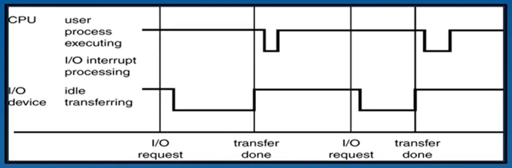
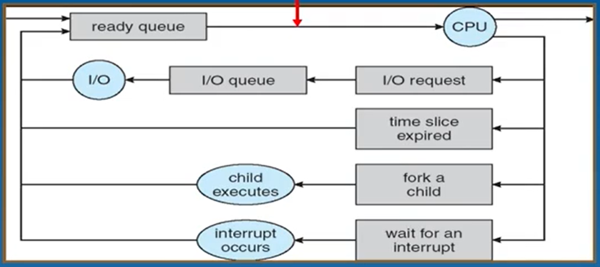
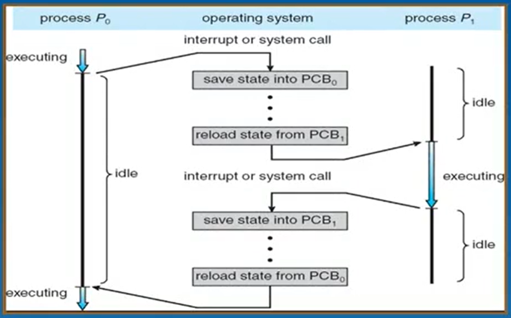

# 操作系统——01：进程的概念

## 设计操作系统的目的是什么？

对于某个程序来说，一定会同时需要CPU和IO同时操作，有时候会出现CPU的利用率不高的情况，达不到100%。



如上图所示，有些时候CPU的使用率低下，没有真的处理任务，而是在等待其他任务在IO上的响应。而计算机在设计初期资源宝贵，需要尽量让CPU一刻不停的运算，为此就需要合理分配CPU在多个程序之间来回切换，进而保证整个运算资源能够被充分的利用起来。

操作系统的目的之一 —— **让资源高效的运行**

如上图所示，假设系统中有两个程序要运行。系统组织得当的话，当A程序进行IO操作的时候让B程序进行CPU操作。这就可以使得CPU的工作机会是100%。这个想法有一定的历史原因，半导体时期的CPU资源是非常昂贵的，人们将要运行的很多程序放在内存中，最终保证CPU饱满的运行。

## 怎么划分这些需要同时处理的任务呢？

计算机宏观上可以处理多个任务，但是微观上每个时刻只能处理一个任务。高效协调的一大想法就是将这些待处理的任务在不同的时序处理不同的阶段，并针对这些任务进行规划。

首先很自然的会联想到采用程序进行任务的划分：每个程序代表一个任务，按照不同的程序进行计算机资源的分配；但是这个想法有个最致命的缺陷：**一个程序可能被不同的用户执行，得到不同的结果**。所以单单用程序进行划分显然不合适。

**进程process就是计算机科学家们创造出来的概念，用于区分这些任务。**

## 用来描述处理任务的“进程”有什么特点？

进程就是一个正在运行中的程序，为什么要区分不同的进程呢？怎么区分不同的进程呢？

> 为什么要区分不同的进程？

前文已经叙述过，操作系统的目的就是使计算机够有效地**合理分配计算机的运算资源**。进程不可能每时每刻都需要所有的计算机部件共同配合完成自己的运算。当一个进程对某个运算资源资源进行高负载的利用时，就可以安排其他进程对别的运算资源进行利用。如此一来每个运算资源都在持续的工作。此举就可以提高资源的利用率。

> 怎么区分不同的进程？

我对进程的理解是：需要被分配运算资源的单位，区分进程的策略也围绕一点，一定要让进程之间占用不同的运算资源。首先不同的程序一定占用资源有所不同。那么运行程序不同的任务肯定可以划分为不同的进程。当同样的程序处理不同的数据时，处理方式也有所不同。所以处理不同数据的任务也可以视为不同的进程。当两个任务所运行的程序相同，处理的数据也相同，但是处于不同的阶段，所需要的运算资源也天差地别。所以描述进程需要明确进程所以依附的运算程序，运算的数据和运行到当前时刻所处的状态。

> Process : A program in execution;process execution must progress in sequential fashion.
>
> > 1.处于什么状态；只有在运行中的程序才有分配资源的必要。所以进程到底是在什么运行阶段，就变得尤为重要，毕竟不同阶段的运行状态所需要的运算处理资源有所不同。同样的程序，处理相同的程序如果处于不同状态也需要按照不同进程进行资源的合理调配。
> >
> > 2.执行什么程序： 程序可以指导计算机怎么处理数据和资源，不同的程序运行的目的、步骤、涉及到的资源分配也不同。这也是区分进程的一个重要因素。
> >
> > 3.运算什么数据： 不同的任务处理的数据不同（不同的输入数据），这也是区分进程的一个重要因素

## 如何描述进程？

### 1.怎么描述进程---PCB？

处于不同状态的进程，所用到的运算资源有所不同，所以要对进城的状态进行描述。不同的系统有不同的进程状态描述，这里大致分为五种。

```c
/*
    new:		 进程处于起始状态，刚刚被创建
    terminated：	进程处于结束状态，可以回收资源
        //不同系统由区别
    ready：		进程处于就绪状态，可以执行
    running：	进程处于运行状态，正在使用运算资源进行运算
    waiting：	进程处于等待状态，正在等待资源或者通讯响应
*/
/*
	PCB (process controler Block)一般包含: 
                                            进程状态
                                            程序控制器，指向下一条的指令
                                            CPU寄存器
                                            CPU调度信息
                                            内存管理信息
                                            记账信息，占用了多少资源等信息
                                            IO信息
											...
											...
	每个PCB对应一个进程，用来描述进程的各种信息。
*/
```

既然每个PCB对应一个进程，通过链表的结构可以将就绪状态的进程放进一个队列。执行状态的进程最多只有一个。而等待状态不能按照就需状态划分到一个队列中，需要进一步细化：等待同一个资源的进程要放在一个队列当中。

```c
/*操作系统通过维护类似的队列来维护整个所有进程的状态*/
ready queue：
    			head ->  PCB1[...] -> PCB4[...] -> PCB8[...]

mag tap queue 0:
				head -> PCB2[...]
                    
mag tap queue 1:
				head -> PCB3[...]

disk queue:
				head -> PCB5[...] -> PCB6[...]

terminal queue 
				head -> PCB7[...]
...
```

在内存空间的角度看来，操作系统是在维护整个队列，操作系统的管理无非就是怎么把某个PCB拎到某个队列，拎出某个队列。进程会在这些队列之间不断地迁移知道最终被终止。



如上图所示，一个进程首先会进入就绪队列，并在随后的某个时刻得到CPU的响应。随后会转到其他设备的等待队列中去。当所需要的IO等待队列轮到该进程时，IO为其服务处理结束后再进入准备状态等待CPU为其服务。当这个进程创建了子进程时，需要等待子进程运行后，才能进行接下来的操作，此时进程等待的是子进程的资源。或者进程等待的是中断信号，中断来临之前会转到等待中断队列中。综上单个进程就是在多个队列中进行不断地迁移直到最终终止。

### 2.进程的上下文切换？为什么是额外开销？

进程希望自己的变量保存在寄存器或者内存中，能够加快运行速度，但是寄存器数量很有限。当CPU切换到另一个进程时，CPU中的寄存器可能还保留着上一个进程的数据。所以需要按照下图的方式进行进程调度。

PCB0此时拥有CPU，寄存器内部保存着PCB0的数据。但是此时需要转换到PCB1进行计算，PCB0在交出资源时需要首先保存自己进程的的寄存器信息。PCB1在得到CPU资源时，首先会恢复自己的寄存器现场。PCB1运行一段时间过后，当PCB1需要交出CPU的使用权时，也需要首先保留自己的寄存器状态。

上述这些开销对于单一的进程没有帮助，但是却有助于多任务的处理。也就意味着系统为了处理多任务引入了这些额外操作，但是这些操作对于单个进程的运行是负担，合理的设计就显得很重要。


