## 线程和并发

第三章节介绍的进程模型将进程假设为一个使用单线程控制的程序。然而，几乎所有的现代操作系统提供了在一个进程中包含多个线程的特性。在多CPU的现代操作系统上，多线程的并行调度变的越来越重要。

本章会介绍很多与多线程计算机系统相关的概念，也会讨论Ptheads，Windows和Java线程库API的内容。此外，本章也会介绍创建线程的抽象概念，允许开发人员聚焦于并行调度，并使用开发语言特性和API框架操作线程的创建和管理。后续内容将会看到于多线程程序的一些问题，以及对操作系统设计的影响。最后，会讲解Windows和Linux操作系统在内核层面对线程的支持。


### 4.1 OverView

线程时CPU利用的基本单元；它包含一个线程ID，程序计数器(PC)，一个寄存器集和栈。一个线程与其他属于同一个进程的线程共享代码段和操作系统资源，如打开的文件和信号。一个传统的进程仅包含一个线程。如果一个进程有多个线程，则可以同时执行一个或多个任务。图4.1展示了传统单线程进程和多线程进程的区别。

#### 4.1.1 Motivation

大多数现代计算机上运行的软件应用和移动设备都是多线程的。一个应用通常被实现为具有多个线程控制的独立进程。后面会重点介绍几个多线程应用。

- 从照片集中创建照片缩略图的应用可能会使用单独的线程来为每个图片生成缩略图
- web浏览器可能会使用一个线程来显示图片或文本，而使用另外一个线程来从网络上接收数据
- 一个word处理器可能使用一个线程来显示图形，而使用另外一个线程来响应用户键盘，使用第三个线程来在后台执行拼写检查和语法检查

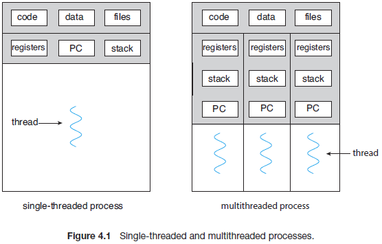

也可以将应用设计为可以在多核系统上运行。这类应用可以在多个计算核上并行执行多个CPU密集型任务。

在特定场景下，一个应用可能会被用于执行多个小的任务。例如，一个web服务器接收客户端对web页面，图片，声音等的请求。一个繁忙的web服务器可能会同时有多个(可能有上千个)客户端接入。如果web服务器使用传统单进程单线程模式，则在同一时间只能处理一个客户端的请求，此时某个客户端可能会等待很长时间才能获得响应。

一种解决方式是将服务器作为单进程运行，当接收到一个请求时会为该请求创建一个独立的进程。实际上，这种创建进程的方式在线程出现之前很常见。创建进程会消耗时间和资源。然而，如果新的进程执行的任务与现有的进程相同，为什么要承担这些额外的开销呢？最有效的方式是在一个进程中包含多个线程。如果web服务器进程是多线程的，服务器会创建一个单独的线程来监听客户端请求。当接收到一个请求时，服务器会创建一个线程来响应该请求并在处理结束后返回监听状态。参见图4.2。

大多数操作系统内核都是多线程的。例如，在Linux系统启动期间，会创建一些内核线程，每个线程执行特定的任务，如管理设备，内存管理，或处理中断。可以使用`ps -ef`命令来查看一个Linux系统上运行的内核线程，检查输出可以看到名为`kthreadd`(pid=2)的内核线程，该线程作为其他内核线程的父亲。

多数应用都可以利用多线程的优势，包括基本排序，树，和图算法。此外，程序员必须解决在数据挖掘，图形和人工智能中的CPU密集型问题，通过设计并行解决方案来利用多核系统的能力。

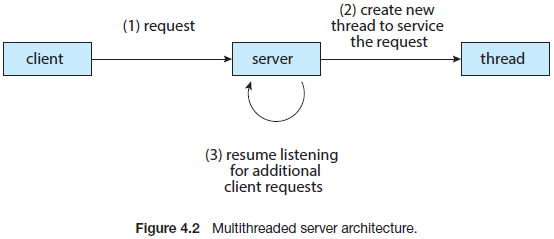

#### 4.1.2 Benefits

多线程程序的优点可以分为如下四类：

1. 反应迅速。多线程交互应用可以在其中一个线程阻塞或在长时间操作时继续运行，并迅速反应给用户。这种特性在设计用户接口时非常有用。例如，当一个用户按了一个按钮触发了一个耗时操作，单线程应用在操作结束前不会给用户反馈。相反的，如果该耗时操作发生在一个单独的异步线程上，此时应用仍然可以反馈给用户。
2. 资源共享。进程可以通过共享内存和消息传递等技术共享资源。这类技术必须由程序员明确安排使用。但默认下，一个进程中的线程会更新内存和资源。更新代码和数据的优点可以使应用在相同的地址空间中创建多个不同的活动的线程。
3. 经济。创建进程或消耗内存和资源。由于进程中的线程共享资源，线程的创建和上下文切换会更经济。很难凭经验衡量开销上的差异，但创建一个线程消耗的时间和内存通常要小于创建一个进程消耗的时间和内存。此外，线程的上下文切换要比进程更快。
4. 可扩展。多线程在多个架构下的优势更大，即多线程可以并行在不同的核上。无论有多有个核可以被利用，单进程单线程程序仅能运行在一个处理器上。后续章节会介绍这种情况。

### 4.2 Multicore Programming

在早期计算机的设计中，为了提升计算性能，单CPU系统发展为多CPU系统。出于类似的原因，系统设计中将多个计算核放在单个处理芯片上，且每个核作为操作系统上独立的CPU(见1.3.2章节)，这种系统被称为多核，多线程编程提供了一种更高效使用多计算核以及提高并发的机制。假设一个应用由四个线程，在一个单核系统上，由于一个处理核心同一时间仅能运行一个线程，并发仅仅意味着线程的交错运行。在多个系统上，由于系统可以将线程分配到每个核上，并发意味着一些线程可以并行(图4.4)。


注意并发和并行的区别。一个并发系统允许执行多个任务。类似的，一个并行系统允许同时运行多个任务。因此，并发可以不并行。在多处理器和多核架构之前，多数计算机系统只有一个进程，且通过将CPU调度设计为进程上下文的快速切换来实现假的并发，使得每个进程都可以运行。这种处理被称为并发，而非并行。

#### 4.2.1 Programming Challenges

多核系统的发展趋势将会持续地迫使系统设计者和应用编程人员更好地使用多核的优势 。操作系统的设计者必须编写使用多处理核心的调度算法来允许图4.4展示的并行执行。对于应用开发者，对现有程序修改的挑战也同样在于多线程的使用。

通常，多核系统现有如下5个挑战：

1. 标识任务。包括检查应用哪些部分可以被划分为单独的，并发的任务。理想情况下，独立的任何可以在独立的核上并行运行。
2. 均衡。当确定任务可以并行运行时，编程人员必须保证任务执行同等价值的同等工作。在一些场景下，某个特定的任务可能不会像其他任务一样为整个过程贡献相同的价值，此时，使用独立的核去运行这种任务可能不划算。

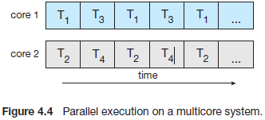

*阿姆达尔*定律：

*阿姆达尔*定律是一个确定同时具有串行和并行组件的应用通过增加额外的计算核心能够增加的性能的公式。如果`S`为必须在`N`个处理核上应用串行执行的部分，公式如下：


例如，假设一个应用由75%并行，25%串行。如果使用2个处理核允许该应用，可以加速1.6倍。如果增加2个额外的核(总计4个)，则可以加速2.28倍。下图展示不同场景下阿姆达尔定律。

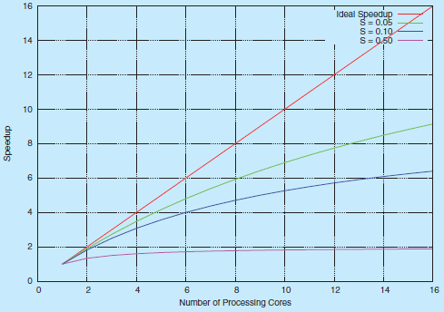

阿姆达尔定律有趣的一点是当`N`趋向无穷，加速收敛为1/S。例如，当一个程序50%串行时，最大加速为2.0倍，此时与新增的处理核数量无关。阿姆达尔定律的基本原则为：应用的串行部分对性能的响应与额外添加的计算核不成比例。

3. 数据分割。正如应用会分割为多个任务，任务对数据的访问和管理也必须分割到多个不同的核上操作。
4. 数据依赖性。必须校验一个或多个任务是否对数据的访问有依赖关系。当一个任务依赖另一个任务的数据时，编程人员必须保证任务执行时数据依赖的同步。参见第六章。

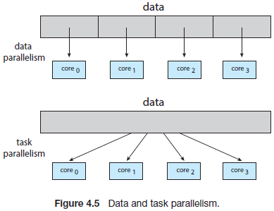

5. 测试和调试。当一个程序在多核上并行运行时，可能有多种执行路径。测试和调试这类并发程序会比测试和调试单线程应用困难得多。

因为这些挑战，许多软件开发者对多核系统有争议，多核系统要求使用全新的方法来设计未来的软件系统。(类似的，许多计算机科学教育工作者相信软件开发必须更加强调并行编程)。

#### 4.2.2 Types of Parallelism

通常有两种并行类型：数据并行和任务并行。数据并行专注于在多核上分发相同数据的子集，并在每个核上执行系统的操作。例如，累加长度为N的数组。在一个单核系统上，一个线程会累加元素[0]...[N-1]。在多个系统上，可以使用运行在核0上的线程A累加元素[0]...[N/2-1]，而运行在核1上的线程B累加元素[N/2]...[N-1]。这两个线程可以并行运行在不同的核上。

任务并行与在多核上分发任务(线程)相关。每个线程都会执行一个唯一的操作。不同的线程可能会操作相同的数据，或操作不同的数据。考虑上面的例子，并行任务可能会运行两个线程，每个线程都会对数据元素进行统计。线程运行在不同的核上，各自执行唯一的操作。

从根本上说，数据并行与多核上数据的分发有关，任务并行与多核上任务的分发有关。然而数据和任务的并行不是互斥的，应用可能会混合使用这两种策略。

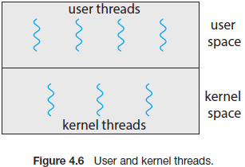

### 4.3 Multithreading Models

到此为止已经多线程有一个宽泛的认识。然而，可以在用户层面提供对线程的支持，称之为用户线程，或在内核层面支持线程， 称之为内核线程。用户线程运行在内核之上，且无需内核支持。内核线程由操作系统直接操作。几乎所有现有操作系统--包括Windows，Linux和macOS--都支持内核线程。

最终，用户线程和内核线程必须存在如图4.6展示的关系。本章中，将介绍3种建立这种关系的方式：多对一模式，一对一模式，和多对多模式。

#### 4.3.1 Many-to-One Model

多对一模式中将多个用户线程映射到一个内核线程。使用用户空间的线程库进行线程管理，因此效率更高(将会在4.4章节介绍线程库)。然而，当一个线程进行阻塞的系统调用时会阻塞整个进程。因此同一时间仅一个线程可以访问内核，且无法在多核系统上并行的多线程。Green threads--一个Solaris系统和Java早期使用的线程库版本，该线程库使用了多对一模型。然而因为该模型无法利用多处理器的优势，后续仅有很少系统会继续使用该模型。

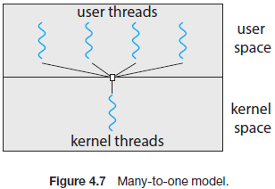

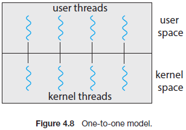

#### 4.3.2 One-to-One Model

一对一模型中一个用户线程对应一个内核线程。它通过允许在一个线程阻塞时其他线程可以允许的方式，相比多对一模型提供了更多的并发能力。该模型也允许在多处理器上并行多线程，唯一的缺点是创建用户线程需要同时创建对应的内核线程，大量的内核线程可能会影响系统的性能。Linux和Windows家族操作系统都实现了一对一模型。

#### 4.3.3 Many-to-Many Model

多对多模型中，将多个用户线程复用到少量或相同数量的内核线程。内核线程的数量可能由特定应用或特定机器(相比四核系统，八核系统上，一个应用会分配更多的内核线程)指定。

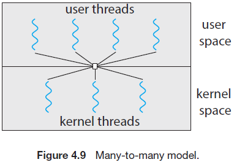

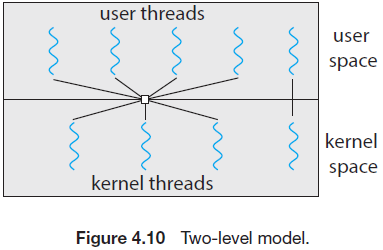

考虑这种设计下对并发的影响。尽管多对一模型允许开发者创建尽可能多的用户线程，因为内核同一时间只能调度一个内核线程，这些用户线程并不会并行。一对一模型允许更大的并发，但开发者必须小心，不能在一个应用中创建太多线程。(实际上，在一些系统中限制了该模型可以创建的线程的数目)。多对多模型则没有这些缺点，开发者可以尽可能创建所需要的用户线程，对应的内核线程可以在多处理器上并行。而且，当线程执行阻塞的系统调用时，内核可以调度执行其他线程。

一个多对多模型的变种是将多个用户级别的线程复用到少量或等量的内核线程，同时允许将用户线程绑定到内核线程上。这种变种优势成为两级模型(图4.10)。

虽然多对多模型可能是上面讨论的模型中最灵活的，但在实践中很难实现。此外，随着大多数系统中处理核的增加，限制内核线程变得不那么重要。结果是，大多数操作系统采用了一对一模型。然而，就像将在4.5章节看到的，一些现代并发库让开发者识别任务，并使用多对多模型将其映射到线程。

### 4.4 Thread Libraries

线程库为编程人员提供了创建和管理线程的API。实现线程库的方式有两种：第一种实现方法为提供一种完全在用户空间运行的库(无内核支持)，线程库中所有的代码和数据结构都存在于用户空间，意味着线程库中函数的调用属于本地函数调用，而非系统调用。

第二种实现方式是由操作系统直接支持的内核态的线程库。这种情况下，线程库的代码和数据结构都存在于内核空间。线程库中函数的调用会导致(内核中)的系统调用。

目前三种主要的线程库为：POSIX Pthread，Windows和Java。Pthread属于POSIX标准的线程扩展，可能由用户态或内核态库提供。Windows线程库属于内核态库。Java线程API允许Java程序直接创建和管理线程。然而，由于大多数情况下，JVM运行在主机操作系统上，Java线程API使用主机系统上的线程库实现，意味着在Windows系统，Java线程通常使用Windows API实现。UNIX，Linux和macOS系统通常使用Pthreads。

对于POSIX和Windows线程，进程中的线程间共享所有该进程中声明的全局数据。例如，假设多线程程序使用如下函数在一个单独的线程中执行非负数的累加：


如果N为5，该函数会将1到5的整数进行累加，结果为15。这三个程序中的每一个都将使用在命令行中输入的求和的上限来运行，即如果输入8，会将1到8的整数进行累加并显示结果。

在执行线程创建之前介绍两种创建多线程的通用策略：异步线程和同步线程。使用异步线程时，一旦父线程创建了一个子线程，父线程会恢复执行，此时父线程和子线程会并发执行且各自独立。由于线程是相互独立的，线程之间共享的数据很好。异步线程为图4.2中的多线程服务器使用的策略，通常用于设计响应式用户界面。

当父线程创建一个或多个子线程后，必须等待所有的子线程结束后才能继续运行，这种策略称为同步线程。这里父线程创建的子线程会同时运行，但父线程在子线程结束前不会继续执行。一旦一个线程结束任务，该线程会结束并加入到父线程中。只有当所有的子线程加入到父线程，此时父线程才能继续执行。通常，同步线程与线程间共享重要数据相关。例如，父线程可能会结果多个子线程的运算结果。下面所有的例子都是用同步线程。

#### 4.4.1 Pthreads

Pthreads与POSIX标准(IEEE 1003.1c)相关，定义了线程创建和同步的API，它规范了线程的行为，并非真正的实现。操作系统设计者可能会使用他们期望的任何方式实现该规范。发部分系统实现了Pthreads规范，大部分UNIX类系统，包括Linux和macOS。虽然Windows天生不支持Pthreads，但一些第三方实现了Windows的Ptheads。

```c
#include <pthread.h>
#include <stdio.h>

#include <stdlib.h>

int sum; /* this data is shared by the thread(s) */
void *runner(void *param); /* threads call this function */

int main(int argc, char *argv[])
{
    pthread_t tid; /* the thread identifier */
    pthread_attr_t attr; /* set of thread attributes */
	
    /* set the default attributes of the thread */
    pthread_attr_init(&attr);
    /* create the thread */
    pthread_create(&tid, &attr, runner, argv[1]);
    /* wait for the thread to exit */
    pthread_join(tid,NULL);
	
    printf("sum = %d∖n",sum);
}

/* The thread will execute in this function */
void *runner(void *param)
{
    int i, upper = atoi(param);
    sum = 0;
	
    for (i = 1; i <= upper; i++)
    sum += i;
	
    pthread exit(0);
}
```

上述C程序展示了创建一个计算非负整数和的多线程程序的基本Pthreads API。一个Pthreads程序中，线程由指定的函数开始执行，上述代码中为`runner()`函数。当该程序开始运行，一开始main函数只有一个控制线程。在一些初始化操作后，`main()`函数创建了第二个运行`runner()`的线程。两个线程共享全局变量`sum`。

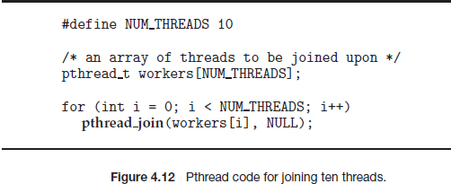

该程序中，所有的Pthreads程序必须包含`pthread.h`头文件。`pthread_t tid`声明了将创建的线程的标识符。每个线程都有一个属性集，包含栈大小和调度信息。`pthread attr t attr`声明标识线程的属性。上述代码通过调用`pthread_attr_init(&attr)`函数设置了属性值，由于没有明确设置任何属性，会使用系统提供的默认属性(第五章中会讨论部分Pthreads API提供的调度属性)。通过调用`pthread_create()`创建一个单独的线程，此外，需要为线程传入线程标识符和属性以及新线程开始执行的函数名称。最后，通过命令行`argv[1]`传入整型参数。

到此为止，该程序有两个线程：`main()`初始线程和在`runner()`函数中执行加法的线程。该程序遵循线程创建/加入策略，集在创建加法线程后，父线程会调用`pthread_join()`函数等待子线程退出。加法线程在调用`pthread_exit()`之后会结束。一旦加法线程返回，父线程会打印共享数据`sum`。

这个例子中的程序仅创建了一个线程。锁着多核系统的发展，编写包含多线程的程序变得越发普及。等待多个线程的简单方法时调用`pthread_join()`。例如图4.12中所示，可以使用Pthead代码等待10个线程。

#### 4.4.2 Windows Threads~4.5 Implicit Threading 

特定实现，忽略

### 4.6 Threading Issues

本章关注设计多线程程序时需要考虑的问题。

#### 4.6.1 The fork() and exec() System Calls

第三章中描述了如何使用`fork()`系统调用来创建一个独立且重复的进程。`fork()`和`exec()`系统调用的语义在多线程程序中有所不同。

如果一个线程调用了`fork()`，会创建包含所有线程的进程还是会创建仅包含一个线程的进程？一些UNIX系统提供了两种版本的`fork()`，一种会创建重复所有线程，而另一种仅会创建调用`fork()`的线程。

`exec()`系统调用与第三章描述的相同。即，如果一个线程调用了`exec()`，`exec()`参数中指定的程序会替换整个进程--包含所有线程。

使用哪个版本的`fork()`取决于应用本身。如果在forking之后立即调用`exec()`,由于`exec()`会替换掉进程，那么`fork()`是否会重复创建所有线程将没有任何意义，在这种场景下，仅需重复创建调用者所在的线程即可。然而，如果在forking之后，独立的进程没有调用`exec()`，则新创建的进程会重复创建所有的线程

#### 4.6.2 Signal Handling

UNIX系统使用信号通知一个进程发生了特定的事件。信号的接收可以是同步的，也可以是异步的，具体取决于事件发生的原因。所有的信号(无论同步还是异步)都遵循下面规范：

1. 信号在特定事件发生时产生；
2. 信号会传递到进程
3. 一旦传递，必须处理信号

同步信号的例子包括非法内存访问和除以0，如果运行的程序产生了任一动作，都会生成信号。生成的同步信号会传递给导致该信号生成的进程(这也是为什么称为同步的原因)。

当一个进程外部事件产生了信号，进程需要使用异步方式接收到该信号。一个例子是使用特定的按键(如<control><C>)或定时器超时来终止一个进程。通常异步信号会发送给其他进程。

一个信号可能被下面两个处理程序处理：

1. 默认的处理程序
2. 用户定义的处理程序

每个信号在内核都有一个默认的信号处理程序。默认的动作可以被用户定义的信号处理程序覆盖。信号有多种处理方式，一些信号会被忽略，而另外一些信号(如非法内存访问)则会终止程序。

在单线程程序中处理信号的方式非常直接：信号总是会传递到进程。然而由于一个进程可以有多个线程，多线程程序的信号传递则非常复杂。那么什么时候应该传递信号？

通常，可以参考如下选项：

1. 当信号产生是传递到线程
2. 传递信号到每个线程
3. 传递信号到特定线程
4. 分配一个独立的线程接收进程的所有信号

传递信号的方法取决于信号产生的类型。例如同步信号需要传递到导致信号生成的线程，不能传递到该进程的其他线程，然而异步信号的使用则没有那么明确。一些异步信号，如结束进程(<control><C>)，应该发送到所有线程。

传递信号的标准UNIX函数如下：

```
kill(pid_t pid, int signal)
```

该函数需要指定进程(pid)所需要的特定的信号(signal)。多数多线程版本的UNIX系统允许线程指定哪些信号会被接收，哪些信号会被阻塞。因此，在一些场景下，一个异步信号可能会传递到不阻塞该信号的线程。然而，由于信号仅需处理一次，这种信号通常会传递到第一个不阻塞该信号的线程上。POSIX Pthread 提供了下面函数来允许一个信号传递到特定的线程(pid)。

```
pthread kill(pthread_t tid, int signal)
```

虽然Windows没有明确提供支持信号的方法，但它允许使用asynchronous procedure calls (APCs)进行模拟。APC允许一个用户线程在接收到特定事件后调用特定函数。如它的名字所述，APC大致等同于UNIX的异步信号。然而，UNIX必须应对在多线程环境中如何处理信号的问题，APC则更加直接，其仅会将一个事件传递到特定线程，而非进程。

#### 4.6.3 Thread Cancellation

线程取消与一个线程在结束前被终止相关。例如，一个多线程并发在数据库中进行搜索，其中一个线程返回了结果，那么其他线程可能会被取消。另外一种场景是，当一个用户在web浏览器载入时按下停止键，此时浏览器不会再继续载入。通常一个web页面的载入会使用到多个线程--每个图片的载入都在独立的线程中进行。当一个用户按下浏览器的停止键，所有正在载入的页面都应该被取消。

被取消的线程退出被称为目标线程。取消目标线程可能会发生在如下两种场景中：

1. 异步取消。一个线程立即停止了目标线程
2. 延迟取消。目标线程周期性检测是否应该停止，使其有机会以有序的方式终止

当一个资源分配给一个取消的线程或当线程间共享的数据正在升级中时，线程的取消会比较困难。在异步取消下会特别棘手。通常操作系统会从取消的线程中回收系统资源，但不会回收所有资源。因此，异步取消一个线程可能不会释放系统层面的资源。

延迟取消下，一个线程指定需要被取消的线程，但仅在校验目标线程的停止标识后才能决定是否取消。通过这种校验可以安全地取消目标线程。

Pthreads中，线程使用`pthread_cancel()`进行线程取消的初始化。目标线程的标识符作为函数的参数。下面代码描述了线程的创建和取消

```
pthread_t tid;

/* create the thread */
pthread_create(&tid, 0, worker, NULL);

. . .

/* cancel the thread */
pthread_cancel(tid);

/* wait for the thread to terminate */
pthread_join(tid,NULL);
```

调用`pthread_cancel()`仅标识请求取消目标线程，然而是否能够真正取消取决于线程处理该请求的方式。当目标线程最终取消后，`pthread_join()`会从正在取消的线程中返回。Pthreads支持三种取消模式，每个模式定义了一个状态和类型，见下描述。一个线程可能使用一个API设置其取消状态和类型。

| Mode         | State    | Type         |
| ------------ | -------- | ------------ |
| Off          | Disabled | -            |
| Deferred     | Enabled  | Deferred     |
| Asynchronous | Enabled  | Asynchronous |

如上表描述，Pthreads允许线程去使能或使能取消功能。显然，一个线程在将取消设置为非使能时不会被取消。然而，取消请求会保持挂起状态，后续线程使能取消后会返回给请求。

默认的取消方式为延迟取消。然而，取消的只有在线程达到取消点时(cancellation point)才会触发。大多数POSIX和标准C库的阻塞系统调用被定义为取消点，在Linux系统上使用`man pthreads`命令式会显示该定义。例如，`read()`系统调用是一个取消点，允许线程在等待`read()`输入时阻塞。

一种创建取消点的方式是调用`pthread_testcancel()`函数。如果发现取消请求被挂起，`pthread_testcancel()`不会返回，线程会终止；否则该函数会返回且线程会继续运行。此外，Pthreads允许在线程取消时进行清理操作。该函数允许在线程终止前释放任何线程资源。

下面代码展示了线程使用延迟取消方式响应取消请求：

```
while (1) {
    /* do some work for awhile */
	
    . . .
	
    /* check if there is a cancellation request */
    pthread_testcancel();
}
```

由于前面描述的问题，Pthreads文档不推荐异步取消。因此，此处不再讨论该方式。需要注意的是，在Linux系统上Pthreads API通过信号取消线程。

Java中线程取消使用的策略类似Ptheads中的延迟取消。为了取消java线程，需要调用`interrupt()`方法，该方法将目标线程的中断状态设置为true：

```
Thread worker;

. . .

/* set the interruption status of the thread */
worker.interrupt()
```

一个线程可以通过isInterrupted()方法校验中断状态，该方法返回一个布尔值表示线程的中断状态：

```
while (!Thread.currentThread().isInterrupted()) {
. . .
}
```

#### 4.6.4 Thread-Local Storage

一个进程中的线程共享进程数据，这种数据共享方式为多线程程序提供了便利。然而，在一些场景下，每个线程可能会拷贝特定的数据，这种数据被称为thread-local storage(或TLS)。例如，一个交易处理系统中，可能会将每个交易放在独立的线程中处理，即每个交易都会分配一个唯一的ID。为了将线程和唯一的交易标识符进行关联，需要使用线程本地存储。

TLS很容易和本地变量混淆。然而本地变量仅在一个函数调用时可见，TLS数据则在多个函数调用时可见。此外，当开发人员无法控制线程创建过程时(例如，当使用线程池时)，也需要采用替代方法。

一些方法中，TLS类似静态数据，不同点是TLS数据属于线程(实际上TLS通常被声明为静态)。大多数多线程库和编译器提供了TLS。例如Java提供了`ThreadLocal<T>`类，使用`set()`和`get()`方法来操作`ThreadLocal<T>`对象。Pthreads包含`pthread_key_t`类型，该类型为每个线程提供了key，该key可以被用于访问TLS数据。微软C#语言仅需要将存储属性[ThreadStatic]添加到声明的线程本地数据中。gcc编译器提供了存储keyword thread来声明TLS数据。例如，如果需要为每个线程分配一个唯一的标识符，则可以使用如下方式：

```
static __thread int threadID
```

#### 4.6.5 Scheduler Activations（类似go语言的协程）

最后一个问题与多线程程序在内核和线程库之间进行通信有关，可能会用到4.3.3章节讨论的多对多和两级模型。这种协调方式允许自动调节内核线程的数据来保证最好的性能。

很多系统实现了多对多或两级模型在用户和内核线程之间放置一个中间数据结构。该数据结构通常被称为轻量进程或LWP(如图4.20所示)。对于用户线程库，LWP可以看作是应用可以调度用户线程执行的虚拟一个处理器。每个LWP都与一个内核线程关联，且该内核线程会被操作系统调度到物理处理器上运行。如果内核线程阻塞(如等待I/O操作结束)，则LWP也会被阻塞。此时与LWP关联的用户线程也会被阻塞。

一个应用可能会需要任意数量的LWP来保证高效运行。假设一个CPU密集型程序运行在一个处理器上，此时同一时间只能运行一个线程，则一个LWP足够。如果一个应用时I/O密集型的，则需要更多的LWP来执行。通常每次并发阻塞系统调用都需要一个LWP。例如，同时发生了五个不同的文件读请求，由于所有的LWP都会等待内核I/O结束，此时需要五个LWP。如果一个进程只有四个LWP，则第五个请求必须等待某个LWP返回后才能发送。

用户线程库和内核通信的一个方案为调度器激活(scheduler activation)。它的工作方式如下：内核提供了带虚拟处理器(LWP)的应用，该应用会将用户线程调度到一个可运行的虚拟处理器上。此外，内核必须将特定的事件通知给该应用。这个过程被称为upcall。线程库使用upcall处理程序处理upcall，一个upcall处理程序必须运行在一个虚拟处理器上。

当一个应用的线程阻塞后会产生一个upcall，这种场景下，内核会给应用生成一个uocall来通知特定的线程将会被阻塞，然后内核会为应用分配一个新的虚拟处理器。应用会在新的虚拟处理器上运行一个upcall处理程序，该处理程序会保存线程的阻塞状态并放弃阻塞线程运行所在的虚拟处理器。upcall处理程序后续会调度另一个有资格运行在新虚拟处理器上的线程。当出现阻塞线程等待事件时，内核会为线程库生成另一个upcall来通知前一个阻塞的线程已经有资格继续运行。该事件的upcall处理程序也会请求一个虚拟处理器，且内核可能会分配一个新的虚拟处理器或抢占其中一个用户线程来运行upcall处理程序。在非阻塞的线程继续运行后，程序会将一个有资格运行的线程调度到一个可以使用的虚拟处理器上。

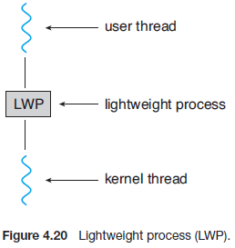

### 4.7 Operating-System Examples

#### 4.7.2 Linux Threads

Linux提供了使用`fork()`系统调用来复制进程的传统方式，也提供了使用`clone()`系统调用创建线程的方式。然而，Linux并没有区分进程和线程。实际上，Linux在程序的控制流程中使用了术语`task`，而非进程或线程。

当调用`clone()`时会传入一系列flags来决定父任务和子任务之间共享的内容。图4.22中罗列出了部分flags。例如，假设`clone()`中传入了`CLONE_FS`，`CLONE_VM`,`CLONE_SIGHAND`和`CLONE_FILES`时，父任务和子任务会共享一部分文件系统信息(如当前工作目录)，一部分内存空间，系统的信号处理程序以及相同的打开的文件。由于父任务和子任务之间共享了大部分资源，因此使用`clone()`等同于创建了一个线程。如果调用`clone()`时没有设置任何flag，则不会共享任何资源，此时类似`fork()`系统调用。

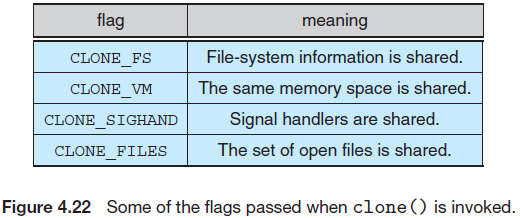

共享的级别可能由内核任务的变化而变化。系统中每个任务都有唯一的内核数据结构（特别是struct task_struct）。该数据结构(而非任务保存的数据)包含了指向存储数据的其他数据结构的指针，例如表示打开的文件的数据，信号处理的信息以及虚拟内存等。当调用`fork()`时会创建一个新的任务，并拷贝父进程相关的所有数据结构。在调用`clone()`时也会创建一个新的任务，然而此时不会拷贝所有的数据结构，新任务的指针指向父任务的数据结构(取决于传入`clone()`的flags)。

最后，`clone()`的灵活性使得该系统调用能够扩展到容器(第一章介绍的虚拟化主题)。一个容器就是操作系统提供的允许在Linux内核下创建多个Linux系统(容器)并相互隔离的虚拟化技术。 正如使用传入`clone()`的(控制共享内容的)flags可以用于区别创建的任务更接近进程还是线程，在创建容器时也可以在`clone()`中传入其它flags。第18章将会介绍容器技术。

*Linux clone系统调用是fork和pthread_create的通用形式，它允许调用者指定在调用进程和新创建的进程之间共享哪些资源*

