[TOC]

## Main Memory

在第5章中展示了一个进程集如何共享CPU。使用CPU调度，可以同时提升CPU利用率和计算机的响应速度。为了提升性能，必须在内存中保存很多进程，即必须使用共享内存。

本章中将会讨论管理内存的几种方式，(内存管理算法)从原始的裸机方法到使用分页策略不等。每种方式都有其各自的优势和劣势。为一个特定系统选择内存管理需要基于多种因素，特别是系统的硬件设计。大多数算法需要硬件支持，导致很多系统具有相似的硬件以及操作系统内存管理。

### 9.1 Background

正如在第1章中看到的，内存在现代操作系统的操作中至关重要。内存由一个大字节数组组成，每个字节拥有各自的地址。CPU根据程序计数器从内存中获取指令，这些指令可能会触发载入额外的数据，并存储到特定内存地址中。

典型的指令执行周期，例如，首先从内存中拉取指令，然后解码指令，解码时可能会触发从内存中拉取操作数。在在操作数上执行指令后，可能会将结果保存到内存中。内存单元仅看到内存地址流，它不知道这些地址是怎么生成的(由指令计数器，索引，间接寻址，文字地址等)或如何使用(指令或数据)。因此，我们可以忽略一个进程如何生成内存地址，主要关注正在运行的程序生成的内存地址顺序。

后面会讨论域内存管理相关的几个问题：基本的硬件，内存地址到实际物理地址的符号绑定，以及逻辑和物理地址之间的区别。在本节的最后，我们讨论了动态链接和共享库

#### 9.1.1 Basic Hardware

内置在每个处理核心中的主存和寄存器是CPU可以直接访问的唯一通用存储。机器指令使用内存地址而非硬盘地址作为参数，因此，任何执行的指令以及指令使用的任何数据，都必须位于某一种可以直接访问的存储设备中。如果数据不在内存中，则必须在CPU操作前移动这些数据。

在一个CPU时钟周期内，通常可以访问每个CPU核中内置的寄存器。一些CPU核可以解码指令并以每时钟周期一次或多次的速率对寄存器中的内容执行一些简单的操作。主存唯一的缺点是需要通过内存总线来传输数据。一个完整的内存访问可能需要花费多个CPU时钟周期。这种情况下，由于没有请求的数据来完成正在执行的指令，因此处理器通常会暂停。由于内存访问的频率过大，这种情况是无法容忍的。通常会在CPU和主存之间添加高速内存，该告诉内存位于CPU芯片上。1.5.5章节描述了这种缓存。为了管理CPU内置的缓存，硬件会自动在没有操作系统控制的前提下提高内存访问(回想5.5.2章节中，当内存访问暂替时，多线程核会从一个暂停的硬件线程切换到另一个硬件线程。)

我们不仅要关注访问物理内存的相对速度，也要保证操作的正确性。为了正确操作系统，必须防止操作系统被用户进程访问，以及防止一个用户进程被其他用户进程访问。由于操作系统不会经常干预CPU以及CPU内存访问(这样会影响性能)，因此必须由硬件提供这种防护。正如我们将在本章中看到的，硬件通常多种方式实现这种防护。这里给出一种可能的实现。


首先我们要确认每个进程都有一个独立的内存空间。每个进程特有的内存空间可以防止其他进程访问，且这种实现是内存加载多进程并发的基础。为了隔离内存空间，需要确定内存可能访问的合法地址范围以及确保进程只能够访问这些合法地址。我们可以使用两个寄存器实现这种防护功能，通常为如图9.1中所示的base和limit。base寄存器保存最小的合法的物理内存地址；Linux寄存器保存了合法的地址空间大小。例如，如果base寄存器保存的值为300040，Linux寄存器为120900，那么程序可以合法访问的地址为从300040到420939(不包含)。

CPU硬件可以通过将生成的用户空间地址与寄存器中的值进程比较来保护内存空间。当一个程序在用户模式尝试访问操作系统内存或其他用户内存会触发一个trap给操作系统，操作系统会将该行为视为fatal错误(如图9.2)。这种方案防止用户程序的代码或数据结构被操作系统或其他用户修改。

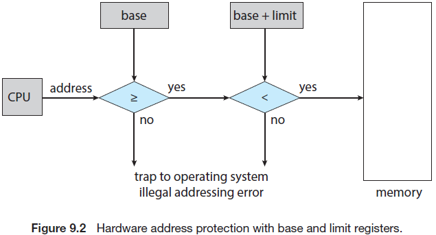

base和limit寄存器尽可以被操作系统使用特权指令加载。由于特权只能只能运行在内核模式，且操作系统只能运行在内核模式，因此只有操作系统才能加载base和limit寄存器。这种方案允许操作系统修改寄存器值，但防止用户程序修改寄存器内容。

操作系统运行在内核模式，能够无限制访问操作系统内存和用户内存。这种规定允许操作系统将用户程序加载到用户内存中，在出错误时转存这些程序，访问和修改系统调用的参数，从/到用户内存进程的I/O，以及提供其他功能。例如多处理系统的操作系统必须执行上下文切换，在将下一个进程的上下文从主存加载到寄存器之前将当前进程的状态从寄存器保保存到主存中。

#### 9.1.2 Address Binding

通常，一个程序在硬盘上体现为一个可执行文件。为了运行该程序，必须将程序放入内存并放在进程的上下文中，这样才能在CPU上运行。进程执行时会从访问内存中的指令和数据。最终，当进程结束后，进程的内存会被其他进程回收利用。

大部分系统允许一个用户进程驻留在物理内存的任意部分。因此，虽然计算机的起始地址空间可能为00000，但用户进程的起始地址可能不是00000。后面会看到操作系统如何将一个进程放置到物理内存中。

大多数场景下，用户程序在执行前会经历一些阶段(其中一部分是可选的)。在些阶段中可能以不同的形式呈现地址。源程序中的地址通常是符号链接。一个编译器通常会将这些符号地址绑定到可重定位地址(如"模块开始的14个字节")。链接器和加载器(见2.5章节)则会将可重定位地址转变为绝对地址(如74014)。每个绑定就是一个地址到另一个地址的映射。

传统上，指令和数据与内存地址的绑定可以在过程的任意阶段完成：

- 编译时间。如果在编译时间内知道进程将会保存到哪段内存，则会生产绝对代码。例如，如果一个用户进程安置的起始位置为R，那么生成的编译代码会从该位置开始并从该位置延伸。如果后面起始位置发生了变化，那么需要重新编译这段代码。


- 加载时间。如果在编译时间内无法获知进程会安置的内存，那么编译器必须生成可重用代码。这种情况下，最终的绑定会推迟到加载时间。如果起始地址发生了变化，此时只需要重新加载用户代码来合并此更改的值
- 执行时间。如果进程能够在执行时间内从一个内存端转移到另外一个，那么绑定需要推迟到运行时间。可能需要特殊的硬件支持这种运行方案(见9.13章节)。大多数操作系统会采用这种方法。

本章最重要的部分是展示计算机系统如何实现各种绑定，并适当讨论了硬件支持。

#### 9.1.3 Logical Versus Physical Address Space

CPU生成的地址通常称为逻辑地址(logical address)。内存单元中看到的地址，即内存中的内存地址寄存器加载的地址通常关联到一个物理地址。


无论是编译时间还是加载时间的绑定地址都会生成逻辑和物理地址。然而，执行时间时的地址绑定方案会导致逻辑和物理地址的不同。这种情况下，通常将逻辑地址称为虚拟地址。下面逻辑地址和虚拟地址的概念可互换。一个程序生成的所有逻辑地址称为逻辑地址空间，与逻辑地址对于的所有物理地址称为物理地址空间。因此，执行时的地址绑定方案下，逻辑和物理地址空间是不同的。

运行时虚拟到物理地址的映射由称为内存管理单元(MMU)的硬件设备完成(图9.4)。我么可以选择多种方法来完成这种映射，如9.2章节到9.3章节中所讲到的。我们暂且使用9.1.1章节中描述的一般base寄存器方案作为简单的MMU来描述地址映射。

此时base寄存器称为可重定位寄存器(relocation register)。可重定位寄存器中的值会在用户进程生成的每个地址发送到内存时进行相加(图9.5)。例如，如果base是14000，当一个位于0位置的地址尝试发送到内存时会动态重定位到位置14000，346位置会映射到14346。

用户程序永远不会访问真实的物理地址。程序可以创建指向346位置的指针，将其保存在内存中，操作该指针，并与其他地址进行比较，这种情况下，指针的值都为346。值由在它作为一个基于base寄存器重定位的内存地址(可能是间接载入或存储)时，用户程序需要与逻辑地址打交道。内存映射硬件会将逻辑地址转化为物理地址，9.1.2章节中讨论了这种类型的执行时地址绑定。在被引用之前，无法确定被引用的内存的最终地址。

现在我们由两种类型的地址：逻辑地址(0到max)和物理地址(对于base=R，范围为R+0到R+max)。用户程序仅会生成逻辑地址，并认为内存中运行的地址的位置为0到max。然而，这些逻辑地址在使用前必须要映射到物理地址。逻辑地址空间绑定到独立的物理地址空间的概念对正确的内存管理至关重要。

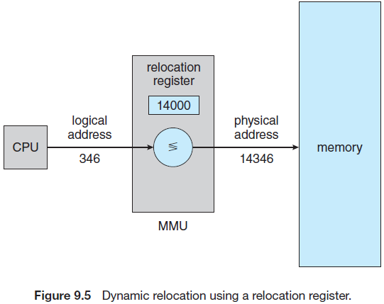

#### 9.1.4 Dynamic Loading

到目前为止的讨论中，进程在执行前需要将整个程序以及进程的数据加载到物理内存中。程序的大小受限于物理内存的大小。为了更好地使用内存空间，引入了动态加载的概念。使用动态加载时，一个例程在调用前不会被加载。所有的例程均以可重载的格式保存在硬盘上。主程序在运行时会被加载到内存中，当一个例程调用两一个例程时，调用的例程首先会检查另外一个例程是都已经被加载，如果没有，会调用可重定位链接加载器将需要的例程加载到内存中，并更新程序的地址表，然后新加载的例程会控制调用过程。

动态加载的好处是只在需要的时候才会加载例程。这种方式在有大量代码需要处理，且这些代码不经常调用时非常有用，例如错误例程。这种情况下，虽然总的程序可能会很大，但可能只会使用到一小部分。

动态加载不需要操作系统的特定支持，应该在用户设计程序的时候考虑这种方法。但操作系统也可能会通过提供实现了动态加载的例程库帮助到编程人员。

#### 9.1.5 Dynamic Linking and Shared Libraries

动态链接库(DLLs)为在程序运行时连接到用户程序的系统库(见图9.3)。一些操作系统仅支持静态链接，在这种系统中，系统库与其他目标模块一样会被加载器组合为二进制程序镜像。动态链接类似动态加载，这里使用了链接，而非加载，表示操作推迟到了执行时间。这种特性通常与系统库一起使用，如标准C语言库。如果没有这种方式，系统中的每个程序必须在可执行的镜像中包含一个符合该程序语言的库(或至少程序引用的例程)副本。这种需求不仅增加了可执行镜像的大小，也可能会浪费主存。DLLs的第二个优势是这些库可以在多个进程间共享，因此内存中只会有一份DLL的实例，此时DLLs也被称为共享库，已经被广泛应用到Windows和Linux系统中。

当程序引用动态库中的例程时，加载器会在需要时寻址该DLL并加载到内存中，然后将动态库中的引用函数地址调节为DLL保存的内存位置。

动态链接库可以扩展到库更新(如bug修复)。此外，一个库可能被新的版本覆盖，所有使用该库的程序会自动使用新版本的库。如果没有动态链接，这些程序都需要通过重新链接来访问新库。这样重新就不会意外执行到新的，版本不兼容的库(版本信息保存在重新和库中)。一个程序可能会载入多个版本的库，且每个程序使用它定义的版本信息来决定使用哪个库副本。minor版本的修改会保持相同的版本号，而major版本的修改则会增加版本号。因此，只有使用新版本库编译的程序才会受该库中包含的不兼容修改的影响。其他链接到老库的则会继续使用老库运行。

与动态加载不同，动态链接和共享库通常需要操作系统的支持。如果内存中的进程受到保护，那么操作系统是唯一可以可以校验所需要的例程是否处理其他进程的内存空间中，或多进程来访问相同的内存地址。在9.3.4章节会详细描述该概念，DLL可以被多进程共享使用。

### 9.2 Contiguous Memory Allocation

主存必须能够同时适应操作系统和各种用户进程。因此我们需要使用尽可能有效的方式来分配主存。本章会介绍一种早期的方式，连续内存分配。

内存通常分为两部分：一部分给操作系统，另一部分给用户进程。我们可以将操作系统放在地内存地址或高内存地址，其位置取决于多种因素，例如中断的位置。大多数操作系统(包括Linu和Windows)将操作系统放在了高内存。

通常，在相同的时间，我们需要一些用户进程驻留在内存中，因此需要考虑如何为这些等待加载到内存中的进程分配有效的内存。在连续内存分配中，每个进程都会包含在一个内存部分中，且该部分与包含下一个进程的内存部分是连续的。在讨论内存分配方案前，必须解决内存防护中的问题。

#### 9.2.1 Memory Protection 

我们可以通过结合前面讨论的两个想法来防止进程访问它不拥有的内存。如果一个系统有一个relocation寄存器(9.1.3章节)，与一个limit寄存器(9.1.1章节)，则可以满足防护目标。relocation寄存器包含最小的物理地址值；limit寄存器包含逻辑地址的范围(例如，relocation=100040，且limit=74600)。每个逻辑地址必须在limit寄存器指定的范围内。MMU会自动将逻辑地址映射为逻辑地址加relocation寄存器中的值之和，该映射的地址会发送到内存(图9.6)。

当CPU调度器选择一个进程运行时，分发器会将正确的值加载到relocation和limit寄存器中，作为上下文切换的一部分。由于CPU生成的每个地址都会跟这些寄存器进行校验，因此，可以防止操作系统和其他用户程序以及数据被正在运行的进程修改。

取决于内存总量和平均进程的大小，外部碎片造成的问题或大或小。例如，对首次拟合的统计分析表明，即使使用了一些优化手段，假设给定分配N个内存块，另外0.5N个块会因碎片而丢失。即三分之一的内存可能不可用！此属性称为50％规则。

内部和外部的内存碎片一样。考虑18,464字节下的多分区分配方案漏洞，假设下一个进程请求18,462字节，如果分配了请求的内存块，将会剩下2字节的漏洞。跟踪该漏洞的开销将大大大于漏洞本身。通常使用的避免该问题的方法是将物理内存切分为固定大小的块，并使用块大小作为单位分配内存。通过这种方法，分配个进程的内存可能会稍微比请求的内存大。这两个数值的区别在于内部碎片，即分区内部未使用的内存。

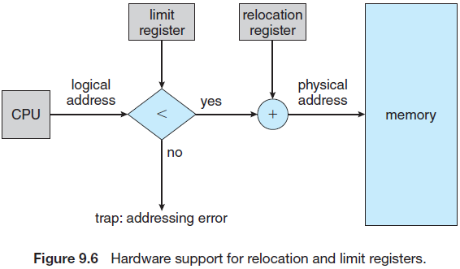

外部碎片的一种解决方案是使用压缩。目标是重新整理内存内容，以便将所有可用内存放在一个大的块中。压缩并不总是有效的，如果在组合或加载时重定位是静态的，则不能使用压缩。只有在执行时间内使用动态重定位时才能使用压缩。如果地址是自动重定位的，此时重定位仅会移动程序和数据，然后使用新的base地址来修改base寄存器。当可以使用压缩时，我们必须要确定其状态。最简单的压缩算法时将所有的进程移动到内存的一端，所有的内存漏洞移动到另一端，这样会生成一个大的内存漏洞，以供后面使用。但这种方案的代价比较高。

另一种解决外部碎片问题的方法是保证进程的逻辑地址空间是非连续的，这样允许在这段内存可用时能够给进程分配物理地址。这种策略称为分页，分页是最通用的计算机系统内存管理技术。后面章节将会讲述分页。

碎片是计算种的常见问题，在管理数据时会发生内存碎片。我们将会在存储管理章节(11章到15章)中进行详细描述。

### 9.3 Paging

目前讨论的内存管理需要进程的物理地址空间是连续的。现在引入分的概念，分页是一种允许进程的物理地址空间非连续的内存管理方案。分页避免了外部碎片以及压缩这两个困扰连续内存分配的问题。由于分页提供的众多优势，它在从大型服务器到移动设备的大多数操作系统中以各种形式被使用。分页实现了操作系统和计算机硬件的协作。

#### 9.3.1 Basic Method

实现分页的基本方法是将物理内存分割成称为帧的固定大小的块，并将逻辑内存分割为与分页相同大小的块。当一个进程将要被执行时，它的分页会从源头(文件系统或块存储)加载到任何可用的内存帧中。块存储会被分割成与内存帧或多帧簇长度相同的块。这个简单的想法具有强大的功能和广泛的影响。例如，现在逻辑地址空间完全与物理地址空间翻开，因此一个进程可以有64位大小的逻辑地址空间，即使物理内存小于2^64^字节。

CPU生成的每个地址分为两部分，页号(p)和页偏移(d)。


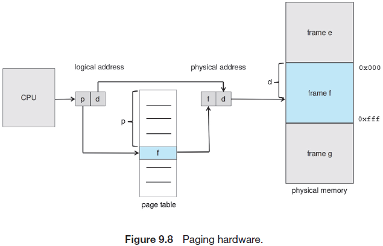

页号作为每个进程的页表的索引。如图9.8所示，页表包含物理内存的每个帧的基地址，偏移量为被引用的帧中的位置。因此，帧的基地址结合页偏移定义了物理内存地址。图9.9展示了内存分页模型。

下面展示了MMU将CPU生成的逻辑地址转换为物理地址的步骤：

1. 取出页号p，并将其作为页表的索引
2. 从页表中取出对应的帧号f
3. 使用帧号f替换掉逻辑地址的页号p

由于偏移量d没有变化，它不会被替换，这样帧号和偏移量构成了物理地址。

分页大小(与帧大小相同)由硬件定义。一个分页的大小是2的倍数，一个分页的大小通常在4KB到1GB之间，具体取决于系统架构。使用2的倍数作为分页大小的方式，使得将一个逻辑地址转变为页号和页偏移变得非常简单。如果逻辑地址空间的大小为2^m^，一个分页大小为2^n^字节，逻辑地址的高m-n位表示页号，低n位表示页偏移。因此逻辑地址为：


p为页表中的索引，d为页面内的位移。

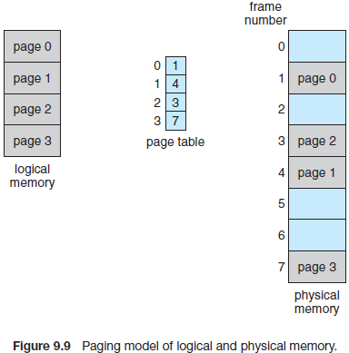

举一个具体的例子，如图9.10中，n=2且m=4，分页大小为4字节，物理内存为32字节(8页)，以编程人员的视角看内存如何映射到物理内存中的。逻辑地址0为分页0，偏移量0。在页表的索引中可以看到，分页0在帧5中，因此逻辑地址0映射到物理地址20[=5*4+0]。逻辑地址3(分页0，偏移量3)映射到物理地址23[= (5 × 4) +3]。逻辑地址为分页1，偏移量0；根据页表，分页1映射到帧6，因此逻辑地址4映射到物理地址24 [= (6 × 4) + 0]。逻辑地址13映射到物理地址9。

可能注意到，分页其实是一种动态重定位。分页硬件将每个逻辑地址绑定到某个物理地址。使用分页类似于使用基址（或重定位）寄存器表，每个内存帧对应一个分页。

当使用分页方案时不会遇到外部碎片，任何空闲的帧都可以被分配到需要的内存。然而，仍然可能遇到内部碎片。注意帧是以一定单位进行分配的。如果一个进程的内存需求与页边界不重合，则分配的最后一个帧可能不会完全被使用。例如，如果分页大小为2048字节，一个72766字节的进程会需要35个分页加上1086个字节。该进程将会被分配到36个帧，最终会导致2048-1086=962字节的内部碎片。在最糟糕的情况下，一个进程可能会使用n个分页，加1字节的内存，此时该进程会分配到n+1个帧，导致由几乎一个帧的内部碎片。

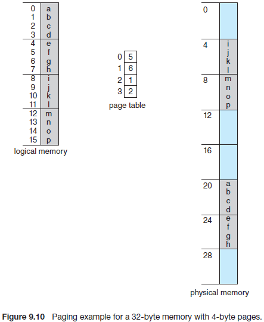

如果进程大小独立于页大小，则预期平均每个进程中有一半分页会存在内部碎片，这种考虑表明小的分页长度是可取的。然而每个页表项都会有开销(性能开销)，且这种开销随着分页大小的增加而下降(正如硬盘I/O在传输大数据时效率更高)。通常，分页大小随着时间的推移而增长，数据集和主存都会变大。今天，分页大小为4KB或8KB，一些系统会支持更大的分页大小。一些CPU和操作系统甚至可以支持多种分页大小。例如，在X86-64系统上，Windows支持4KB和2MB的也大小。Linux也支持两种也大小：默认分页大小(通常是4KB)和架构独立的大的页大小，称为大页。

在一个32位CPU系统上，一个分页表项大小为4字节，但该大小也可以变化。一个32位的表项可以指向2^32^物理页帧的某一帧。如果帧大小为4KB(2^12^)，那么一个使用4字节大小的表项可以寻址2^44^字节(或16TB)的物理内存。这里需要注意的是，内存系统中的物理内存大小通常与进程的最大逻辑大小不同，在后面对分页的探讨中，会看到页表项中还需要保存其他信息(除了帧位置)。这些信息减少了寻址页帧的比特位。因此一个使用32位页表项的系统能够寻址物理内存小于可能的最大内存。

当一个进入系统的进程将被执行时，需要检查以分页为单位的进程大小。进程的每个分页需要一个帧。因此如果该进程需要n个分页，则内存中至少需要n个可用的帧。如果有n个可用的帧，则会将这些帧分配给该进程。进程的第一个分页会加载到这些帧的某一个帧中，且进程的帧号会被放到页表中。下一个分页会加载到另一个帧中，该帧号会也会被放到页表中，以此类推(见图9.11)。

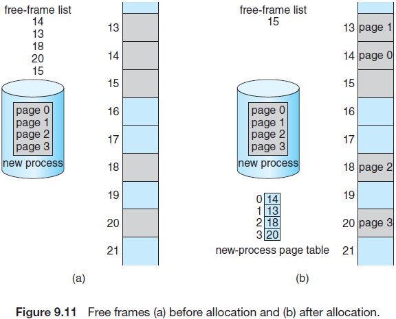

分页的一个重要的特点是从编程人员的角度看，将内存和实际物理内存完全分割开来。在编程人员看来，内存是一个包含一个程序的空间。实际上，用户程序和其他程序被分散在整个物理内存中。地址转换硬件协调了用户视角看的内存和实际内存之间的区别。将逻辑地址转换为物理地址，这种映射隐藏在用户程序背后，并由操作系统控制。注意用户进程不能访问不属于它的内存，它无法寻址到不在其页表的内存，且页表中仅包含进程所拥有的内存。

由于操作系统管理着物理内存，其必须了解物理内存的分配细节，即分配了哪些帧，哪些帧是可用的，一共有多少帧等。这种信息通常保存在一个系统范围的数据结构中，称为帧表。帧表中的每个表项对应一个物理帧，表示后者是否可用或已经被分配，如果已经被分配，那么分配给了哪个进程(或哪些进程)。

此外，操作系统必须注意到进程在用户空间的操作，所有逻辑地址必须通过映射来生成物理地址。如果用户使用了系统调用(如 I/O操作)，并提供一个地址参数(如buffer)，那么该地址必须被映射为正确的物理地址。操作系统为每个进程维护了页表的副本，就像维护了进程的指令计数器和寄存器内容的副本。该副本用于在操作系统必须手动将一个逻辑地址映射到物理地址时将逻辑地址转换为物理地址。此外，CPU分发器也会在进程分配到该CPU时使用该副本来定义一个硬件页表，因此分页会增加上下文切换时间。

#### 9.3.2 Hardware Support

页表属于单进程数据结构，指向页表的指针与其他寄存器值(如指令指针)一起保存在每个进程的进程控制块中。当CPU调度器选择一个进程执行时，必须重载用户寄存器，并从保存的用户页表中重载合适的硬件页表值。可以使用多种方式实现硬件页表。最简单的场景是使用专用高速硬件寄存器组(用于提高页表转换效率)来实现页表。然而，由于每个寄存器在上下文切换中必须进行交换，因此这种办法会增加上下文切换时间。

如果页表相当小(比如，256个表项)，可以使用寄存器来实现页表。然而大多数当代CPU支持非常大的页表(如2^20^个表项)。对于这种机器，使用寄存器来实现页表就不可行，而应该将页表保存在主存中，并使用一个页表基寄存器(PTBR)指向页表。修改页表仅需要修改一个寄存器，减少了后续的上下文切换时间。

#### 9.3.2.1 Translation Look-Aside Buffer

虽然通过在主存中保存页表的方式可以加快上下文切换，但也可能会降低内存访问时间。假设我们想要访问位置i，首先必须使用页号i以及对应的PTBR偏移在页表中索引。这项任务需要一次内存访问，通过帧号和页偏移来生成实际的物理地址，然后就可以访问内存中期望的位置。这种方案下，需要两次内存访问来访问数据(一次访问页表，一次访问实际数据)。这样内存访问速度降低了2倍，这种延迟在大多数场景下是不可接受的。

对该问题的标准解决方案是使用一个特殊的，小的且能够快速查找的硬件缓存，称为地址变换高速缓存(translation look-aside buffer),TLB是一种关联的高速存储器。TLB中的每个表项都由两部分组成：一个key(或tag)和一个value。当出现一个与内存关联的项时，该项会同时与TLB中的所有key进行比较，如果发现了该项，则返回对应的字段值。这种搜索是非常快的，现代硬件中的TLB查找属于指令流水线的一部分，基本上不增加性能损失。为了在一个流水线中执行搜索，必须使用小规格的TLB，通常是32到1024个表项大小。一个CPU实现了独立的指令和数据寻址TLB，这样将TLB表项的大小提升了一倍(由于这些查找发生在不同的流水线步骤中)。我们可以在此开发中看到CPU技术发展的一个例子：系统从没有TLBs发展到有多级TLBs，这样实现了多级缓存。

TLB使用如下的方式与页表配合使用。TLB仅包含很小的页表项。当CPU生成一个逻辑地址时，MMU会首先校验TLB中是否有该页表，如果有，则可以直接使用帧号来访问内存。正如前面提到的，这些步骤属于CPU指令流水线的一部分，相比没有实现页的系统机会不会增加性能损耗。

如果TLB中没有页号(即TLB miss)，地址转换过程会按照9.3.1章节中描述的步骤执行，此时必须访问内存引用的页表。当获得帧号后，就可以访问内存了(图9.12)，同时还会将页号和帧号保存在TLB中，这样在下一次引用时就能够快速获得需要的信息。


如果TLB的表项已经被填满，则必须选择替换一条现有的表项。替换策略的范围从最近最少使用（LRU）到轮循到随机。一些CPU允许操作系统参与LRU表项替换，而其他CPU则会自行处理。此外，一些TLB允许包含的表项下线(wired down)，即不能从TLB中移除。通常，提高给内核代码使用的TLB表项是下线的。

一些TLB会在每个TLB表项中包含地址空间标识符(ASIDs)。一个ASID唯一标识一个进程，并给该进程提供了地址空间防护功能。当TLB尝试解析虚拟页数目时需要保证当前运行的进程的ASID匹配虚拟页的ASID。如果ASID不匹配，则该操作会被认为时一个TLB miss。为了提供地址空间防护，一个ASID会允许TLB同时包含不同进程的表项。如果TLB不支持独立的ASID，那么当需要选择一个页表时(例如上下文切换时)，必须要刷新(或清除)TLB来保证下一个运行的进程不会使用错误的转换信息。否则TLB会包含老的条目，这些条目中包含了无效的虚拟地址，对应前一个进程留下的错误的或无效的物理地址。

TLB中查找到所需要的页号次数的百分比称为命中率。例如，80%的命中概率表示在80%的时间内可以找到所需要的页号。如果它花费10纳秒来访问内存，那么当TLB中存在需要的页号时，访问一个mapped内存会花费10纳秒。如果TLB中没有找到对应的页号，则必须首先访问内存以获取页表和帧号(花费10纳秒)，然后才能访问内存中需要的字节(10纳秒)，总计花费20纳秒(我们假设一次页表查询仅访问了一次内存，但实际会花费更多时间)。为了找出有效内存访问时间，上述场景下的有效访问时间为：

```
effective access time = 0.80 × 10 + 0.20 × 20 = 12 nanoseconds
```

本例中，平均内存访问时间下降了20%(从10降到12纳秒)。而99%的命中率则更现实的多：

```
effective access time = 0.99 × 10 + 0.01 × 20 = 10.1 nanoseconds
```

此时仅降低了1纳秒的访问时间。

前面所说，现在的CPU可能会提供多级TLB，计算现代CPU访问内存的时间要比上面例子中复杂得多。例如，Intel Core i7 CPU有一个128表项的L1指令TLB和64表项的L1数据TLB，当L1发生miss时，会在L2的512表项查找中花费6个CPU周期。大概L2发生miss时，意味着CPU必须浏览内存中所有的页表来查找所需要的帧地址，这可能会花费上百个CPU周期，或发出中断，让操作系统完成这种工作。

对这类系统上分页的完整的性能开销分析，需要知道每层TLB的命中率信息。从上面的介绍中，我们看到一些常用的信息，但硬件的特点会显著影响内存性能，且操作系统(如分页)的改进可能会影响硬件，会受硬件改变(如TLBs)的影响。在第10章节会描述TLB命中率的影响。

TLB是一个硬件特性，因此，对于操作系统及其设计者来说似乎并不重要。但设计者需要理解TLB的功能和特性，这种特性会随着硬件平台的不同而不同。为了优化操作，一个为特定平台设计的操作系统必须根据平台的TLB来设计分页。同样地，TLB设计中的变更可能会需要变更操作系统的分页实现。

#### 9.3.3 Protection

分页环境中内存的防护通过对每个帧有关的比特位的防护来实现，通常这些比特位保存在页表中。

可以使用一个比特位来定义一个分页是可读写的还是只读的。每次引用内存时都需要浏览页表来找出正确的帧号，同时会计算物理地址，防护的比特位可以用于检查是否有对只读页进行写。对只读分页执行写操作会触发一个trap给操作系统(或内存冲突防护)。

我们可以通过扩展该方法来提供一个更好的防护，例如通过创建硬件来提供只读，读写或只执行防护；或为每种访问提高独立的防护比特位，这样可以允许这些访问的任何组合。非法尝试会触发一个trap给操作系统。

此外需要一个比特位关联到页表中的每一项，即有效-无效位。当该比特位设置为有效，则该分页位于进程的逻辑地址空间中，则为一个合法(或有效的)分页。当该比特位设置为无效，则该分页不在进程的逻辑地址空间中。非法的地址使用有效-无效位捕获。操作系统会为每个分页设置这样的比特位来允许或禁止访问分页。

假设，一个14位(0到16383)地址空间的系统上，在0到10468地址段上运行了一个程序。给定的分页大小为2KB，场景如图9.13所示。分页0，1，2，3，4和5中的地址通过页表映射到物理帧。任何尝试在分页6，7中生成的地址将会把有效-无效位设置为无效，且计算机会触发一个trap给操作系统(无效的分页引用)。

注意这种方案也引发了一个问题，由于程序只能扩展到地址10468，引用任何超出该地址的操作都是非法的。然而引用分页5被认为是合法的，因此访问到地址12287的操作都是合法的。只有对12288到16383地址的访问是非法的。2KB的分页大小导致了这种问题，并反映为分页的内部碎片。

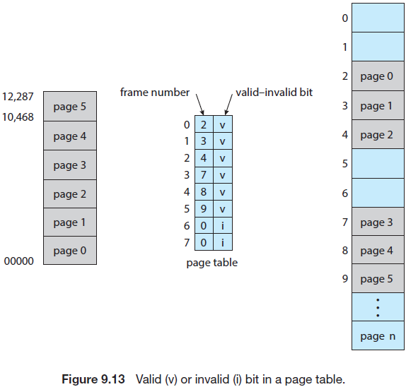

极少情况下，一个进程会用到其全部地址空间。实际上，很多进程只会使用地址空间的一小部分，在这种情况下，为每个进程地址范围内的分页创建一个页表是很浪费的，这种页表的大部分是无用的，且会占用内存空间。一些系统提供了硬件，即使用页表长度寄存器(PTLR)来标识页表的长度，通过比较寄存器中的值和逻辑地址来验证该地址是否在进程的有效范围内。校验失败时会触发一个trap给操作系统。

#### 9.3.4 Shared Pages

分页的一个优势时可以共享通用代码，特别是在多进程环境中。标准的C库为多个版本的UNIX和Linux提供了一部分系统调用，在典型的Linux系统上，很多用户进程都会使用标准C库，`libc`。一种办法是在每个进程中将libc载入到地址空间中。如果一个系统有40个用户进程，libc库大小为2MB，那么将会消耗80MB的内存。

如果代码是可重入代码，则改代码可以被共享，见图9.14。这里我们可以看到3个进程共享标准C库libc的分页。可重入代码为非自修改代码：它不会在执行时改变。因此，两个或多个进程可以在同一时间执行相同的代码。每个进程都有其寄存器和数据存储的副本，来个进程执行提供数据。两个不同的进程使用一份数据是很困难的。只将一份标准C库的的父辈保存在物理内存中，每个用户进程的页表映射到相同的libc的物理副本上。因此，为了支持40个进程，此时仅需要一份libc库的副本，总消耗的空间为2MB，而非80MB，大大节省了空间。


除了如libc之外的运行时库，其他用到的笨重的程序也可以被共享，如编译器，窗口相同，数据系统等等。9.1.5中描述的共享库通常使用共享页实现。为了实现共享，代码必须是可重入的。共享代码的只读特性不应由代码的正确性决定，而应该由操作系统强制执行此属性。

在系统的进程见共享内存类似第4章中描述的，在线程间共享一个任务的地址空间。回想第3章中描述的，使用共享内存作为交互通信的一种方法。一些操作系统使用共享页实现了共享内存。

根据页组织内存的方式提供了很多便利(出允许多进程共享系统的物理页)。我们将在第10章中涵盖这部分便利之处。

### 9.4 Structure of the Page Table

本章将会探索一些组件页表的通用技术，包括分层分页，哈希页表和反向页表。

#### 9.1.4 Hierarchical Paging

大多数现代计算机系统都支持一个大型的逻辑地址空间(2^32^到2^64^)，在这种环境下，页表会变得非常大。例如，考虑一个使用32位逻辑地址空间的系统，如果分页大小为4KB(2^12^)，那么一个页表可能会包含超过1百万个条目(2^20^ = 2^32^/2^12^)。加上个每项为4字节，这样每个进程的页表会占用4MB的物理地址空间。显然，我们不想在主内存中连续分配页表。一种简单的解决方案是将页表切割为更小的页表。我们可以使用几种方式来实现这种分割。

一种是使用两级页算法，此时页表本身也被分页(图9.15)。例如，考虑使用32位逻辑地址空间的系统，分页大小为4KB。一个逻辑地址将会切分为20位的页号以及12位的页偏移。由于会对页表分页，页号进一步会切分为10位的页号以及10位的页偏移。因此，一个逻辑地址的组成如下：


p1为外页表的索引，p2为内页表中的偏移。这种架构下的地址转换方法见图9.16。由于地址转换是从外页表向内进行的，这种方案也被称为正向映射页表。

对于使用64位逻辑地址空间的系统，使用两级分页方案不再合适。为了描述这一点，假设这种系统的分页大小为4KB(2^12^)。如果使用了两级分页方案，那么内页表可以简单地看作一张很大的分页，或2^10^个4字节表项。地址看起来是这样的：

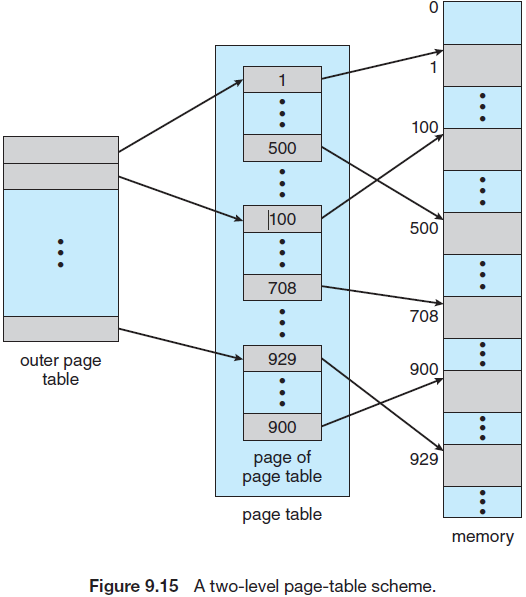


外页表包含2^42^个表项，或2^44^字节。一个避免大表的显而易见的办法是将外页表进行切割(一些32位处理器也会使用这种方法来提高的灵活性和效率)。

我们可以使用多种方法来切割外页表。例如，可以使用三级页方案来对外页表分页。假设外页表包含标准大小的分页(2^10^个表项，或2^12^字节)。这种情况下，64位地址空间下分页的内存消耗仍然令人生畏。


外页表仍然需要2^34^字节(16GB)大小的空间。

下一步是使用四级分页方案，此时第二个外业表也会被分页。64位 UltraSPARC将会需要七级分页，此时在转换一个逻辑地址时会发生大量内存访问。从这个例子中可以看到，为什么64为架构的下，分层页表通常并不合适。

#### 9.4.2 Hashed Page Tables

一种处理大于32位的地址空间的方法是使用哈希页表，哈希值为虚拟页号。哈希表中的每个表项包含一个链接的元素列表，这些元素哈希到相同的位置(来处理碰撞)。每个元素包含3个字段：(1)虚拟页号；(2)映射的页帧值；(3)指向下一个链接列表的元素。

这种算法的工作方式为：虚拟地址中的虚拟页号会被哈希到哈希表中。虚拟页号会跟链接列表中的第一个元素的第一个字段进行比较，如果匹配，则使用对应的页帧(字段2)来生成需要的物理地址。如果不匹配，则会从后续链接列表的表项中查找一个匹配的虚拟页号。这种方案见图9.17

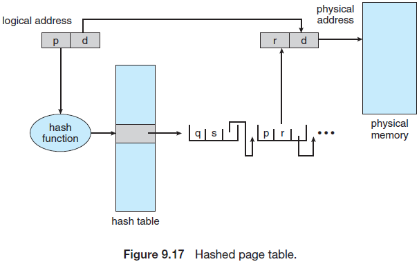

已经提出了该方案下支持64位地址空间的变体，该变体被称为集群页表，它与哈希页表类似，除了哈希表中的表项指向一些分页(例如16)，而不是一个分页。因此，一个页表项可以映射到多个物理页帧。集群页表特别适用于疏散的地址空间，此时引用的内存是非连续的，其散布在整个地址空间中。

#### 9.4.3 Inverted Page Tables

通常，每个进程都有一个页表。页表中的每一条对应进程正在使用的一个分页(或一个槽对应一个虚拟地址，不论后者是否有效)。由于进程会通过分页的虚拟地址引用分页，因此该表的表示是自然的。操作系统必须将该引用转换为物理内存地址。由于表使用虚拟地址进行排序，操作系统能够计算表中哪一项对应物理地址，并直接使用该表项中的值。该方法的缺点之一是每个页表可能会有上百万个表项。这些表可能会消耗大量物理内存来跟踪被使用的物理内存。

为了解决这种问题，我们使用了反向页表。一个反向页表中的每一项对应一个真实的内存页。每个表项包含保存在真实内存位置的页的虚拟地址，以及哪个进程使用该页的信息。因此，整个系统只需要一个页表，且页表中的每一项对应一个物理内存页。图9.18展示了如何操作一个反向页表。与图9.8(描绘了运行中的标准页表)相比较。由于表通常会包含映射到物理内存的不同地址空间，因此反向页表需要在页表的每一项中保存地址空间标识(9.3.2章节)。通过保存的地址空间标识来保证特定进程的逻辑页映射到了物理页帧。64位的Ultra SPARC和PowerPC使用了反向页表。


为了描述该方法，我们使用IBM RT系统中使用的简单版本的反向页表。IBM是第一个使用反向页表的主要公司，从IBM System 38开始，一直到RS/6000以及现在的IBM Power CPUs。对于IBM RT，每个虚拟地址包含3个内容：

```
<process-id, page-number, offset>.
```

每个反向页表项都是一个`<process-id, page-number>`对，proces-id承担地址空间标识符的角色。当引用一个内存时，或通过虚拟地址部分和`<process-id, page-number>`结合起来呈现给内存子系统。然后再在反向页表中查找匹配的项。如果发现了一个匹配项，例如，表项i，然后会生成物理地址<i,offset>。如果没有找到匹配的表项，则说明访问了一个非法的地址。

虽然这种方案减少了保存页表的内存消耗，但它增加了在分页引用时的页表搜索时间。由于反向页表使用物理地址排序，但查找又发生在虚拟地址，有可能在找到一个匹配的表项前会搜索整个表，这种搜索会花费很长时间。为了缓解这种问题，我们使用如9.4.2章节中描述的哈希表来将搜索限制为一个或最多几个页表项。当然，每次访问页表会增加一次内存引用， 因此一个虚拟地址引用至少需要读取两次真实内存，一次用于哈希表项，一次用于页表。(回想一下，在查询哈希表前会首先搜索TLB，以此来提升性能)。

反向页表的会涉及到共享内存。标准分页中，每个进程都有其各自的页表，这样允许相同的物理地址映射到多个虚拟地址中。这种方法不适用于反向页表，因为每个物理页只会对于一个虚拟页表项，一个物理页不能有两个(或更多)共享的虚拟地址。因此，使用反向页表时，在任何时间只能有一个虚拟地址映射到共享的物理地址。当共享内存的另一个进程引用时会导致分页错误，并映射到一个不同的虚拟地址上。

#### 9.4.4 Oracle SPARC Solaris--ignore

### 9.5 Swapping

进程在执行时必须将进程和数据加载到内存中。然而，进程，或进程的一部分可以临时从内存交换到后备存储中，然后在执行时加载到内存中(图9.19)。交换功能使所有进程的总物理地址空间可以超过系统的实际物理内存，从而提升系统中多道程序的程度。

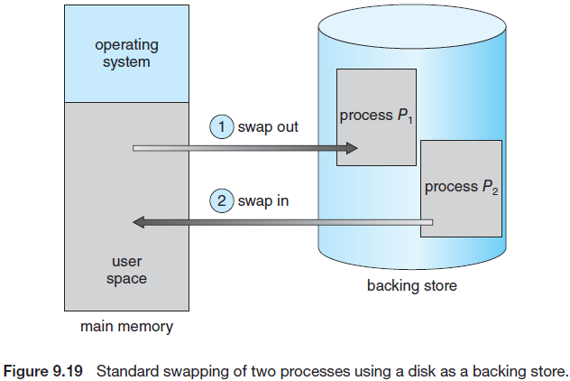

#### 9.5.1 Standard Swapping

标准交换涉及在主存和后备存储中移动整个进程。后备存储通常为快速二级存储。它必须足够大来容纳需要存储和检索的进程的任何部分，且必须提供直接访问这些内存镜像。当一个进程或进程的一部分交换到后备存储中，与进程有关的数据结构也会被写入到后备存储中。对于一个多线程进程，所有的线程数据结构也都要交换到后备存储中。操作系统必须维护换出的进程的元数据，这样在需要时可以交换回内存。

标准交换的好处是允许超额申请物理内存，这样系统能够比实际物理内存容纳更多的进程。空闲或大部分空闲的进程是能够被交换的候选进程。任何分配到这些进程的内存可能被分配给其他活动的进程。如果一个非活动的进程被交换出内存，然后再次变为活动状态，则必须交换回内存，见图9.19。

#### 9.5.2 Swapping with Paging

传统的UNIX系统使用标准交换，但由于需要大量时间在内存和后备存储中移动整个进程且后备存储可能禁止这种操作(Solaris仍然在使用标准交换，但是仅发生在可用内存极低的严峻情况下)，因此在当代操作系统上不再使用这种方案。

大多数操作系统，包括Linux和Windows，现在使用进程的页进行交换，而不是整个进程。这种策略也允许超额申请物理内存，但不会交换整个进程，仅交换涉及的一小部分分页。现在术语"交换"通常指标准交换，术语"分页"指使用分页的交换。一个page out操作涉及将内存中的分页换到后备存储中；相反的过程则称为page in。图9.20描绘了分页交换，分别paged-out 和paged-in进程A和进程B的分页子集。在第10章中将会看到，分页交换与虚拟内存结合使用时效果很好。

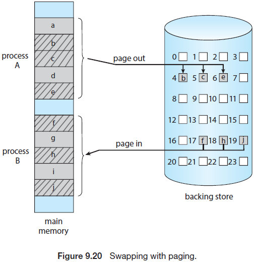

#### 9.5.3 Swapping on Mobile Systems

### 9.6 Example: Intel 32- and 64-bit Architectures

数十年来，英特尔芯片的架构一直主导着个人电脑领域。1970年代后期出现了16位的Intel 8086，不久之后就出现了另一个16位芯片的Intel8088，它是最早在IBM个人电脑中使用的芯片。后续Intel生产了一系列的32位芯片，即IA-32，包含32位的奔腾处理器。而最近，Intel基于X86-64架构发布了一系列64位芯片。当前，几乎所有的个人PC操作系统都运行在Intel芯片上，包括Windows，macOS和Linux(虽然，Linux也会运行在其他架构上)。然而， Intel的主导地址并没能传达到手机系统上，而在该位置上ARM架构相当成功(见9.7章节)。

本章中，我们将会讨论IA-32和X86-64架构下的地址转换。在开始前，需要注意由于Intel在多年来发布了很多版本，因此无法描述所有芯片下的内存管理，也无法提供所有CPU的相信信息(这部分信息最好参见计算机架构相关的书籍)。后面呈现Intel CPUs的主要内存管理概念。

#### 9.6.1 IA-32 Architecture

IA-32架构允许一个段最大为4GB，每个进程最大的段数目为16K。一个进程的逻辑地址空间分为两个部分，第一部分包括进程私有的最大8K个内存段，第二部分包括所有进程间共享的最大8K个内存段。第一部分的信息保存在局部描述符表(LDT)中；第二部分的信息保存在全局描述符表(GDT)中。LDT和GDT中的每个表项包含8字节的段描述符以及特定段的相信信息(包括位置和该段的限制等)。


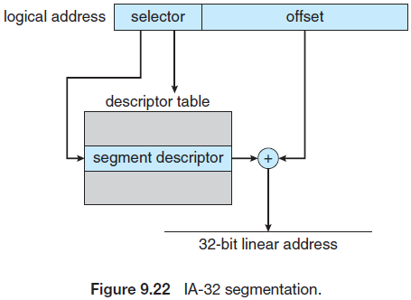

逻辑地址是(selector，office)对，其中selector为一个16位的数字：


这里，s表示段号，g表示该段在GDT还是LDT中，p用于防护。offset是一个32位的数字，指定所请求的段中的字节的位置。

机器有六个段寄存器，允许一个进程在任一时间寻址到六个内存段，它还具有六个8字节的微程序寄存器，用于保存LDT或GDT中的相应描述符。这种缓存使得奔腾处理器能够避在每次内存引用时都要从内存中读取描述符。

IA-32的线性地址是32位长度，结构如下描述。段寄存器指向LDT或GDT中的表项，所请求的段的base和limit信息用于生成线性地址。首先limit用于校验地址有效性，如果地址无效，则会生成内存错误信息，并触发一个trap给操作系统。如果有效，则将offset与base相加，得到一个32位的线性地址。见图9.22，在后面章节中将描述分页单元如何将一个线性地址转换为一个物理地址。

##### 9.6.1.2 IA-32 Paging

IA-32架构允许分页大小为4KB或4MB。对于4KB大小的分页，IA-32使用两级分页方案，将32位线性地址划分如下：


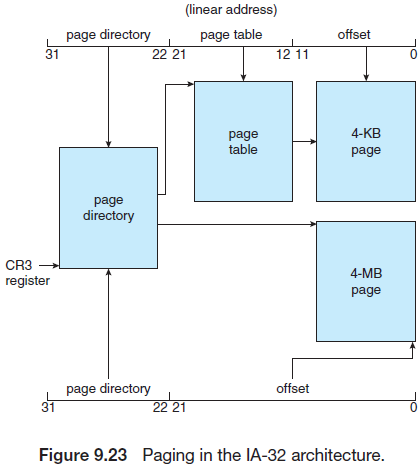

该架构下的地址转换方案类似图9.16中展示的方案。图9.23展示了更加详细的IA-32地址转换。其高10位引用了最外部页表，在IA-32的术语位页目录(CR3寄存器指向当前进程的页目录)。页目录条目指向一个内部页表，该表由线性地址中最里面10位的内容索引。最终，低0–11位表示页表中指向的4KB页中的偏移量。

如果设置了页目录的表项中的标识位Page_Size，则表示页帧位4MB，如果没有设置，而非标准大小4KB。如果设置了该标志位，页目录会跳过内部页表直接指向4KM的页帧，此时线性地址的低22位位4MB页帧的偏移量。

为了提升物理内存的使用效率，IA-32页表可以交换到硬盘中。这种情况下，页目录会使用一个无效位来表示表项指向的表是在内存中还是在磁盘上。如果表在硬盘上，操作系统会使用其他31位来指示表在硬盘上的位置。该表在需要时可以加载到内存中。

由于软件开发者发现32位系统上4GB内存的局限性，Intel引入了分页地址扩展(PAE)功能，它允许32位处理器能够访问超过4GB的物理地址空间。PAE引入的最根本的区别在于分页从两级方案变为了三级方案，最高两位指页目录指针表(page directory pointer table)。图9.24描述了4KB分页下的PAE系统(PAE也支持2MB分页)。

PAE将页目录和页表项从32位扩展到64位，允许页表和页帧的base地址从20扩展到24位。结合12位的偏移量，PAE将IA-32的地址空间扩展到36位，支持最大64GB的物理内存。需要注意的是，PAE需要操作系统的支持。Linux和macOS都支持PAE。然而，32位版本的Windows桌面操作系统在使能PAE的情况下仍然仅支持4GB的物理内存。

#### 9.6.2 X86-64

英特尔在开发64位架构方面经历了一段有趣的历史，它的初始入口为IA-64架构，但是 该架构没有被广泛采纳。同时，另外一种芯片厂商AMD开始基于现有的IA-32指令集开发64位架构。X86-64支持更大的逻辑和物理地址空间，以及其他架构功能。历史上，AMD经常基于Intel架构开发芯片，但是现在换成了Intel采纳AMD的X86-64架构。为了讨论架构，不会使用商业名称AMD64和Intel64，而使用更为通用的术语X86-64。

对64位地址空间的支持产生了惊人的2^64^字节的可寻址内存(大于16亿字节)。然而，即使64位系统可以寻址这么多内存，但实际的设计中内存的使用要远低于64位。X86-64架构当前支持48位的虚拟地址，使用四级分页来支持4KB，2MB或1GB大小的分页。图9.25展示了线性地址的表示方式。由于这种寻址可以使用PAE，虚拟地址的大小为48位，但可以支持52位的物理地址(4097TB)。


### 9.7 Example: ARMv8 Architecture --ignore