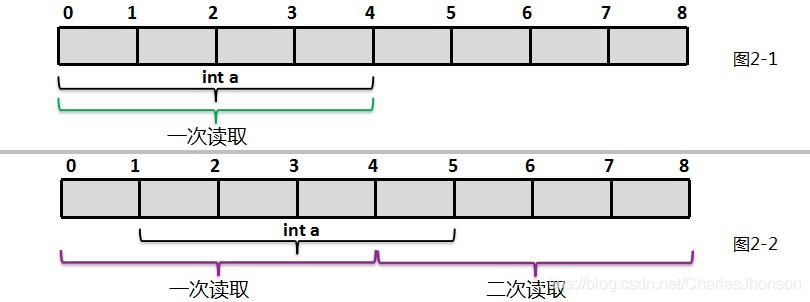

## 什么是数据对齐？

数据对齐（data alignment）指的就是访问数据的地址要满足一定的条件：能被这个数据的长度整除。例如1字节的数据本身就是对齐的；2字节的数据要被2整除，4字节的数据要被4整除。

现代计算机的内存空间是按照字节划分的，**理论上说任何类型的变量的访问可以从任何地址开始，但是实际的情况是特定变量的访问经常在特定的内存地址访问**。这就需要各类数据按照一定的规则在空间排列，而不是顶针式的首尾排列，这就是所谓的数据对齐。

数据对齐不是操作系统对内存的限制，而是CPU构造的一部分。CPU操作正确对齐的数据时，运行的效率最高。当数据的大小刚好能被数据内存地址整除时，数据是对齐的。

## 为什么要数据对齐？

举个例子：一个int类型（4字节）如果存放在偶数地址的地方，有可能出现一个读周期就可以独处，而如果存放的地址是从奇数开始的，那么一定就需要2次读取周期。然后再对结果的高低字节进行拼凑才能得到这个int数据。这就是一种空间和时间的取舍与博弈。



不是所有的数据都适合一个字节一个字节的读取的，这样一来效率会变得奇低无比。同时为了提高数据的带宽，现代操作系统都会采用很多并行的存储芯片来提升效率。

与此同时，有些处理器平台强制要求数据对齐，否则会导致指令集执行报错。

## 如何实现内存对齐？

### 基础知识

1.操作系统–32-bit(x86)和64-bit(x64)
（1）位数

  每个时钟周期内，处理器处理二进制代码数，即“0”和“1”的个数。

（2）64-bit

  优点：①可以进行更大范围的整数运算；②可以支持更大的内存。

2.处理器CPU位数
  CPU位数=CPU中寄存器的位数=CPU能够一次并行处理的数据宽度（位数）=数据总线宽度；
  //现在的计算机处理器一般都是64位，这是硬件的事。

3.CPU指令集
  CPU为了实现其功能设计了指令集，即是CPU的全部指令，这是机器语言。计算机的所有功能都是基于CPU的指令集。指令集和CPU的位数是有联系的。

  指令集的作用, 就是告诉程序员/编译器, 汇编一定要有格式. 支持什么指令, 指令带什么限制条件, 用什么操作数, 用什么地址, 都是指令集规范的内容, 要是写错了, 就无法翻译成机器码.

  指令集规范汇编, 汇编可以翻译成机器码, 机器码告诉CPU每个周期去做什么. 因此, CPU指令集是描述CPU能实现什么功能的一个集合, 就是描述"CPU能使用哪些机器码"的集合"。X86是指令集的代号。
  那么指令集在CPU里就代表: 只有CPU指令集范围内的指令可以被成功的译码, 并送往CPU流水线后端去执行.

4.寄存器
  寄存器是CPU内部用来创建和储存CPU运算结果和其它运算结果的地方。

5.关系
  操作系统位数 = 其所依赖的指令集位数 <= CPU位数。

6.计算机字长（机器字长）
  计算机字长（机器字长）取决于数据总线的宽度，通常就是CPU一次能处理的数据的位数（CPU位数）。

7.总结
  在标准c++中，int的定义长度要依靠你的机器的字长，也就是说，如果你的机器是32位的，int的长度为32位，如果你的机器是64位的，那么int的标准长度就是64位，比如16位机上，sizeof(int) = 2，而32位机上sizeof(int) = 4；32位机上sizeof(long) = 4，而64位机上sizeof(long) = 8。

  但是在32位机器和64机器中int类型都占用4个字节，因为一般编译器可以根据自身硬件来选择合适的大小，但是需要满足约束：short和int型至少为16位，long型至少为32位，并且short型长度不能超过int型，而int型不能超过long型。

  这即是说**各个类型的变量长度是由编译器来决定**的，而当前主流的编译器中一般是32位机器和64位机器中int型都是4个字节（例如，GCC）。
### 实施途径

①基本类型：自身对齐

②数组：首元素对齐。

③联合：成员最大对齐值，公倍数；

④结构体：其成员中自身对齐值最大的那个值。

⑤指定对齐方式：

​		```#pragma pack (n)```和```pragma pack ()```；

​		```attribute((aligned(n)))和__attribute__((packed))```

⑥数据成员、结构体和类的有效对齐值：自身对齐值和指定对齐值中较小者，即``有效对齐值=min{自身对齐值，当前指定的pack值}``；注意```_attribute__```。

